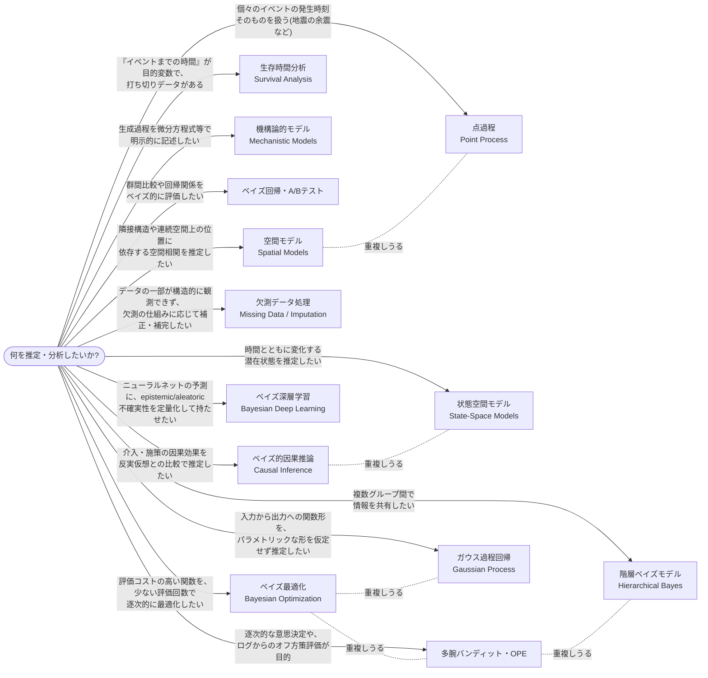

# ベイズ分析の種類

これまで取り組んできたプロジェクトを、「何のためのベイズ分析か」という種類(ジャンル)で分類したカタログ。`techniques/`(症状/対処の教訓)・`tools/`(手段そのものの定義)がどちらも横断的な索引であるのに対し、こちらは各プロジェクトを種類ごとに束ねて全体像を見るための地図。個々の種類の中でさらに複数のモデル構造を扱う場合は、対応する`tools/`ページに詳細を譲る(例: 状態空間モデルの内訳は[tools/state-space-models.md](tools/state-space-models.md)を参照)。

## 種類を見分ける特徴質問チャート

新しい分析を始めるとき、12種類のどれに当たるかを見分けるための特徴質問一覧。各質問は独立した判定基準であり、上から順にYes/Noで絞り込んでいく決定木ではない(複数の質問にYesと答えることもある)。実際、Multi-Armed-Banditは「多腕バンディット・OPE」であると同時に「階層ベイズモデル」でもあり、bayesian-causal-inferenceも「ベイズ的因果推論」であると同時に、反実仮想の構成そのものは「状態空間モデル」でもある。空間モデルの空間点過程(LGCP)も、時間軸を空間軸に置き換えただけの「点過程」でもある。ベイズ最適化はガウス過程を代理モデルに使う点で「ガウス過程回帰」の応用でもあり、獲得関数の1つGP版Thompson Samplingは離散腕のThompson Samplingを連続空間へ拡張したものという点で「多腕バンディット・OPE」とも重なる。図中の点線はそうした代表的な重複を示す。

- [ベイズ的因果推論](#ベイズ的因果推論bayesian-causal-inference) / [点過程](#点過程point-process) / [生存時間分析](#生存時間分析survival-analysis) / [機構論的モデル](#機構論的モデルmechanistic--compartmental-models) / [状態空間モデル](#状態空間モデルstate-space-models) / [多腕バンディット・OPE](#多腕バンディットオフ方策評価multi-armed-bandit--ope) / [階層ベイズモデル](#階層ベイズモデルhierarchical-bayes--partial-pooling) / [ベイズ回帰・A/Bテスト](#ベイズ回帰abテストbayesian-regression--ab-testing) / [ガウス過程回帰](#ガウス過程回帰gaussian-process-regression) / [空間モデル](#空間モデルspatial-models) / [欠測データ処理](#欠測データ処理missing-data--multiple-imputation) / [ベイズ最適化](#ベイズ最適化bayesian-optimization) / [ベイズ深層学習](#ベイズ深層学習bayesian-deep-learning)

---

### ベイズ的因果推論(Bayesian Causal Inference)

- **定義**: ある介入・施策(広告キャンペーンなど)が実際に効果を持ったかどうかを、「介入が無かったら観測値はどう推移していたか」という反実仮想をベイズモデルで構成し、実測値との差として推定する分析。ランダム化比較試験が使えない観測データに対して、時系列の構造(トレンド・季節性)と介入の影響を受けない対照系列を手がかりに反実仮想を組み立てる(BSTS/CausalImpact型)。
- **代表的な問い**: この介入は本当に効果があったか、それとも見かけ上の変動か。効果があったとして、その大きさはどれくらいで、どの程度自信を持って言えるか。手法自体はどの程度小さい効果まで検出できるのか(検出力)。
- **登場プロジェクト**: [bayesian-causal-inference](https://github.com/karahashimanato/bayesian-causal-inference/blob/main/README.md)(BigQuery公開データセット、半合成デザインによる検出力キャリブレーション)
- **関連ページ**: [tools/state-space-models.md](tools/state-space-models.md#gaussianrandomwalk時変パラメータの状態空間表現)(反実仮想の構成に使うローカルレベルトレンド) / [techniques/model-evaluation.md](techniques/model-evaluation.md#半合成データへの効果量注入で検出力mdeをキャリブレーションする)(半合成キャリブレーション、プラセボ検定) / [techniques/implementation-hacks.md](techniques/implementation-hacks.md#相関の強い状態空間パラメータではmean-fieldfullrank-adviとも分散を誤推定しうる)(ADVIの落とし穴)

---

### 機構論的モデル(Mechanistic / Compartmental Models)

- **定義**: 対象システムの因果的な生成過程(感染症の伝播メカニズムなど)を、微分方程式のような明示的な構造方程式で記述し、そのパラメータをベイズ推定するモデル。
- **代表的な問い**: このシステムを支配する構造的パラメータ(感染率、回復率など)はいくつか。将来の挙動はどう予測されるか。
- **登場プロジェクト**: [bayesian-epidemiological-models](https://github.com/karahashimanato/bayesian-epidemiological-models/blob/main/README.md)(SIR/SIS/SIRS/SEIR)
- **関連ページ**: [tools/observation-models.md](tools/observation-models.md#poisson)(Poisson観測分布) / [tools/greek-letters.md](tools/greek-letters.md)(β,γ,σ,δ,ξ,φ等)

---

### 階層ベイズモデル(Hierarchical Bayes / Partial Pooling)

- **定義**: 複数のグループ(打者、国、広告群、腕など)にまたがるパラメータが、グループ間で情報を共有する共通の事前分布から生成されると仮定し、グループごとの推定値を「全体平均寄りに縮小(shrinkage)」させるモデル。
- **代表的な問い**: 観測数が少ないグループの推定値を、他グループの情報でどう補正するか。グループ間のばらつきはどれくらいか。
- **登場プロジェクト**: [bayesian-modeling-lab](https://github.com/karahashimanato/bayesian-modeling-lab/blob/main/README.md#mlb打率-階層ベイズbeta-binomial)(MLB打率、サメ襲撃件数、ポケモンカード) / [bayesian-A-B-testing](https://github.com/karahashimanato/bayesian-A-B-testing/blob/main/README.md#分析の流れnotebooks)(曜日・時間帯の交差ランダム効果) / [Multi-Armed-Bandit](https://github.com/karahashimanato/Multi-Armed-Bandit/blob/main/README.md#notebook構成)(階層ベイズ版Thompson Sampling)
- **関連ページ**: [tools/observation-models.md](tools/observation-models.md#beta-binomial)(Beta-Binomial, Gamma-Poisson, Dirichlet-Multinomial) / [tools/posterior-pathologies.md](tools/posterior-pathologies.md#funnel漏斗状の病理neals-funnel)(Funnel)

---

### 状態空間モデル(State-Space Models)

- **定義**: 時間とともに変化する直接観測されない潜在状態を明示的にモデル化し、その状態の時間発展(遷移)と、状態から観測データが生成される過程(観測モデル)を分けて記述する時系列モデル。
- **代表的な問い**: 観測されていない内部状態(ボラティリティ、レジームなど)は今どんな値か。その状態はどう時間変化していくか。
- **登場プロジェクト**: [bayesian-modeling-lab](https://github.com/karahashimanato/bayesian-modeling-lab/blob/main/README.md#nile川-ベイズ変化点分析)(Nile川変化点分析、Sunspot、Lynx、日経225 Markov-Switching Model、日経225 Stochastic Volatility)
- **関連ページ**: [tools/state-space-models.md](tools/state-space-models.md)(変化点モデル・GaussianRandomWalk・非線形状態空間・Markov-Switching・Stochastic Volatilityの内訳はこちらに独立してまとめている)

---

### 生存時間分析(Survival Analysis)

- **定義**: 「イベントが起きるまでの時間」を目的変数とし、観測終了時点でイベントが未発生の対象(打ち切りデータ)を尤度に正しく組み込んで扱う分析。
- **代表的な問い**: ハザード率(瞬間イベント発生率)は時間や共変量でどう変わるか。特定の対象が将来どれくらいの確率で生存し続けるか。
- **登場プロジェクト**: [bayesian-hazard-models](https://github.com/karahashimanato/bayesian-hazard-models/blob/main/README.md#モデル一覧)(Telco Customer Churn) / [bitcoin-utxo-survival](https://github.com/karahashimanato/bitcoin-utxo-survival/blob/main/README.md)(UTXO滞留時間)
- **関連ページ**: [tools/observation-models.md](tools/observation-models.md#exponentialハザード関数)(Exponential/Weibull/Piecewise Exponential/Frailty) / [tools/evaluation-metrics.md](tools/evaluation-metrics.md#c-index--time-dependent-auc)(C-index, Time-Dependent AUC) / [tools/statistical-biases.md](tools/statistical-biases.md#informative-censoring情報を持つ打ち切り)(Informative Censoring, IPCW)

---

### 点過程(Point Process)

- **定義**: 個々のイベントが起こる正確な時刻そのもの(離散化した時系列のカウントではなく)を、連続時間上の確率過程としてモデル化する分析。
- **代表的な問い**: 過去のイベントが将来のイベント発生率をどれだけ、どれくらいの期間押し上げるか。イベントは自己励起的(連鎖的)か、独立に発生するか。
- **登場プロジェクト**: [bayesian-modeling-lab](https://github.com/karahashimanato/bayesian-modeling-lab/blob/main/README.md#能登半島地震-自己励起点過程hawkesetas)(能登半島地震 Hawkes/ETAS)
- **関連ページ**: [tools/observation-models.md](tools/observation-models.md#hawkes過程点過程の尤度)(Hawkes過程) / [tools/posterior-pathologies.md](tools/posterior-pathologies.md#ridge型非識別性)(Ridge型非識別性)

---

### 多腕バンディット・オフ方策評価(Multi-Armed Bandit & OPE)

- **定義**: 逐次的な意思決定(どの腕を選ぶか)を通じて探索と活用のバランスを取るアルゴリズムの設計・評価と、過去にある方策で収集したログデータだけから、別の方策を実際に運用した場合の性能を推定するオフ方策評価(OPE)。
- **代表的な問い**: 次にどの腕を選ぶべきか。過去のログだけから、まだ試していない新しい方策の性能をどう見積もるか。
- **登場プロジェクト**: [Multi-Armed-Bandit](https://github.com/karahashimanato/Multi-Armed-Bandit/blob/main/README.md)
- **関連ページ**: [tools/evaluation-metrics.md](tools/evaluation-metrics.md#ips-inverse-propensity-scoring)(IPS/DM/DR/SNIPS/SNDR) / [tools/inference-methods.md](tools/inference-methods.md#thompson-sampling)(Thompson Sampling, Replay法) / [tools/statistical-biases.md](tools/statistical-biases.md#propensity-score傾向スコア)(Propensity Score)

---

### ベイズ回帰・A/Bテスト(Bayesian Regression & A/B Testing)

- **定義**: 群間の比較(コンバージョン率など)や、説明変数から目的変数への関係を、事後分布・期待損失・信用区間といったベイズ的な意思決定の枠組みで評価する分析。
- **代表的な問い**: どちらの群が優れている確率はどれくらいか。説明変数と目的変数の関係はどんな形か(線形か、非線形か)。
- **登場プロジェクト**: [bayesian-A-B-testing](https://github.com/karahashimanato/bayesian-A-B-testing/blob/main/README.md#分析の流れnotebooks)(Beta-Binomial CVR比較、ロジスティック回帰、P-スプライン)
- **関連ページ**: [tools/observation-models.md](tools/observation-models.md#beta-binomial)(Beta-Binomial) / [tools/statistical-biases.md](tools/statistical-biases.md#jensen不等式jensens-inequality)(Jensen不等式) / [tools/inference-methods.md](tools/inference-methods.md#advi--mean-field変分推論svi)(ADVI/NUTS比較)

---

### ガウス過程回帰(Gaussian Process Regression)

- **定義**: 入力から出力への関数形をあらかじめ固定のパラメトリックな式(線形・多項式など)で仮定せず、「関数そのもの」に事前分布(ガウス過程)を置いてベイズ推定するノンパラメトリックな回帰。関数の滑らかさ・周期性・トレンドといった性質はカーネル(共分散関数)の設計を通じて表現する。
- **代表的な問い**: 観測データを滑らかに補間・平滑化する関数はどんな形か。その関数を観測範囲外まで延長(外挿)したとき、どこまで信頼できるか。トレンド・季節性のような複数の構造を、カーネルの組み合わせでどう分離するか。
- **登場プロジェクト**: [bayesian-gaussian-process](https://github.com/karahashimanato/bayesian-gaussian-process/blob/main/README.md)(標準RBFカーネル/複合カーネル/非ガウス尤度(Poisson)/スパースGPの4ケーススタディ)
- **関連ページ**: [tools/inference-methods.md](tools/inference-methods.md#pmgpmarginalgpの解析的周辺化)(pm.gp.Marginal/HSGP/VFEの使い分け) / [tools/posterior-pathologies.md](tools/posterior-pathologies.md#ridge型非識別性)(平均関数とGPの交絡、基底関数近似のスケール退化) / [techniques/model-evaluation.md](techniques/model-evaluation.md#カーネル近似手法ごとに外挿での挙動が全く異なるため観測域内の当てはまりとは別に外挿時の振る舞いを確認する)(外挿挙動の評価)

---

### 空間モデル(Spatial Models)

- **定義**: 隣接する地区・領域(行政区画など)間、あるいは連続空間上の近い位置同士が似た値を持ちやすいという空間相関を、隣接グラフの精度行列やガウス過程で明示的にモデル化する分析。エリアデータ(隣接構造を持つ集計データ)・空間時系列(エリア×時間)・連続空間上のイベント(点過程)の3類型がある。
- **代表的な問い**: ある地区の値(罹患率など)は、隣接地区の情報も借りるとどう補正されるか。観測されたばらつきのうち、隣接地区間で共有される空間構造に由来する部分と、地区固有の非構造的なばらつきに由来する部分をどう分離するか。空間パターンは時間とともにどう変化するか。連続空間上のイベント(地震の震源など)はどこに集中しやすいか。
- **登場プロジェクト**: [bayesian-spatial-models](https://github.com/karahashimanato/bayesian-spatial-models/blob/main/README.md)(ICAR→BYM→BYM2によるスコットランド口唇癌の疾病マッピング、Knorr-Held型空間時系列BYMによるオハイオ州COVID-19、LGCPによる能登半島地震の空間強度場推定)
- **関連ページ**: [tools/spatial-models.md](tools/spatial-models.md)(ICAR・BYM・BYM2・空間時系列BYM・LGCPの内訳はこちらに独立してまとめている) / [tools/posterior-pathologies.md](tools/posterior-pathologies.md#ridge型非識別性)(BYMのθ/φ非識別性) / [techniques/reparameterization.md](techniques/reparameterization.md#bymのθφ分離の非識別性はbym2のσρ再パラメータ化で解消する)(BYM2への再パラメータ化)

---

### 欠測データ処理(Missing Data / Multiple Imputation)

- **定義**: 観測されるはずのデータの一部が構造的に欠けている状況で、欠測が起こる仕組み(欠測メカニズム: MCAR/MAR/MNAR)をまず見極め、それに応じた統計的処理(完全ケース分析・多重代入・欠測値を潜在変数として扱うフルベイズ同時モデル・欠測メカニズム自体を明示的にモデル化するSelection Model/Pattern-Mixture Model)を選ぶ分析。真値が既知の半合成デザイン(完全なデータに人為的に欠測を注入する)で手法を検証したうえで、真の欠測を持つ実データに適用する二段構成を取ることが多い。
- **代表的な問い**: この欠測は無視してよい(MCAR/MAR)か、それとも欠測の有無自体が値と結びついている(MNAR)か。欠測を無視した処理(完全ケース分析・平均補完)は、どの推定量(回帰係数か、周辺平均か)をどれだけ歪めるか。MNARのように原理的に識別できない設定で、結果は仮定にどれだけ依存するか。
- **登場プロジェクト**: [bayesian-missing-data](https://github.com/karahashimanato/bayesian-missing-data/blob/main/README.md)(World Bank開発指標パネルデータ、MCAR/MAR/MNARを横断検証)
- **関連ページ**: [tools/missing-data.md](tools/missing-data.md)(MCAR/MAR/MNAR・フルベイズ同時モデル・MICE・Selection Model・Pattern-Mixture Model・多変量同時欠測モデルの内訳はこちらに独立してまとめている) / [techniques/data-pitfalls.md](techniques/data-pitfalls.md#平均補完は最も単純な対処であり最も危険でもある)(平均補完の危険性) / [techniques/model-evaluation.md](techniques/model-evaluation.md#真値のない実データに適用する前に半合成デザインで手法の妥当性を確立する)(半合成デザインでの検証)

---

### ベイズ最適化(Bayesian Optimization)

- **定義**: 評価コストの高いブラックボックス関数(シミュレーション、機械学習モデルの性能など)を、ガウス過程(GP)を代理モデルとして少ない評価回数で最適化する逐次的な意思決定手法。各反復で、代理モデルの事後分布(平均・不確実性)から獲得関数(PI/EI/UCB/GP版Thompson Samplingなど)を計算し、次に評価すべき点を選ぶ。
- **代表的な問い**: 限られた評価回数の中で、次にどこを評価すれば最も効率よく最適解に近づけるか。探索(不確実性が高い領域を試す)と活用(良さそうな領域を深掘りする)のバランスをどう取るか。次元が増えるにつれて、必要な評価回数はどう増えるか(次元の呪い)。
- **登場プロジェクト**: [bayesian-optimization](https://github.com/karahashimanato/bayesian-optimization/blob/main/README.md)(1次元/2次元Branin/6次元Hartmannベンチマークでの獲得関数比較、XGBoostハイパーパラメータ探索への実応用)
- **関連ページ**: [tools/acquisition-functions.md](tools/acquisition-functions.md)(PI・EI・UCB・GP版Thompson Samplingの内訳はこちらに独立してまとめている) / [tools/evaluation-metrics.md](tools/evaluation-metrics.md#regret単純後悔simple-regret)(収束の評価指標regret) / [techniques/implementation-hacks.md](techniques/implementation-hacks.md#獲得関数の最大化は次元が増えるとグリッド探索が組合せ爆発するためscipyoptimizeマルチスタートに切り替える)(高次元での獲得関数最大化)

---

### ベイズ深層学習(Bayesian Deep Learning)

- **定義**: ニューラルネットワークの予測に、モデルが「知らない」ことに由来するepistemic不確実性と、データ自体が持つ本質的なばらつきに由来するaleatoric不確実性を分離して持たせる分析。他カテゴリの多くがPyMC+MCMCで事後分布を厳密にサンプリングするのに対し、こちらは近似ベイズ推論(MC Dropout・Deep Ensembles・Laplace近似・変分推論など)をPyTorchで実装し、複数手法を横断比較する点が特徴。
- **代表的な問い**: モデルの予測は「データが足りないから自信がない」のか、「データ自体にばらつきがあるから自信がない」のか。訓練データの範囲外(OOD)にどれだけ入り込むと、不確実性はどれだけ増加すべきか。ある不確実性定量化手法の性能は、タスクの次元・データ量・分布シフトの性質が変わっても頑健か。
- **登場プロジェクト**: [bayesian-deep-learning](https://github.com/karahashimanato/bayesian-deep-learning/blob/main/README.md)(1次元合成回帰・California Housing・MNIST vs Fashion-MNIST・Mauna Loa CO2の4タスクでMC Dropout/Deep Ensembles/Laplace近似/Bayes by Backprop/Anchored Ensemblesを比較)
- **関連ページ**: [tools/uncertainty-quantification-methods.md](tools/uncertainty-quantification-methods.md)(MC Dropout・Deep Ensembles・Laplace近似・Bayes by Backprop・Anchored Ensembles・in-between uncertaintyの内訳はこちらに独立してまとめている) / [techniques/model-evaluation.md](techniques/model-evaluation.md#手法比較の結論はタスクの次元複雑さに依存し単純に外挿できない)(手法比較の外挿限界) / [techniques/implementation-hacks.md](techniques/implementation-hacks.md#cpu環境のtorchビルドと周辺ライブラリの依存衝突は同じcpuビルド系列に揃えて解消する)(PyTorch依存衝突の回避)
