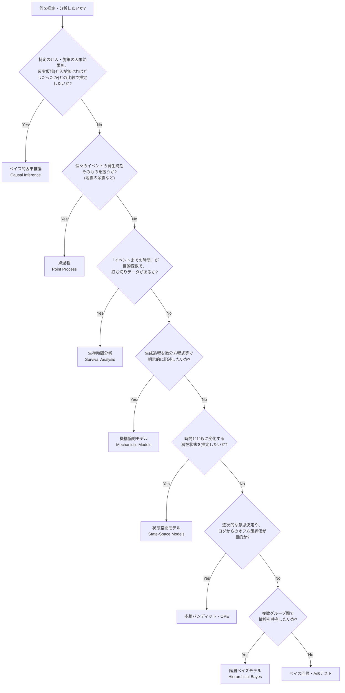

# ベイズ分析の種類

これまで取り組んできたプロジェクトを、「何のためのベイズ分析か」という種類(ジャンル)で分類したカタログ。`techniques/`(症状/対処の教訓)・`tools/`(手段そのものの定義)がどちらも横断的な索引であるのに対し、こちらは各プロジェクトを種類ごとに束ねて全体像を見るための地図。個々の種類の中でさらに複数のモデル構造を扱う場合は、対応する`tools/`ページに詳細を譲る(例: 状態空間モデルの内訳は[tools/state-space-models.md](tools/state-space-models.md)を参照)。

## 種類を選ぶフローチャート

新しい分析を始めるとき、何を推定したいかから8種類のどれに当たるかを大まかに絞り込むための診断フロー。実際には複数の種類が組み合わさる場合もある(例: Multi-Armed-Banditは「多腕バンディット・OPE」であると同時に「階層ベイズモデル」でもある。bayesian-causal-inferenceも「ベイズ的因果推論」であると同時に、反実仮想の構成そのものは「状態空間モデル」でもある)ため、あくまで最初の切り分けの目安として使う。

- [ベイズ的因果推論](#ベイズ的因果推論bayesian-causal-inference) / [点過程](#点過程point-process) / [生存時間分析](#生存時間分析survival-analysis) / [機構論的モデル](#機構論的モデルmechanistic--compartmental-models) / [状態空間モデル](#状態空間モデルstate-space-models) / [多腕バンディット・OPE](#多腕バンディットオフ方策評価multi-armed-bandit--ope) / [階層ベイズモデル](#階層ベイズモデルhierarchical-bayes--partial-pooling) / [ベイズ回帰・A/Bテスト](#ベイズ回帰abテストbayesian-regression--ab-testing)

---

### ベイズ的因果推論(Bayesian Causal Inference)

- **定義**: ある介入・施策(広告キャンペーンなど)が実際に効果を持ったかどうかを、「介入が無かったら観測値はどう推移していたか」という反実仮想をベイズモデルで構成し、実測値との差として推定する分析。ランダム化比較試験が使えない観測データに対して、時系列の構造(トレンド・季節性)と介入の影響を受けない対照系列を手がかりに反実仮想を組み立てる(BSTS/CausalImpact型)。
- **代表的な問い**: この介入は本当に効果があったか、それとも見かけ上の変動か。効果があったとして、その大きさはどれくらいで、どの程度自信を持って言えるか。手法自体はどの程度小さい効果まで検出できるのか(検出力)。
- **登場プロジェクト**: [bayesian-causal-inference](https://github.com/karahashimanato/bayesian-causal-inference/blob/main/README.md)(BigQuery公開データセット、半合成デザインによる検出力キャリブレーション)
- **関連ページ**: [tools/state-space-models.md](tools/state-space-models.md#gaussianrandomwalk時変パラメータの状態空間表現)(反実仮想の構成に使うローカルレベルトレンド) / [techniques/model-evaluation.md](techniques/model-evaluation.md#半合成データへの効果量注入で検出力mdeをキャリブレーションする)(半合成キャリブレーション、プラセボ検定) / [techniques/implementation-hacks.md](techniques/implementation-hacks.md#相関の強い状態空間パラメータではmean-fieldfullrank-adviとも分散を誤推定しうる)(ADVIの落とし穴)

---

### 機構論的モデル(Mechanistic / Compartmental Models)

- **定義**: 対象システムの因果的な生成過程(感染症の伝播メカニズムなど)を、微分方程式のような明示的な構造方程式で記述し、そのパラメータをベイズ推定するモデル。
- **代表的な問い**: このシステムを支配する構造的パラメータ(感染率、回復率など)はいくつか。将来の挙動はどう予測されるか。
- **登場プロジェクト**: [bayesian-epidemiological-models](https://github.com/karahashimanato/bayesian-epidemiological-models/blob/main/README.md)(SIR/SIS/SIRS/SEIR)
- **関連ページ**: [tools/observation-models.md](tools/observation-models.md#poisson)(Poisson観測分布) / [tools/greek-letters.md](tools/greek-letters.md)(β,γ,σ,δ,ξ,φ等)

---

### 階層ベイズモデル(Hierarchical Bayes / Partial Pooling)

- **定義**: 複数のグループ(打者、国、広告群、腕など)にまたがるパラメータが、グループ間で情報を共有する共通の事前分布から生成されると仮定し、グループごとの推定値を「全体平均寄りに縮小(shrinkage)」させるモデル。
- **代表的な問い**: 観測数が少ないグループの推定値を、他グループの情報でどう補正するか。グループ間のばらつきはどれくらいか。
- **登場プロジェクト**: [bayesian-modeling-lab](https://github.com/karahashimanato/bayesian-modeling-lab/blob/main/README.md#mlb打率-階層ベイズbeta-binomial)(MLB打率、サメ襲撃件数、ポケモンカード) / [bayesian-A-B-testing](https://github.com/karahashimanato/bayesian-A-B-testing/blob/main/README.md#分析の流れnotebooks)(曜日・時間帯の交差ランダム効果) / [Multi-Armed-Bandit](https://github.com/karahashimanato/Multi-Armed-Bandit/blob/main/README.md#notebook構成)(階層ベイズ版Thompson Sampling)
- **関連ページ**: [tools/observation-models.md](tools/observation-models.md#beta-binomial)(Beta-Binomial, Gamma-Poisson, Dirichlet-Multinomial) / [tools/posterior-pathologies.md](tools/posterior-pathologies.md#funnel漏斗状の病理neals-funnel)(Funnel)

---

### 状態空間モデル(State-Space Models)

- **定義**: 時間とともに変化する直接観測されない潜在状態を明示的にモデル化し、その状態の時間発展(遷移)と、状態から観測データが生成される過程(観測モデル)を分けて記述する時系列モデル。
- **代表的な問い**: 観測されていない内部状態(ボラティリティ、レジームなど)は今どんな値か。その状態はどう時間変化していくか。
- **登場プロジェクト**: [bayesian-modeling-lab](https://github.com/karahashimanato/bayesian-modeling-lab/blob/main/README.md#nile川-ベイズ変化点分析)(Nile川変化点分析、Sunspot、Lynx、日経225 Markov-Switching Model、日経225 Stochastic Volatility)
- **関連ページ**: [tools/state-space-models.md](tools/state-space-models.md)(変化点モデル・GaussianRandomWalk・非線形状態空間・Markov-Switching・Stochastic Volatilityの内訳はこちらに独立してまとめている)

---

### 生存時間分析(Survival Analysis)

- **定義**: 「イベントが起きるまでの時間」を目的変数とし、観測終了時点でイベントが未発生の対象(打ち切りデータ)を尤度に正しく組み込んで扱う分析。
- **代表的な問い**: ハザード率(瞬間イベント発生率)は時間や共変量でどう変わるか。特定の対象が将来どれくらいの確率で生存し続けるか。
- **登場プロジェクト**: [bayesian-hazard-models](https://github.com/karahashimanato/bayesian-hazard-models/blob/main/README.md#モデル一覧)(Telco Customer Churn) / [bitcoin-utxo-survival](https://github.com/karahashimanato/bitcoin-utxo-survival/blob/main/README.md)(UTXO滞留時間)
- **関連ページ**: [tools/observation-models.md](tools/observation-models.md#exponentialハザード関数)(Exponential/Weibull/Piecewise Exponential/Frailty) / [tools/evaluation-metrics.md](tools/evaluation-metrics.md#c-index-time-dependent-auc)(C-index, Time-Dependent AUC) / [tools/statistical-biases.md](tools/statistical-biases.md#informative-censoring情報を持つ打ち切り)(Informative Censoring, IPCW)

---

### 点過程(Point Process)

- **定義**: 個々のイベントが起こる正確な時刻そのもの(離散化した時系列のカウントではなく)を、連続時間上の確率過程としてモデル化する分析。
- **代表的な問い**: 過去のイベントが将来のイベント発生率をどれだけ、どれくらいの期間押し上げるか。イベントは自己励起的(連鎖的)か、独立に発生するか。
- **登場プロジェクト**: [bayesian-modeling-lab](https://github.com/karahashimanato/bayesian-modeling-lab/blob/main/README.md#能登半島地震-自己励起点過程hawkesetas)(能登半島地震 Hawkes/ETAS)
- **関連ページ**: [tools/observation-models.md](tools/observation-models.md#hawkes過程点過程の尤度)(Hawkes過程) / [tools/posterior-pathologies.md](tools/posterior-pathologies.md#ridge型非識別性)(Ridge型非識別性)

---

### 多腕バンディット・オフ方策評価(Multi-Armed Bandit & OPE)

- **定義**: 逐次的な意思決定(どの腕を選ぶか)を通じて探索と活用のバランスを取るアルゴリズムの設計・評価と、過去にある方策で収集したログデータだけから、別の方策を実際に運用した場合の性能を推定するオフ方策評価(OPE)。
- **代表的な問い**: 次にどの腕を選ぶべきか。過去のログだけから、まだ試していない新しい方策の性能をどう見積もるか。
- **登場プロジェクト**: [Multi-Armed-Bandit](https://github.com/karahashimanato/Multi-Armed-Bandit/blob/main/README.md)
- **関連ページ**: [tools/evaluation-metrics.md](tools/evaluation-metrics.md#ips-inverse-propensity-scoring)(IPS/DM/DR/SNIPS/SNDR) / [tools/inference-methods.md](tools/inference-methods.md#thompson-sampling)(Thompson Sampling, Replay法) / [tools/statistical-biases.md](tools/statistical-biases.md#propensity-score傾向スコア)(Propensity Score)

---

### ベイズ回帰・A/Bテスト(Bayesian Regression & A/B Testing)

- **定義**: 群間の比較(コンバージョン率など)や、説明変数から目的変数への関係を、事後分布・期待損失・信用区間といったベイズ的な意思決定の枠組みで評価する分析。
- **代表的な問い**: どちらの群が優れている確率はどれくらいか。説明変数と目的変数の関係はどんな形か(線形か、非線形か)。
- **登場プロジェクト**: [bayesian-A-B-testing](https://github.com/karahashimanato/bayesian-A-B-testing/blob/main/README.md#分析の流れnotebooks)(Beta-Binomial CVR比較、ロジスティック回帰、P-スプライン)
- **関連ページ**: [tools/observation-models.md](tools/observation-models.md#beta-binomial)(Beta-Binomial) / [tools/statistical-biases.md](tools/statistical-biases.md#jensen不等式jensens-inequality)(Jensen不等式) / [tools/inference-methods.md](tools/inference-methods.md#advi--mean-field変分推論svi)(ADVI/NUTS比較)
