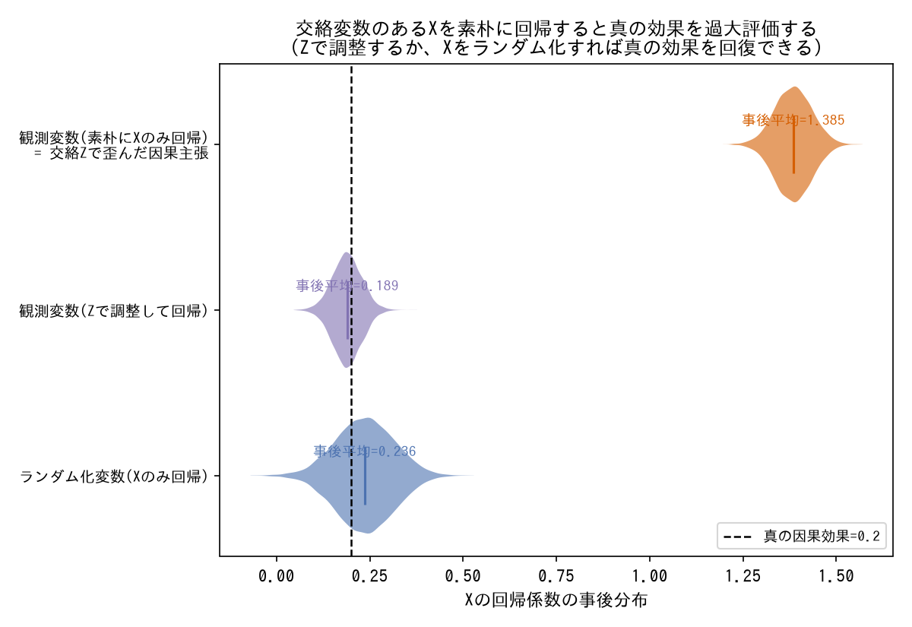
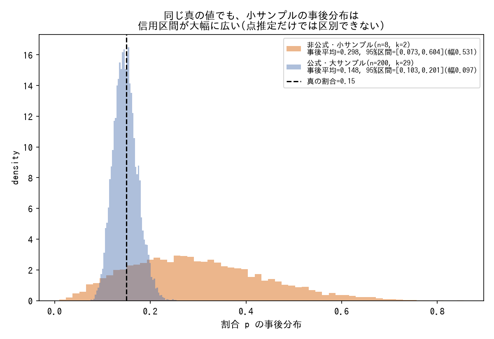

# データ・単位・前処理の落とし穴

単位の取り違え、正規化の見落とし、外れ値の扱い、因果解釈の限界。

---

### 「γ=期間」ではなく「1/γ=期間」の取り違え

- **症状**: 感染症モデルなどでレート系パラメータ(γ)とその逆数(期間)を混同し、事前分布のスケールを1桁以上間違える。SIS・SEIRの双方で同型の誤りが発生。
- **対処**: 違和感が出るたびに「単位」に立ち返り、パラメータが表す量の次元(時間の逆数か、時間そのものか)を確認する。
- **なぜ効くか**: レート/期間の混同は式の上では自然に発生しやすく、結果の生物学的妥当性チェックでしか気づけないことが多い。
- **登場プロジェクト**: [bayesian-epidemiological-models](https://github.com/karahashimanato/bayesian-epidemiological-models/blob/main/README.md#横断的な学び)

---

### 指標の母数(単位)を見落とすとパラメータ推定が丸ごと狂う

- **症状**: World Bank指標が「リスク人口1,000人あたり」であることを見落としてN=1000をそのまま使用し、γの生物学的妥当性とデータの平衡水準が両立しない結果になった。
- **対処**: 指標の定義(何人当たりの値か、パーセントかカウントか)をデータソースのドキュメントで必ず確認し、実際のリスク人口(この例では2×10^8)へ変換する。
- **なぜ効くか**: 母数の取り違えはモデル構造やサンプリング自体には現れず、パラメータの絶対値だけが不自然にズレるため、単位を疑わない限り発見が遅れる。
- **登場プロジェクト**: [bayesian-epidemiological-models](https://github.com/karahashimanato/bayesian-epidemiological-models/blob/main/README.md#sis-ナイジェリア-マラリア罹患率)

---

### 外れ値は除外する前に中身を見る

- **症状**: 統計的な外れ値(接触回数の多い上位1%など)を機械的に除外すると、実はビジネス上最も価値あるセグメント(CVRが通常の6倍)を切り捨ててしまう。
- **対処**: 外れ値を除外する前に、それが「ノイズ」なのか「意味のある高価値セグメント」なのかを確認する。除外せず専用のダミー変数で扱うという選択肢もある。
- **なぜ効くか**: 統計的な外れ値の定義(分布の端)とビジネス上の重要性は独立の軸であり、前者だけで後者を判断すると意思決定に直結する情報を失う。
- **登場プロジェクト**: [bayesian-A-B-testing](https://github.com/karahashimanato/bayesian-A-B-testing/blob/main/README.md#主な結果)

---

### ランダム化されていない観測変数から因果を主張しない

*PyMCで実際にベイズ線形回帰を3通り(観測変数を素朴に回帰/交絡変数で調整/ランダム化変数を回帰)フィットし、Xの回帰係数の事後分布を比較した結果(生成スクリプト: [scripts/generate_data_pitfalls_plots.py](../scripts/generate_data_pitfalls_plots.py))。*

- **症状**: 相関関係(例: 広告接触回数とCVRの関係)から「接触回数を増やせばCVRが上がる」という因果的な投資判断を導いてしまう。
- **対処**: 各説明変数がランダム化されているか(実験的に割り当てられたか)を確認する。ランダム化された変数(test group)は因果効果と解釈できるが、観測変数(total ads)は相関にとどまる。
- **なぜ効くか**: ランダム化は交絡変数を統計的に均等化する唯一の一般的な手段であり、それがない限り観測されたパラメータは因果効果の推定値ではない。
- **登場プロジェクト**: [bayesian-A-B-testing](https://github.com/karahashimanato/bayesian-A-B-testing/blob/main/README.md#主な結果)

---

### イベント発生率で層別化して訓練・テスト分割を行う

- **症状**: 単純ランダム分割では、訓練データとテストデータでイベント発生率(解約率など)がずれ、評価指標が分割の偶然に左右される。
- **対処**: イベント有無の列で層別化(`stratify`)して分割し、訓練・テストの発生率を一致させる。
- **なぜ効くか**: 評価指標の変動要因からデータ分割の偏りを排除でき、モデル間の比較がフェアになる。
- **登場プロジェクト**: [bayesian-hazard-models](https://github.com/karahashimanato/bayesian-hazard-models/blob/main/README.md#データ)

---

### 除外基準は「客観的なフラグ」に限定し、恣意的な推測での除外を避ける

- **症状**: データの一部(Bitcoinの「おつり」output等)を「これはノイズだろう」というヒューリスティックで除外すると、除外基準そのものがその後の挙動と相関し、生存時間分析ではinformative censoring(打ち切りが無情報でなくなる)のリスクを持ち込む。
- **対処**: 除外は `is_coinbase` のような客観的でプロトコル由来のフラグに基づくものだけに限定し、推測に基づく除外(change outputのフィルタなど)は行わない。業界標準の指標も同様の方針を取っている場合はそれに倣う。
- **なぜ効くか**: 恣意的な除外基準は、除外されたデータと除外されなかったデータの間に分析対象の性質と相関する差を生みやすい。客観的なフラグは分析対象の値そのものとは無関係に決まるため、この種のバイアスを持ち込まない。informative censoringそのものの定義は[tools/statistical-biases.md](../tools/statistical-biases.md#informative-censoring情報を持つ打ち切り)を参照。
- **登場プロジェクト**: [bitcoin-utxo-survival](https://github.com/karahashimanato/bitcoin-utxo-survival/blob/main/README.md#データの定義除外方針)

---

### パーティション列は「列名の意味」を鵜呑みにせず実際の値を確認する

- **症状**: BigQueryのパーティション列 `block_timestamp_month` が、列名から「月」だと思って月単位のフィルタに使うと、実際には月初日に丸められた値(例: 8月中の全トランザクションが同一の`2026-08-01`)であり、DAY単位で宣言されたパーティションが実質月単位でしか絞れない。さらに便宜用の公開VIEWはこのパーティション列を露出しておらず、素朴に期間フィルタをかけると全期間フルスキャン(796GB規模)になる。
- **対処**: パーティション列は実際の値をサンプルクエリで確認してから使う。ベーステーブルを直接`UNNEST`し、パーティション列で粗いプルーニングをした上で、実時刻の列で精密なフィルタを別途かける。
- **なぜ効くか**: 列名やドキュメント上の説明と実装の実際の丸め方にズレがあることは珍しくなく、特に大規模データではこの種の見落としがコスト(フルスキャンの課金)に直結する。
- **登場プロジェクト**: [bitcoin-utxo-survival](https://github.com/karahashimanato/bitcoin-utxo-survival/blob/main/README.md#元データの形式bigquery-public-datacrypto_bitcoin)

---

### 傾向スコア(propensity score)など補正用の値は、条件によって分布が異なる点に注意する

- **症状**: Off-Policy Evaluation(IPS/DR/SNIPS等)で使う`propensity_score`のような重み付け用の値を、条件(表示位置`position`など)によらず一様に扱ってしまうと、補正が歪む。
- **対処**: 補正用の値がどの条件(表示位置、セグメント等)によって分布が変わりうるかを事前に確認し、必要なら条件ごとに扱いを分ける。
- **なぜ効くか**: 傾向スコアに基づく補正手法(IPS系)は、傾向スコアの推定精度・分布の妥当性にそのまま結果が依存するため、分布が条件依存であることを見落とすとバイアスや高分散の原因になる。傾向スコアそのものの定義は[tools/statistical-biases.md](../tools/statistical-biases.md#propensity-score傾向スコア)を参照。
- **登場プロジェクト**: [Multi-Armed-Bandit](https://github.com/karahashimanato/Multi-Armed-Bandit/blob/main/README.md#実装上の注意点)

---

### データソースの限界(非公式・小サンプル)は分析結果とセットで明示する

*PyMCで実際にベイズ二項モデル(Beta(1,1)事前分布)を2通りのサンプルサイズでフィットした結果(生成スクリプト: [scripts/generate_data_pitfalls_plots.py](../scripts/generate_data_pitfalls_plots.py))。*

- **症状**: 非公式なコミュニティ集計や小サンプル(n=8商品など)から得た結果を、公式データや十分なサンプルサイズから得た結果と同じ確からしさで報告してしまう。
- **対処**: データソースの性質(公式発表か個人・コミュニティ集計か)、サンプルサイズ、値の丸め方(範囲表記を中間値で近似する等)を分析の限界として明示的に整理し、結果の解釈にどの程度の慎重さが必要かを添える。
- **なぜ効くか**: モデルの診断(収束・分散)が健全であることは、入力データの信頼性を保証しない。データソースの限界を明示することで、結果を読む側(未来の自分を含む)が過大評価するリスクを減らせる。
- **登場プロジェクト**: [bayesian-modeling-lab](https://github.com/karahashimanato/bayesian-modeling-lab/blob/main/README.md#ポケモンカード封入率-階層ベイズdirichlet-multinomial)

---

### 平均補完は最も単純な対処であり、最も危険でもある

- **症状**: 欠測値を「とりあえず変数の平均で埋める」対処は実装が最も簡単なため分析の入口として選ばれがちだが、個別値の精度・回帰係数・分散のいずれの観点でも他のあらゆる手法(完全ケース分析・フルベイズ同時モデル・MICE)より一貫して劣る。
- **対処**: 平均補完を採用する前に、少なくとも完全ケース分析(CC)と比較する。bayesian-missing-dataの半合成検証では、回帰係数`beta_gdp`(真値-0.660)がMCARで-0.480(27%減衰)、MARで-0.374(43%減衰)と欠測メカニズムによらず大きく過小推定され、CC(MCAR: -0.636、MAR: -0.636)よりも系統的に悪化した。
- **なぜ効くか**: 平均補完は「欠測していた観測点には全て同じ値が入っていた」という仮定を暗黙に置くため、その変数が本来持っていたばらつき(分散)そのものを機械的に押しつぶす。その結果、他の変数との相関・回帰係数は実際の関係より薄まった(過小評価された)ものに系統的に歪む。CC(欠測行を単純に除外)は分散を破壊しない分、少なくともこの点では平均補完に優る。
- **登場プロジェクト**: [bayesian-missing-data](https://github.com/karahashimanato/bayesian-missing-data/blob/main/README.md#01-mcarmar--単一変数ケーススタディ)

---

### 探索範囲の端に最適点が張り付いている場合、真の最適値が範囲外にある可能性を疑う

- **症状**: ハイパーパラメータ探索の範囲(`reg_lambda∈[1e-3,10]`など)を分析者が事前に決め打ちすると、BOが選んだ最良点が範囲の端(上限10.0)に張り付いていても、それが「範囲内で最良」なのか「本当はもっと外に真の最適値がある」のかを区別しないまま結果を確定してしまう。
- **対処**: 最終的に採用したハイパーパラメータの値が探索範囲の上限・下限と一致していないか確認する。一致していれば、その範囲設計自体を反省点として明示的に記録し、範囲を広げた再探索の余地があることを報告に含める。
- **なぜ効くか**: BO自体は与えられた探索範囲内で最良の点を見つけることは保証するが、範囲の外に真の最適値があるかどうかは原理的に判定できない。範囲の端への張り付きは「範囲設計が狭すぎた」ことを示す観測可能なシグナルであり、これを見逃すと過小評価された性能を最終結果として報告してしまう。
- **登場プロジェクト**: [bayesian-optimization](https://github.com/karahashimanato/bayesian-optimization/blob/main/README.md#part-b-xgboostハイパーパラメータ探索california-housing)

---

### 緯度経度を平面座標に近似変換する際は、対象領域のスケールに対する精度を確認する

- **症状**: 空間点過程(LGCP)で震源の緯度経度をkm単位の平面座標として扱いたいが、地球は球面であり緯度経度をそのままユークリッド距離として扱うと歪みが生じる。
- **対処**: 領域中心を原点とした等長方形図法近似(equirectangular projection)で緯度経度をkm単位に変換する。ただし、この近似は対象領域が十分小さい場合にのみ精度が保たれる(能登半島地震の事例では対象領域が約80km四方であり、この規模であれば近似誤差は無視できる)。
- **なぜ効くか**: 等長方形図法近似の誤差は対象領域の緯度・広がりに依存して系統的に増加するため、対象領域の大きさを確認せずに適用すると、広域データ(大陸規模など)では距離の歪みがモデルの空間構造(GPの長さスケールなど)の推定を系統的に歪める。狭い領域(数十〜百km四方程度)であれば近似誤差は実用上無視できる。
- **登場プロジェクト**: [bayesian-spatial-models](https://github.com/karahashimanato/bayesian-spatial-models/blob/main/README.md#part-3-空間点過程lgcp能登半島地震)
