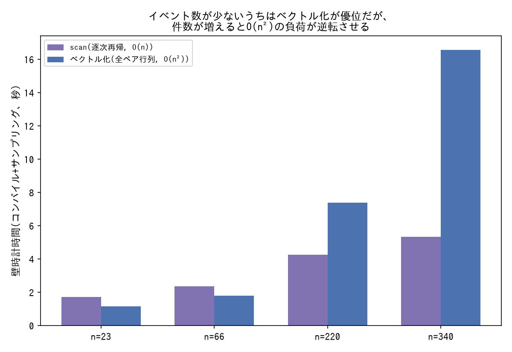
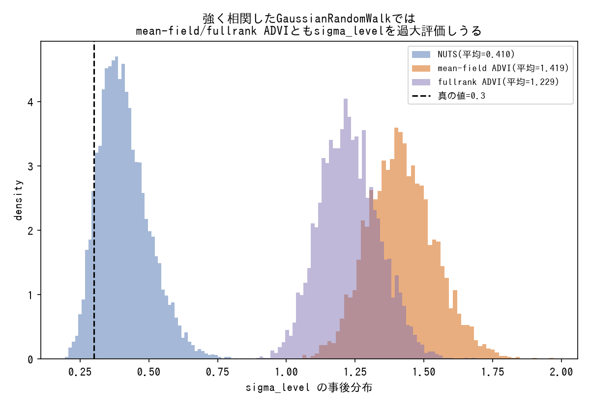
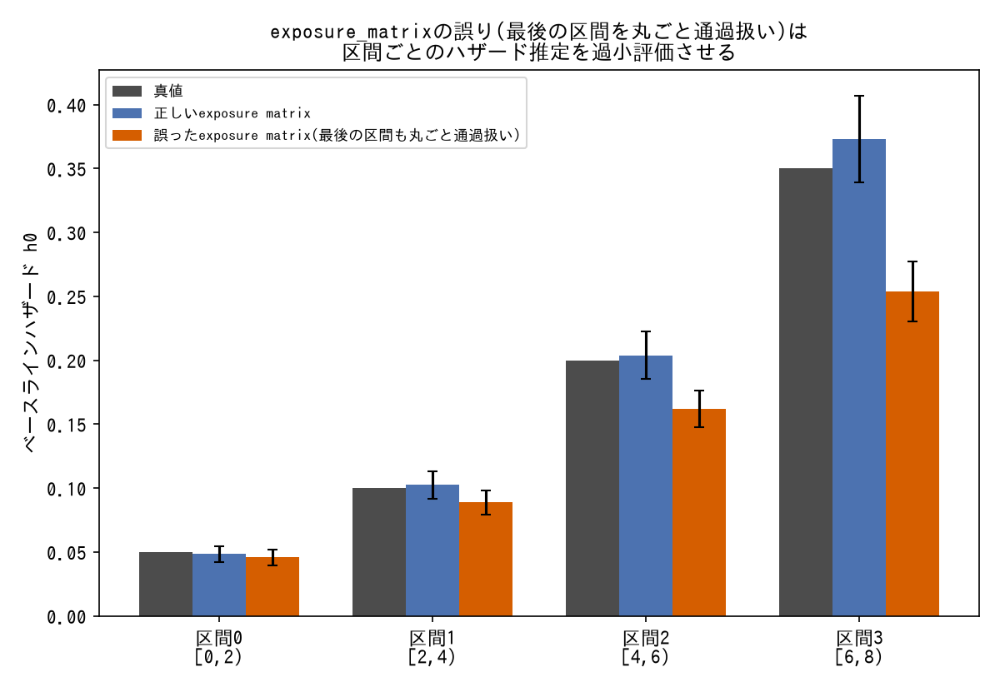

# 実装上のハック

PyMC/ArviZ/JAX/pytensor固有のバグ回避・キャストなど、統計的方法論とは別種の実装知識。

---

### `pytensor.scan` の `sequences` で時変パラメータを実装する

- **症状**: β(t)のように時刻ごとに値が変わるパラメータを微分方程式の数値積分(オイラー法)に組み込みたい。
- **対処**: `pytensor.scan` の `sequences` 引数(ステップごとに異なる値を渡す)を使って、季節変動するβ(t)のような時変パラメータを実装する。
- **登場プロジェクト**: [bayesian-epidemiological-models](https://github.com/karahashimanato/bayesian-epidemiological-models/blob/main/README.md#sirs-米国季節性インフルエンザ)

---

### `pm.Potential` では対数尤度が自動保存されないので明示的に保存する

- **症状**: `pm.Potential` で尤度を実装すると、ArviZのLOO計算などに必要な対数尤度グループが自動保存されない。
- **対処**: 各データ点の対数尤度を `pm.Deterministic("lik_i", log_lik_elementwise)` として明示的に保存する。
- **登場プロジェクト**: [bayesian-hazard-models](https://github.com/karahashimanato/bayesian-hazard-models/blob/main/README.md#診断実装における重要ハック)

---

### JAX配列の不変性(immutable)エラーを `np.asarray()` で回避する

- **症状**: NumPyroが生成する対数尤度はJAX配列であり、ArviZのPSIS-LOO(パレート平滑化)がインプレース上書きを試みてクラッシュする。
- **対処**: 対数尤度を `np.asarray()` で通常のNumPy配列にキャストしてから登録する。
- **登場プロジェクト**: [bayesian-hazard-models](https://github.com/karahashimanato/bayesian-hazard-models/blob/main/README.md#診断実装における重要ハック)

---

### ArviZ 0.20+のDataTree構造には直接代入する

- **症状**: 旧式の `add_groups` メソッドが、ArviZ 0.20+以降の `xarray.DataTree` 構造に対応していない。
- **対処**: `idata["log_likelihood"] = ...` のように、Datasetを直接キーへ代入する。
- **登場プロジェクト**: [bayesian-hazard-models](https://github.com/karahashimanato/bayesian-hazard-models/blob/main/README.md#診断実装における重要ハック)

---

### 打ち切り時刻ちょうどのゼロ除算をわずかなクリップで回避する

- **症状**: IPCW(逆確率重み付け)で、最大生存時間に生存者が集中していると打ち切り生存確率 `G(t_max) = 0` となり、Brier Score/AUC計算がゼロ除算でクラッシュする。
- **対処**: テストデータの最大時間をごくわずかに(例: 72.5ヶ月→72.4ヶ月)クリップする。IPCWそのものの定義は[tools/statistical-biases.md](../tools/statistical-biases.md#ipcw逆確率重み付けinverse-probability-of-censoring-weighting)を参照。
- **登場プロジェクト**: [bayesian-hazard-models](https://github.com/karahashimanato/bayesian-hazard-models/blob/main/README.md#診断実装における重要ハック)

---

### 乱数シードは全notebookで統一する

- **症状**: 複数のnotebookにまたがる分析で乱数シードがバラバラだと、結果の再現性が失われ、notebook間の比較(独立版 vs 階層版のシミュレーション結果など)がノイズなのか本質的な差なのか判断しづらくなる。
- **対処**: `np.random.default_rng(42)` のように、シード値を固定した乱数生成器を全notebookで統一して使う。
- **登場プロジェクト**: [Multi-Armed-Bandit](https://github.com/karahashimanato/Multi-Armed-Bandit/blob/main/README.md#実装上の注意点)

---

### BigQueryのコストは「コード側のルール」と「GCP側の予算アラート」の二重で管理する

- **症状**: 大規模データセット(数億〜数十億行)に対する探索的なクエリは、想定外の全件スキャンで高額な課金が発生するリスクがある。
- **対処**: クエリ実行前に必ずドライラン(`dry_run=True`)でスキャン量を確認し、各クエリに `maximum_bytes_billed` を設定して想定外のフルスキャンを未然に防ぐ。さらにGCPプロジェクト側にも予算アラートを設定し、コード側のルールが形骸化した場合の保険とする。
- **なぜ効くか**: コード側のガードは書き忘れ・レビュー漏れで機能しなくなりうるため、独立した監視層(予算アラート)を重ねることで単一障害点をなくす。
- **登場プロジェクト**: [bitcoin-utxo-survival](https://github.com/karahashimanato/bitcoin-utxo-survival/blob/main/README.md#セットアップ)

---

### ローカルで捌けない規模のデータは「集計→ローカル推定」と「サンプル抽出→検証」の二段構えにする

- **症状**: 数億件規模のデータをそのままローカルでNUTSサンプリングするのは非現実的だが、集計してしまうと集計由来のバイアス(ecological bias)が生じていないかを検証する術がなくなる。
- **対処**: (1)BigQuery側で必要な粒度に集計し、その小さな集計テーブルに対してローカルのPyMC/NUTSでモデルをフィットするステージと、(2)層化ランダムサンプリングで抽出した生の個体レベルデータに対し、SVI(変分推論)など軽量な手法で別途モデルをフィットし、(1)の集計が真の関係を歪めていないかを検証するステージを両方用意する。
- **なぜ効くか**: 集計ステージだけでは計算量の問題は解決してもバイアスの有無を確認できず、個体レベルステージだけでは規模の問題を解決できない。両方を組み合わせることで、計算可能性と結果の妥当性検証を両立できる。
- **登場プロジェクト**: [bitcoin-utxo-survival](https://github.com/karahashimanato/bitcoin-utxo-survival/blob/main/README.md#計算戦略二段構え)

---

### `GaussianRandomWalk`の`shape`引数によるint8オーバーフローを`steps`/`init_dist`で回避する

- **症状**: `pm.GaussianRandomWalk("x", sigma=..., shape=n)`で、`n`が127を超えると`OverflowError: Python integer ... out of bounds for int8`が発生する。
- **対処**: `shape`引数を使わず、`steps`と`init_dist`を明示的に指定する(`pm.GaussianRandomWalk("x", sigma=..., init_dist=pm.Normal.dist(0,1), steps=n-1)`)。`GaussianRandomWalk`そのものの定義は[tools/state-space-models.md](../tools/state-space-models.md#gaussianrandomwalk時変パラメータの状態空間表現)を参照。
- **登場プロジェクト**: [bayesian-modeling-lab](https://github.com/karahashimanato/bayesian-modeling-lab/blob/main/README.md#sunspot-周期性を持つ非線形状態空間モデル)

---

### `pm.Gamma`が`(alpha,beta)`/`(mu,sigma)`しか受け付けない制約を`Deterministic`で変換して回避する

- **症状**: 「平均・集中度」への再パラメータ化(`mu`, `alpha_conc`)をGamma分布に適用したいが、PyMCの`pm.Gamma`は`(alpha,beta)`または`(mu,sigma)`の組み合わせしか受け付けず、`(mu, alpha)`を直接指定できない。
- **対処**: `beta = alpha_conc / mu`という関係式を`pm.Deterministic`で明示的に計算してから、`pm.Gamma(alpha=alpha_conc, beta=beta)`という受理される形に変換する。
- **なぜ効くか**: 分布のパラメータ化(数式上の自然な表現)とライブラリが受け付ける引数の組み合わせは必ずしも一致しない。`Deterministic`を挟むことで、モデル記述上は好きなパラメータ化を保ちながら、実装上の制約を吸収できる。
- **登場プロジェクト**: [bayesian-modeling-lab](https://github.com/karahashimanato/bayesian-modeling-lab/blob/main/README.md#サメ襲撃件数-階層ベイズgamma-poisson)

---

### 時間差行列のベクトル化で`pytensor.scan`を避ける

*Hawkes過程の対数尤度を、scanによる逐次再帰実装(O(n))とベクトル化実装(O(n²))の2通りでPyMCモデルとして実際にサンプリングし、壁時計時間を実測比較した結果(生成スクリプト: [scripts/generate_implementation_hacks_plots.py](../scripts/generate_implementation_hacks_plots.py))。イベント数が少ないうちはベクトル化が有利だが、O(n²)の計算量ゆえに件数が増えると優劣が逆転する点には注意が必要。*

- **症状**: 点過程モデル(Hawkes過程など)で、各イベントが過去の全イベントから受ける影響を計算する必要があり、素朴に実装すると逐次ループ(`pytensor.scan`)が必要に見える。
- **対処**: `dt = t[:, None] - t[None, :]`のように全イベントペアの時間差を表す $T\times T$ 行列を作り、`dt > 0`のマスクで「自分より前に起きたイベントだけ」を抽出、`pt.switch`で条件付き計算を行うことで、`scan`を使わずベクトル演算のみでモデルを構築する。
- **なぜ効くか**: `pytensor.scan`は逐次処理のオーバーヘッドがあり、微分やコンパイルの面でもベクトル化された演算より扱いにくい場合がある。ペアワイズな時間差計算は行列演算に落とし込めるため、スケールしやすいベクトル化実装が可能になる。
- **登場プロジェクト**: [bayesian-modeling-lab](https://github.com/karahashimanato/bayesian-modeling-lab/blob/main/README.md#能登半島地震-自己励起点過程hawkesetas)

---

### 相関の強い状態空間パラメータではmean-field/fullrank ADVIとも分散を誤推定しうる

*PyMCで実際に同一のローカルレベルモデルをNUTS・mean-field ADVI・fullrank ADVIの3通りでフィットし、sigma_levelの事後分布を比較した結果(生成スクリプト: [scripts/generate_implementation_hacks_plots.py](../scripts/generate_implementation_hacks_plots.py))。*

- **症状**: 219次元の`GaussianRandomWalk`(強く相関したローカルレベルトレンド)を含むBSTSモデルをmean-field ADVIでフィットすると、`sigma_level`の事後推定値がNUTSの結果(約0.06)の2〜3倍(0.15〜0.19)に膨らむ。fullrank ADVIに切り替えても改善せず、同じイテレーション数(30000)ではむしろAverage Lossが悪化した(18→139、収束していない)。
- **対処**: NUTSに切り替える。219日規模のモデルであれば1回あたり数秒〜十数秒で収束するため、繰り返し試行(キャリブレーションなど)でも実用上の速度上の問題はなかった。
- **なぜ効くか**: mean-field ADVIは各パラメータの独立性を仮定するが、`GaussianRandomWalk`の各時点の値は本来強く相関している。この相関を表現できない分を`sigma_level`(スケールパラメータ)の膨張で埋め合わせようとするため、周辺事後分布が過大評価される。fullrank ADVIは相関を表現できる代わりに推定すべき共分散パラメータ数が次元の2乗のオーダーで増え、同じイテレーション数では収束しきらない。
- **登場プロジェクト**: [bayesian-causal-inference](https://github.com/karahashimanato/bayesian-causal-inference/blob/main/README.md#学び)

---

### 区間ごとの滞在時間行列で累積ハザードを積算する

*PyMCで実際に2種類のPiecewise Exponentialモデル(正しいexposure_matrix/誤ったexposure_matrix)をフィットし、各区間のベースラインハザードh0の事後平均を比較した結果(生成スクリプト: [scripts/generate_implementation_hacks_plots.py](../scripts/generate_implementation_hacks_plots.py))。*

- **症状**: Piecewise Exponentialモデルで、各対象が実際に通過した時間区間ごとのベースラインハザードを正しく積算する必要がある(完全通過した区間と、途中で終わる最後の区間とで扱いが異なる)。
- **対処**: 各対象 × 各区間の滞在時間(完全通過なら区間幅、最後の区間なら端数)を表す行列 `exposure_matrix` を構築し、`H_i = pt.dot(exposure_matrix, h0) * hazard_ratio` で累積ハザードを積算してから対数尤度を計算する。
- **登場プロジェクト**: [bayesian-hazard-models](https://github.com/karahashimanato/bayesian-hazard-models/blob/main/README.md#診断実装における重要ハック)
