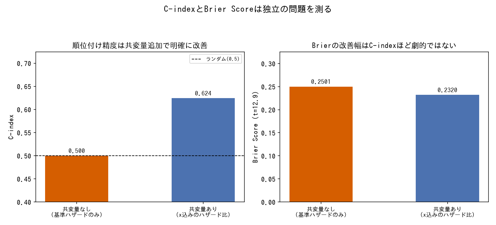
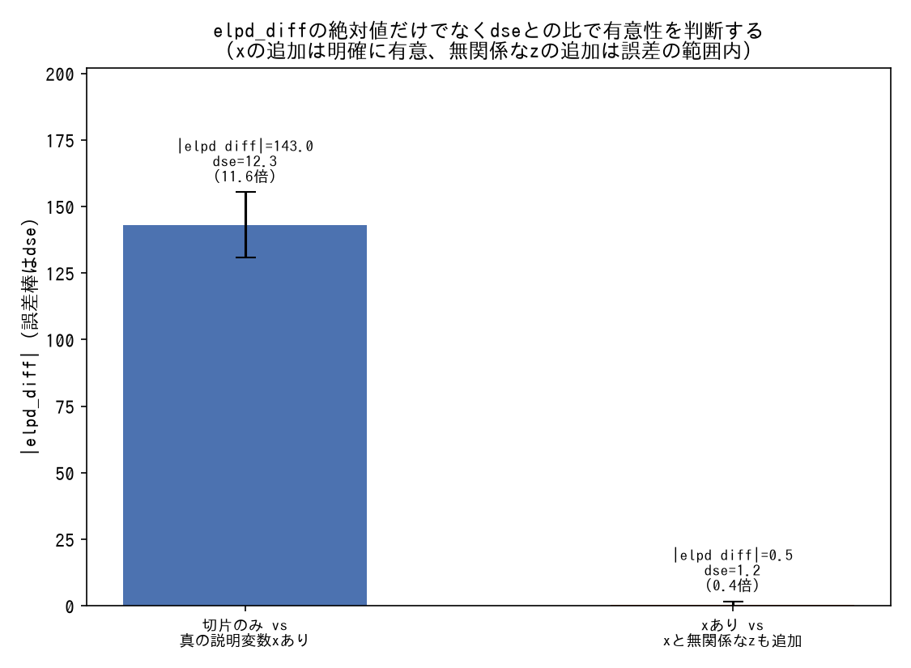
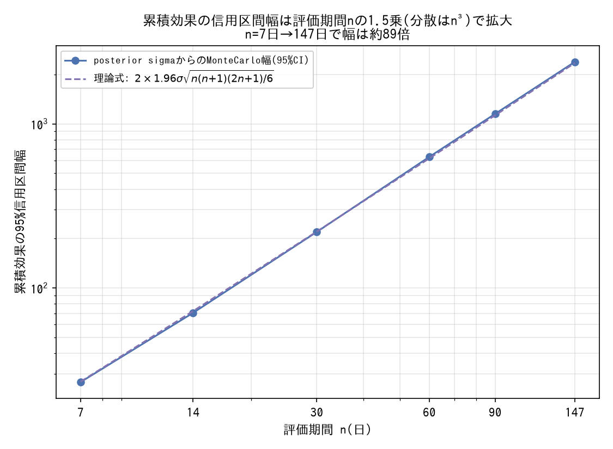
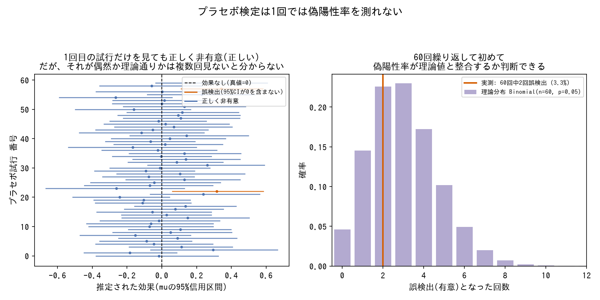
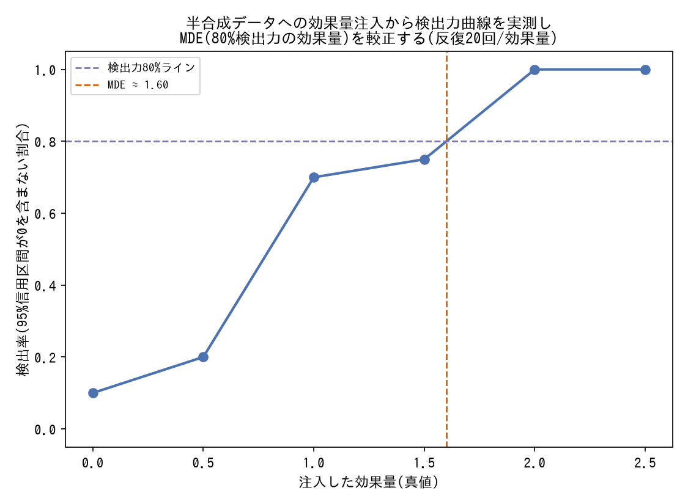
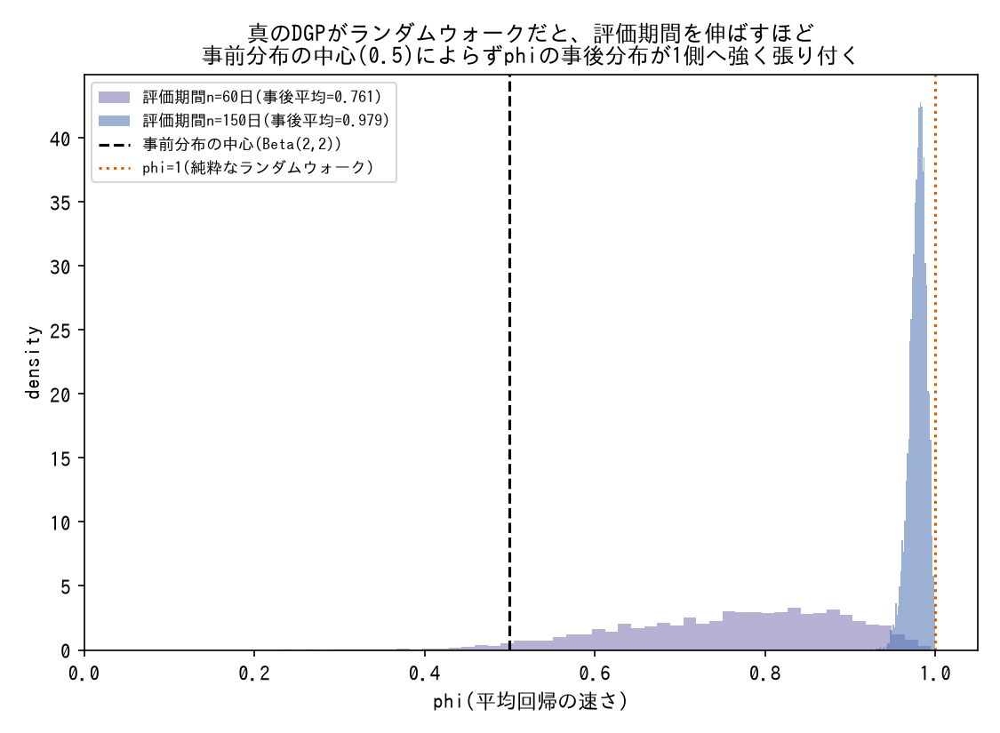

# モデル評価・比較

LOO/AUC/Brier scoreなどの集計指標をどう使い、どう使いすぎないか。

---

### 集計指標だけでモデルの良し悪しを判断しない

- **症状**: LOO・AUC・Brier scoreなど1つの集計指標が良いというだけでモデルを採用すると、局所的なキャリブレーションのズレ(特定の説明変数帯でのみ系統的にズレるなど)を見逃す。
- **対処**: 集計指標に加えて、帯ごとのz値診断など局所的なキャリブレーション診断で裏を取る。対数尤度は確率が0付近だと鈍感になるなど、指標ごとの感度特性を理解しておく。
- **なぜ効くか**: 集計指標は全データを平均するため、一部の領域だけで起きている系統的な誤差を打ち消してしまうことがある。
- **登場プロジェクト**: [bayesian-A-B-testing](https://github.com/karahashimanato/bayesian-A-B-testing/blob/main/README.md#得られた方法論的な学び)

---

### C-indexとBrier Scoreは独立の問題を測る

*PyMCで実際に2種類のベイズ指数分布ハザードモデル(共変量なし/共変量あり)をフィットし、ホールドアウトデータでC-indexとBrier Scoreを計算した結果(生成スクリプト: [scripts/generate_model_evaluation_plots.py](../scripts/generate_model_evaluation_plots.py))。*

- **症状**: 「順位付け(誰が先にイベントを迎えるか)」の指標(C-index)が改善したことをもって、「確率の絶対値」の較正(Brier Score)も改善したと誤解する。
- **対処**: 両指標を別々に確認する。C-indexが `0.767→0.798` と向上しても、Brier Scoreは `0.104→0.101` とほぼ変化しないことがある。
- **なぜ効くか**: 順位付けの正しさと確率較正の正しさは数学的に独立な性質であり、一方の改善がもう一方を保証しない。各指標そのものの定義は[tools/evaluation-metrics.md](../tools/evaluation-metrics.md#c-index-time-dependent-auc)を参照。
- **登場プロジェクト**: [bayesian-hazard-models](https://github.com/karahashimanato/bayesian-hazard-models/blob/main/README.md#2-予測性能評価とモデル比較-held-outデータによる検証)

---

### LOOの差は標準誤差(dse)と比較して評価する

*3つのベイズ線形回帰モデル(切片のみ/真の説明変数xあり/xと無関係なノイズ変数zも追加)をPyMCで実際にサンプリングし、`az.compare`でelpd_diffとdseを算出した結果(生成スクリプト: [scripts/generate_model_evaluation_plots.py](../scripts/generate_model_evaluation_plots.py))。LOOそのものの仕組みは[tools/evaluation-metrics.md](../tools/evaluation-metrics.md#loo-leave-one-out-cross-validation-psis-loo)を参照。*

- **症状**: `elpd_diff` の絶対値の大きさだけを見て「圧倒的に優れている」と判断すると、誤差の範囲内かもしれない差を過大評価する。
- **対処**: `elpd_diff` を標準誤差 `dse` で割り、何倍の差があるかで有意性を判断する(例: 差が標準誤差の約6倍)。あわせて有効パラメータ数 `p_LOO` の増加が過学習のペナルティとして妥当な範囲かも確認する。
- **なぜ効くか**: `elpd_diff` 単体では不確実性の大きさがわからず、`dse` との比較で初めて「意味のある差か」を判断できる。LOOそのものの仕組みは[tools/evaluation-metrics.md](../tools/evaluation-metrics.md#loo-leave-one-out-cross-validation-psis-loo)を参照。
- **登場プロジェクト**: [bayesian-hazard-models](https://github.com/karahashimanato/bayesian-hazard-models/blob/main/README.md#2-予測性能評価とモデル比較-held-outデータによる検証)

---

### 意思決定に使う推定は、信用区間が安定している範囲に限定する

- **症状**: 限界効果や変曲点がデータの疎な領域(端の方)に出た場合、それは真の構造ではなく過適合の産物である可能性がある。
- **対処**: 変曲点やピークがデータの疎な端に出ていないか確認し、出ている場合はモデルを複雑にするのではなく「信頼できる適用範囲を明示して打ち切る」方針を取る。
- **なぜ効くか**: モデルの複雑化は新たな非識別性を生みうる([reparameterization.md](reparameterization.md)参照)一方、適用範囲を正直に絞ることは副作用がなく、実務判断としても誠実。
- **登場プロジェクト**: [bayesian-A-B-testing](https://github.com/karahashimanato/bayesian-A-B-testing/blob/main/README.md#分析の流れnotebooks)

---

### 階層モデルの収縮(shrinkage)バイアスは事前分布の調整だけでは消えないことがある

- **症状**: 階層DM推定量は単純平均よりMAEが約1/3小さく全体としては優れているが、真のCTRが高い腕を体系的に過小評価し、低い腕を過大評価する収縮バイアスを持つ。Student-t事前分布や事前分布スケールの変更を試しても緩和できなかった。
- **対処**: 「全体の誤差(MAE)が小さいこと」と「両端の腕で系統的にバイアスがあること」を分けて評価する。今回の試行数では事後分布がすでにデータ支配的(事前分布の形をほぼ無視する水準)であることを確認し、緩和策の限界として記録した。
- **なぜ効くか**: 階層モデルの収縮は「他の腕の情報を借りて分散を減らす」という設計そのものに由来するバイアスであり、事前分布の形状を変える調整では原理的に消しきれない場合がある。全体指標(MAE)だけでなく、腕ごとの系統誤差を分けて見ないと発見できない。
- **登場プロジェクト**: [Multi-Armed-Bandit](https://github.com/karahashimanato/Multi-Armed-Bandit/blob/main/README.md#主な発見)

---

### 特殊構造の下で推定量どうしが一致することを確認し、実装の妥当性検証に使う

- **症状**: 複数の評価指標・推定量(SNIPS, SNDR, 単純平均DMなど)を実装した際、それぞれが独立に正しく実装されているかを検証する手段が乏しい。
- **対処**: 「ランダム方策の一様な傾向スコア」のような特殊構造の下では、理論的に複数の推定量が数式的に一致するはずだという性質を利用し、実データで実際に一致することを確認する。
- **なぜ効くか**: 特殊ケースでの理論的な恒等式は、実装のバグ検出に使える強力な回帰テストになる。一致しなければ実装のどこかが誤っている。各推定量そのものの定義は[tools/evaluation-metrics.md](../tools/evaluation-metrics.md#sndr-self-normalized-dr)を参照。
- **登場プロジェクト**: [Multi-Armed-Bandit](https://github.com/karahashimanato/Multi-Armed-Bandit/blob/main/README.md#主な発見)

---

### 独立した外部データ・公開指標との突き合わせで妥当性を検証する

- **症状**: モデルの評価指標(LOO, AUC, OPE推定値など)がモデル内部で自己完結していると、「モデルの中では良く見えるが現実とズレている」可能性を排除できない。
- **対処**: モデルの外にある独立した情報源と突き合わせる。例えば、ログのみから算出したOPE推定値ランキングと、実際の本番方策が収束した腕の選択頻度との順位相関(Spearman)を確認する(rho=0.79)。あるいは集計モデル(BigQuery側)の推定と個体レベルモデル(ローカル側)の推定を突き合わせ、集計由来のバイアス(ecological bias)が生じていないかを検証する。既知の公開オンチェーン指標(UTXO Age Bands等)との突き合わせも同じ位置づけ。
- **なぜ効くか**: モデル内部の診断(収束・尤度・集計指標)はすべて「モデルの前提が正しい」という条件付きの保証にすぎない。前提そのものの妥当性は、モデルの外にある独立した情報と照らし合わせない限り確認できない。ecological biasそのものの定義は[tools/statistical-biases.md](../tools/statistical-biases.md#ecological-bias生態学的錯誤)を参照。
- **登場プロジェクト**: [Multi-Armed-Bandit](https://github.com/karahashimanato/Multi-Armed-Bandit/blob/main/README.md#主な発見) / [bitcoin-utxo-survival](https://github.com/karahashimanato/bitcoin-utxo-survival/blob/main/README.md#背景目的)

---

### PPCが良好でも、モデルの機構が現象を説明しているとは限らない

- **症状**: Posterior Predictive Check(観測値が予測区間に収まる、分布形状が一致する)の結果が良好でも、それがモデルの構造(パラメータの意味する機構)が現象を正しく説明していることの証明にはならない場合がある。特に潜在変数(process noiseなど)が各時点で自由に調整可能なモデルでは、機構部分が何も説明していなくても、潜在変数側が観測値に「帳尻合わせ」して見かけ上良好なPPCを作れてしまう。
- **対処**: 潜在変数(process noise等)を使わず、構造パラメータの事後サンプルのみで決定論的にモデルを走らせるforward simulationを行い、実データの主要な特徴(周期性など)を再現できるか検証する。
- **なぜ効くか**: PPCは「観測値と整合する予測ができるか」しか検証しない。自由度の高い潜在変数がある場合、その整合性はモデル構造の正しさではなく潜在変数の柔軟性に由来しうる。潜在変数を封じた状態での検証によって、初めて「機構による説明」と「自由度による帳尻合わせ」を区別できる。process noise付き非線形状態空間モデルそのものの定義は[tools/state-space-models.md](../tools/state-space-models.md#非線形状態空間モデルprocess-noise付き)を参照。
- **登場プロジェクト**: [bayesian-modeling-lab](https://github.com/karahashimanato/bayesian-modeling-lab/blob/main/README.md#lynx-非線形状態空間モデル)

---

### 「有意なパラメータ」と「狙っていた問題の解決」は別軸で検証する

- **症状**: モデルに追加したパラメータ(leverage effectの $\rho$など)が統計的に明確な値(信用区間が0を含まない)を示したため、それによって当初解決したかった問題(ACFのギャップなど)も解決したと判断してしまう。
- **対処**: パラメータの有意性(事後分布が0を含まないか)と、当初の診断で見つかった具体的な問題(可視化・診断指標の特定のギャップ)が実際に解消したかを、別々に確認する。
- **なぜ効くか**: あるパラメータの追加がモデルの当てはまりを何らかの意味で改善させることと、分析者が狙っていた特定の現象を説明できるようになることは、必ずしも同じではない。前者だけを見て満足すると、本当の問題を見過ごしたまま「改善した」と誤認する。
- **登場プロジェクト**: [bayesian-modeling-lab](https://github.com/karahashimanato/bayesian-modeling-lab/blob/main/README.md#日経225-stochastic-volatility)

---

### 累積効果の分散はランダムウォークの評価期間の3乗で増える

*局所レベル(GaussianRandomWalk)モデルをPyMCで実際にサンプリングし、事後のσから累積効果をMonte Carloシミュレーションした結果(理論式と実測がほぼ一致することも確認済み。生成スクリプト: [scripts/generate_model_evaluation_plots.py](../scripts/generate_model_evaluation_plots.py))。*

- **症状**: BSTS(CausalImpact型)でローカルレベルトレンド(`GaussianRandomWalk`)を持つモデルの反実仮想を長期間(147日)にわたって累積すると、95%信用区間が±150を超えるほど広がり、30%という大きな注入効果ですら検出できなくなる。
- **対処**: 累積効果を評価する期間を短く(介入直後の1〜2週間程度に)絞る。`level[t]=level[t-1]+ε_t`をn日分累積和した分散は`sigma_level²×n(n+1)(2n+1)/6`(nの3乗のオーダー)で増加するため、評価期間を147日→7日に短縮するだけで信用区間の幅は数十分の一まで縮む。
- **なぜ効くか**: ランダムウォークの各時点の値は直前までの全ての増分を引きずっており、それをさらに長期間合計すると、個々の増分の不確実性が何重にも積み重なる。評価期間を短くすることは、この積み重なりの回数そのものを減らすことに相当する。ローカルレベルの定義そのものは[tools/state-space-models.md](../tools/state-space-models.md#gaussianrandomwalk時変パラメータの状態空間表現)を参照。
- **登場プロジェクト**: [bayesian-causal-inference](https://github.com/karahashimanato/bayesian-causal-inference/blob/main/README.md#学び)

---

### プラセボ検定は1回では偽陽性率を測れない

*PyMCで実際にベイズ平均推定モデルを60回フィットし、各回の95%信用区間が0を含むかを判定した結果(生成スクリプト: [scripts/generate_model_evaluation_plots.py](../scripts/generate_model_evaluation_plots.py))。*

- **症状**: time placebo(架空の介入日での検定)を1つの日付だけで行い「有意な効果は検出されなかった」ことをもって手法の頑健性を確認したつもりになっていたが、95%信用区間による判定は理論上5%の確率で誤検出するはずであり、1回の試行だけでは「本当に頑健なのか」「たまたま外れなかっただけか」を統計的に区別できない。
- **対処**: 架空の介入日を複数(例: 8つ)設定して繰り返し、実測の偽陽性率を集計する。得られた偽陽性率が理論値(5%)と統計的に矛盾しないか(二項分布で`P(検出回数≥observed)`を計算するなど)を確認する。
- **なぜ効くか**: 半合成キャリブレーションを25回反復して検出率を測定するのと同じ理屈で、プラセボ検定も「1回の結果」ではなく「繰り返した結果の分布」で評価しないと、判定基準(信用区間・有意水準)が実際に約束通りの誤り率で機能しているかを検証したことにならない。
- **登場プロジェクト**: [bayesian-causal-inference](https://github.com/karahashimanato/bayesian-causal-inference/blob/main/README.md#学び)

---

### 半合成データへの効果量注入で検出力(MDE)をキャリブレーションする

*既知の効果量を注入した半合成データを残差プールのブートストラップ再サンプリングで反復ごとに変えながら生成し、ベイズ的な平均差検定(95%信用区間が0を含まないか)をPyMCで実際に20回ずつ繰り返して検出率を実測した結果(生成スクリプト: [scripts/generate_model_evaluation_plots.py](../scripts/generate_model_evaluation_plots.py))。*

- **症状**: 観測データにモデルを当てて「有意な効果が検出されなかった」という結果だけでは、それが「本当に効果がない」のか「モデルの検出力が低いだけ」なのかを区別できない。
- **対処**: 実データの季節性・過分散・対照系列との相関構造を保ったまま、既知の大きさの効果を人為的に注入した半合成データセットを複数生成し(残差のブートストラップ再サンプリングで反復ごとにノイズを変える)、効果量ごとに検出率を測定する。得られた検出力曲線から最小検出可能効果(MDE)を推定し、実データの結果をその文脈で解釈する。
- **なぜ効くか**: 半合成データは真の効果量が既知なので、「モデルがどの程度の効果量から検出できるか」を直接測定できる。これにより、実データでの「効果なし」という結果が、真に効果がなかったためなのか、あるいは効果がMDEを下回っていたに過ぎないのかを定量的に切り分けられる。
- **登場プロジェクト**: [bayesian-causal-inference](https://github.com/karahashimanato/bayesian-causal-inference/blob/main/README.md#学び)

---

### モデル構造を変えても、データがそれを支持しなければ挙動は変わらない

*真のデータ生成過程が純粋なランダムウォーク(平均回帰なし)であるデータに対し、平均回帰を許すAR(1)型local levelモデルをKalmanフィルタで周辺化しPyMCで実際にサンプリングした結果(divergence=0、r_hat=1.00。生成スクリプト: [scripts/generate_model_evaluation_plots.py](../scripts/generate_model_evaluation_plots.py))。*

- **症状**: BSTSのローカルレベルを、累積効果の分散発散を抑える狙いで単純なランダムウォークから平均回帰を持つAR(1)型(`level[t]=level_mean+φ(level[t-1]-level_mean)+eps`)に置き換えたが、147日という長い評価窓での検出力はほとんど改善しなかった。
- **対処**: 事後分布の`φ`(平均回帰の速さ、1に近いほど単純なランダムウォークに近い)を確認したところ0.981という値になっており、モデル構造上は平均回帰を持たせたはずが、実質的にほぼ単純なランダムウォークのまま推定されていたことが判明した。
- **なぜ効くか**: `φ`のようなpersistenceパラメータは、それを制約するだけの情報(十分に長い観測期間、明確な平均回帰の兆候)がデータになければ、事前分布が許容する範囲の端(非定常に近い側)に事後分布が張り付いてしまう。モデルの構造を変えることと、その構造がデータによって実際に支持されることは別問題であり、狙った効果が出たかは推定されたパラメータの値まで確認しないと分からない。
- **登場プロジェクト**: [bayesian-causal-inference](https://github.com/karahashimanato/bayesian-causal-inference/blob/main/README.md#学び)

---

### 分析結果を過大解釈せず、証明できたこと/できていないことを分けて言語化する

- **症状**: モデルがきれいに収束し、パラメータが明確な値(高い集中度など)を示すと、それをそのまま「当初期待していた知見の発見」として報告してしまう。
- **対処**: 分析の最後に「この分析で証明できたことは何か」「証明できていないことは何か」を切り分けて明示する。データソースの限界(非公式、小サンプルなど)も含めて検討し、実際の位置づけ(例: 新しい知見の発見ではなく、モデルが既知の性質を正しく検出できることのsanity check)を正直に評価する。
- **なぜ効くか**: 「モデルが健全に収束したこと」「パラメータが明確な値を示したこと」は、分析の入り口が意図した問いに答えられたことを保証しない。結果の解釈自体を批判的に検討する工程を挟むことで、過大な主張を避けられる。
- **登場プロジェクト**: [bayesian-modeling-lab](https://github.com/karahashimanato/bayesian-modeling-lab/blob/main/README.md#ポケモンカード封入率-階層ベイズdirichlet-multinomial)

---

### カーネル/近似手法ごとに外挿での挙動が全く異なるため、観測域内の当てはまりとは別に外挿時の振る舞いを確認する

- **症状**: 標準RBFカーネル・複合カーネル・HSGP(Poisson尤度)・VFE(スパースGP)の4ケースはいずれも観測範囲内でdivergence=0・r_hat=1.00前後という健全なサンプリング診断と良好なin-sampleフィットを示すが、観測域外への外挿の挙動は手法ごとに全く異なる: RBF単体は事前平均(0)へ回帰、複合カーネルはトレンド成分のみ事前平均へ回帰し季節周期は持続、HSGP(大域基底関数近似)は学習域外で早期に発散(2028年時点で12万件超、2035年には77万件)、VFE(誘導点近似)は季節周期を安定して継続。健全なサンプリング診断・良好なin-sampleフィットだけでは、この外挿挙動の違いを検出できない。
- **対処**: 観測範囲内の当てはまりの確認とは別に、`gp.conditional`などで意図的に観測域外まで予測を延ばし、モデル構造(カーネル/近似手法の組み合わせ)ごとの外挿挙動を個別に確認する。
- **なぜ効くか**: 外挿時の挙動はカーネルの関数形(RBFは長さスケールを超えると事前平均へ回帰する性質を持つ)や近似手法の数学的構造(HSGPは有限個の大域基底関数の線形結合、VFEは誘導点近傍での厳密カーネル近似)に依存し、観測データ自体には現れない。in-sample指標だけを見て「このモデルは良い」と判断すると、外挿の信頼性という別軸のリスクを見逃す。
- **登場プロジェクト**: [bayesian-gaussian-process](https://github.com/karahashimanato/bayesian-gaussian-process/blob/main/README.md#総括-ケース別チェックリスト)
