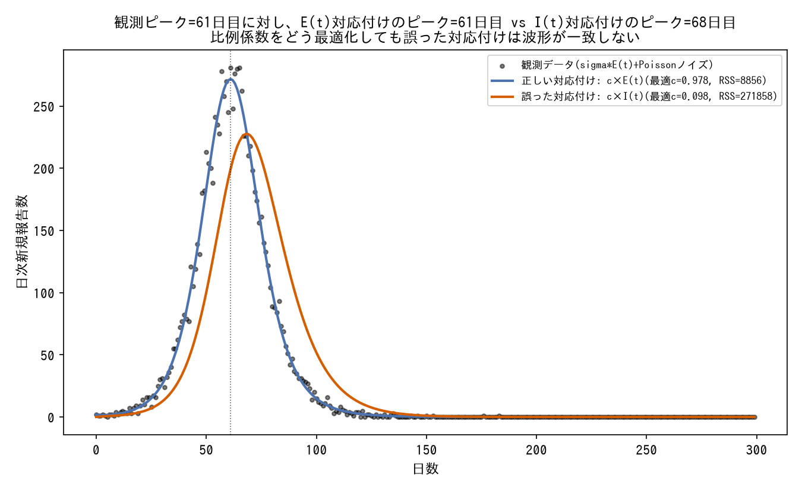
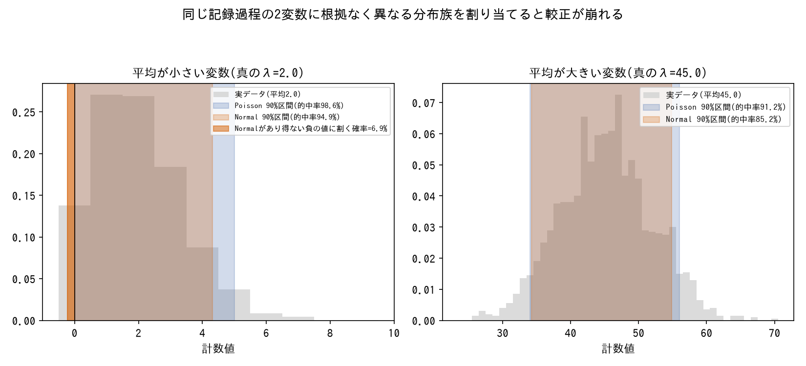
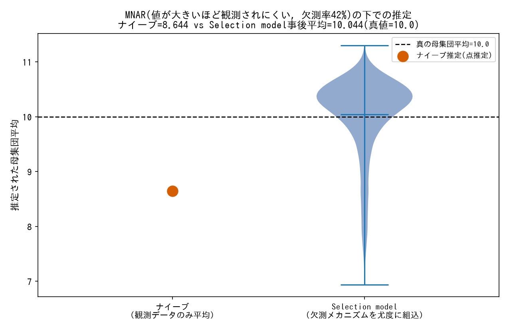
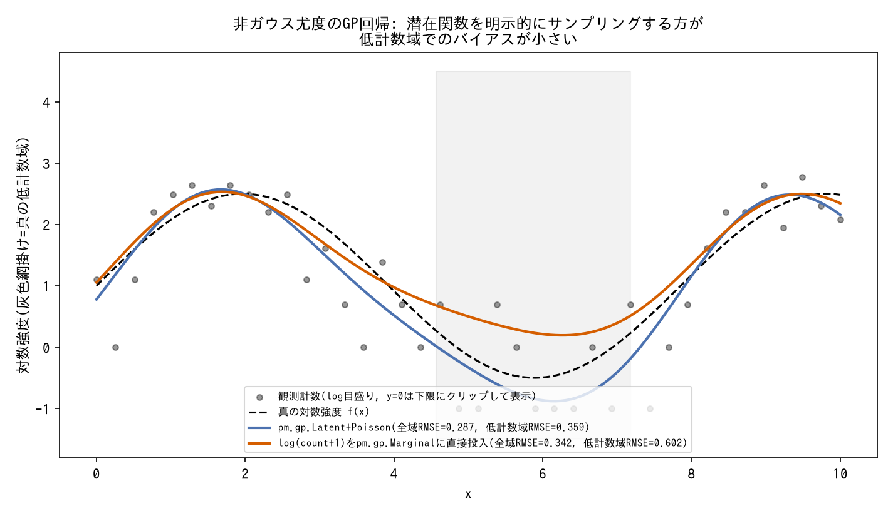

# 尤度・観測モデル選択

観測データを生成過程のどの量に結びつけるか、どの分布族を選ぶか。

---

### 観測変数がモデルのどの量に対応するかを明示的に検討する

*SEIRモデルをEuler法で数値積分し、真の観測(sigma×E(t)+Poissonノイズ)に対して、正しい対応付け(c×E(t))と誤った対応付け(c×I(t))それぞれの最小二乗最適な比例係数cで当てはめた結果(生成スクリプト: [scripts/generate_observation_model_plots.py](../scripts/generate_observation_model_plots.py))。*

- **症状**: 観測データ(incidence, daily new casesなど)が、モデル内のどの状態変数・どの流量に対応するかが自明でない場合、誤った対応付けをすると尤度全体が意味を持たなくなる。
- **対処**: 「incidenceはI(t)そのものか、β・S・I/Nか、γ・Iか」のように候補を列挙し、データの前提(平衡期データか、報告のタイミングか)から選択根拠を明示する。SEIRでは「E(潜伏期)は観測に直接現れない部分観測系」であることを踏まえ `daily_new ≈ σ・E(t)` を採用。
- **なぜ効くか**: 観測モデルの選択を誤ると、以降どれだけパラメータを調整しても構造的に正しい結果に辿り着けない。
- **登場プロジェクト**: [bayesian-epidemiological-models](https://github.com/karahashimanato/bayesian-epidemiological-models/blob/main/README.md#sis-ナイジェリア-マラリア罹患率)

---

### 同一の観測プロセスなら分布族を統一する

*同一のPoisson記録過程から生まれた平均の異なる2つの計数変数に対し、統一してPoisson尤度を使った場合と、根拠なくNormal尤度を割り当てた場合の90%予測区間の較正を比較した結果(生成スクリプト: [scripts/generate_observation_model_plots.py](../scripts/generate_observation_model_plots.py))。*

- **症状**: 複数の観測変数(S, Iなど)に対して、根拠なく異なる分布族を割り当ててしまう。
- **対処**: 「村の記録という同一観測プロセス」のように観測が生成される仕組みが同じなら、尤度の分布族もPoissonなどで統一する。
- **なぜ効くか**: 観測プロセスの実態とモデルの仮定を一致させることで、恣意的なモデル選択を避けられる。Poissonそのものの定義・制約は[tools/observation-models.md](../tools/observation-models.md#poisson)を参照。
- **登場プロジェクト**: [bayesian-epidemiological-models](https://github.com/karahashimanato/bayesian-epidemiological-models/blob/main/README.md#sir-eyamペスト流行1666)

---

### 右側打ち切りを尤度に直接組み込む

*PyMCで実際に指数分布ハザードの生存時間モデルを2通り(`pm.Potential`で打ち切りを正しく組み込み/打ち切りを無視して全観測をイベント扱い)フィットし、生存曲線を比較した結果(生成スクリプト: [scripts/generate_observation_model_plots.py](../scripts/generate_observation_model_plots.py))。*

- **症状**: 生存時間分析でイベント未発生(打ち切り)のデータを単純に除外・打ち切り時刻をイベント時刻として扱うと、生存確率を過小評価する。
- **対処**: `pm.Potential` を用いて統一対数尤度 `event_i・log h(t_i) + log S(t_i)` を直接実装し、イベント有無で対数尤度の項を切り替える。
- **なぜ効くか**: 打ち切り観測は「少なくともここまでは生存していた」という下限情報を持つため、尤度に正しく組み込むことでバイアスを避けられる。
- **登場プロジェクト**: [bayesian-hazard-models](https://github.com/karahashimanato/bayesian-hazard-models/blob/main/README.md)

---

### 離散潜在状態はforward algorithmで周辺化し`pm.Potential`に組み込む

![2レジームMarkov-Switchingモデルをforward algorithmで周辺化した尤度でPyMCフィットし、推定パラメータ(mu=[0.19, 2.92]、真値は[0, 3])から復元したP(レジーム1)は真のレジームの切り替わりとほぼ一致し、時点ごとのレジーム判定精度は94.7%だった](../assets/observation-model/markov_switching_forward_algorithm.png)

*合成データ(自己遷移確率0.95/0.90の2レジームHMM)に対し、`pytensor.scan`によるforward algorithmで周辺化した対数尤度を`pm.Potential`としてNUTSでフィットし、推定パラメータからforward algorithmで復元したレジーム確率と真のレジームを比較した結果(生成スクリプト: [scripts/generate_observation_model_plots.py](../scripts/generate_observation_model_plots.py))。*

- **症状**: Markov-Switching Modelのようにレジーム(離散潜在状態 $S_t$)を持つモデルは、 $S_t$を直接MCMCでサンプリングしようとすると離散変数のHMC/NUTSが扱いづらく、Compound Step(離散部分はMetropolis)によりESSが著しく低下する。
- **対処**: $S_t$自体をサンプリングせず、forward algorithmで各時点の状態確率分布を`pytensor.scan`で逐次更新し、対数周辺尤度を`pm.Potential`としてモデルに直接加える。連続パラメータ(遷移確率・平均・分散)だけをNUTSでサンプリングすればよい形に変換する。
- **なぜ効くか**: 離散潜在状態を解析的に積分(周辺化)してしまうことで、サンプラーは連続パラメータ空間だけを探索すればよくなり、離散変数由来の低ESS問題を根本的に回避できる。離散HMM系のベイズ実装における定石。forward algorithmそのものの仕組みは[tools/observation-models.md](../tools/observation-models.md#forward-algorithm離散潜在状態の周辺化尤度)を参照。
- **登場プロジェクト**: [bayesian-modeling-lab](https://github.com/karahashimanato/bayesian-modeling-lab/blob/main/README.md#日経225-markov-switching-model)

---

### 点過程の対数尤度は`pm.Potential`で直接記述する

![Hawkes過程の対数尤度をpm.Potentialで直接記述して真のパラメータを復元: 真の分岐比0.60に対し事後平均の分岐比0.584(95%区間[0.468, 0.707])、強度関数λ(t)も真の形状とほぼ重なる](../assets/observation-model/point_process_potential.png)

*Ogata's thinning algorithmで生成した指数核Hawkes過程のイベント列(n=444)に対し、対数尤度(イベント項の再帰和+補償項)を`pytensor.scan`とpm.Potentialで直接記述してNUTSでフィットした結果(生成スクリプト: [scripts/generate_observation_model_plots.py](../scripts/generate_observation_model_plots.py))。*

- **症状**: 自己励起点過程(Hawkes/ETAS)のような連続時間イベントデータの尤度 $\log L = \sum_i\log\lambda(t_i) - \int_0^T\lambda(t)\,dt$ は、`pm.Normal`等の既製の確率分布に対応しない。
- **対処**: `pm.Potential`で対数尤度を直接記述する。積分項は、強度関数のカーネルが指数減衰など解析的に積分可能な形であれば、解析解をそのままコードに書き下ろす。
- **なぜ効くか**: PyMCの確率分布は「既知の分布族の対数密度」を前提にしているため、点過程のように尤度が総和と積分の組み合わせで表現される場合は、`pm.Potential`で任意のスカラー(対数尤度)をモデルに加える仕組みを使うしかない。MSMのforward algorithmと同じ「既製の分布に押し込めない尤度は`pm.Potential`で書く」という設計パターンの一例。Hawkes過程そのものの定義は[tools/observation-models.md](../tools/observation-models.md#hawkes過程点過程の尤度)を参照。
- **登場プロジェクト**: [bayesian-modeling-lab](https://github.com/karahashimanato/bayesian-modeling-lab/blob/main/README.md#能登半島地震-自己励起点過程hawkesetas)

---

### MNAR(欠測が値自体に依存する)が疑われる場合は、欠測メカニズム自体を尤度に組み込む

*値が大きいほど観測されにくいMNARメカニズム(Φ型のprobit選択関数)でデータを生成し、観測データのみの単純平均と、欠測尤度をGauss-Hermite求積で数値積分してモデルに組み込んだSelection modelを比較した結果(生成スクリプト: [scripts/generate_observation_model_plots.py](../scripts/generate_observation_model_plots.py))。*

- **症状**: 欠測値を単に潜在変数として自動補完する(観測されていれば普通の尤度、欠測していれば事前分布だけから補完される)フルベイズ同時モデルは、欠測がMCAR/MARであれば妥当だが、欠測の有無が値そのものに依存するMNAR(死亡率が高い国ほど報告されにくい、など)の下では系統的に歪む。しかもMNARかどうかはデータからは直接検証できない(欠測している値は観測できないため)。
- **対処**: 欠測が起こる確率自体を明示的にモデル化する。値と欠測確率の相関パラメータを持つSelection model(Heckman型、`P(観測|y) = Φ(...+ γ_y・y)`のように欠測確率をyに依存させる)、または欠測パターンごとに条件付き分布のズレを感度パラメータδで表現するPattern-mixture modelのいずれかを尤度に組み込み、単純な「欠測=潜在変数」より一段複雑な観測モデルとして扱う。
- **なぜ効くか**: MNARでは「観測される」こと自体が値に関する情報を持つため、欠測を無視した尤度(観測データだけに基づく通常の尤度)はその情報を捨てて母集団の分布を歪めて推定する。Selection model/Pattern-mixture modelはこの「観測されたか否か」という追加の確率過程を尤度の一部として明示的に書き下すことで、少なくとも歪みの方向・大きさを定量化できる。ただしどちらのモデルも、MNARの非識別性(観測データだけからは真の欠測メカニズムを一意に特定できないこと)自体は解消しない。両モデルの数式・使い分けは[tools/missing-data.md](../tools/missing-data.md#selection-modelheckman型)を参照。
- **登場プロジェクト**: [bayesian-missing-data](https://github.com/karahashimanato/bayesian-missing-data/blob/main/README.md#02-mnar--selection-model-vs-pattern-mixture-model)

---

### 非ガウス尤度でGPを使う場合は、解析的周辺化を諦めて潜在関数を明示的にサンプリングする

*Poisson尤度(`y ~ Poisson(exp(f(x)))`)で生成した合成データに対し、`pm.gp.Latent`で潜在関数fを明示的にサンプリングする正しいアプローチと、`log(count+1)`をガウス近似して`pm.gp.Marginal`に直接投入する簡便法を比較した結果(生成スクリプト: [scripts/generate_observation_model_plots.py](../scripts/generate_observation_model_plots.py))。*

- **症状**: ガウス尤度のGP回帰(`y ~ Normal(f(x), sigma)`)では`pm.gp.Marginal`により潜在関数`f`を解析的に周辺化(積分消去)し、ハイパーパラメータだけをサンプリングできるが、Poissonのような非ガウス尤度(`y ~ Poisson(exp(f(x)))`)ではこの周辺化に使う共役性が成り立たず、同じ手法が使えない。
- **対処**: `pm.gp.Latent`(または大規模データでは基底関数近似の`pm.gp.HSGP`)に切り替え、潜在関数`f`自体を明示的な確率変数としてモデルに含め、NUTSでハイパーパラメータと`f`を同時にサンプリングする。
- **なぜ効くか**: 解析的周辺化はガウス尤度という共役性に依存する数学的トリックであり、尤度が非ガウスになるとその閉形式が失われる。潜在関数を明示的にサンプリングする分だけ計算コストが増え、平均関数との交絡や基底関数近似特有の退化といった新たな非識別性のリスクも生じる([techniques/reparameterization.md](reparameterization.md#gpの平均関数を固定定数にし基底関数数を絞ることで非識別性を解消する)参照)。GPの推論手法そのものの定義は[tools/inference-methods.md](../tools/inference-methods.md#pmgpmarginalgpの解析的周辺化)を参照。
- **登場プロジェクト**: [bayesian-gaussian-process](https://github.com/karahashimanato/bayesian-gaussian-process/blob/main/README.md#非ガウス尤度ポアソン-山火事件発生件数)
