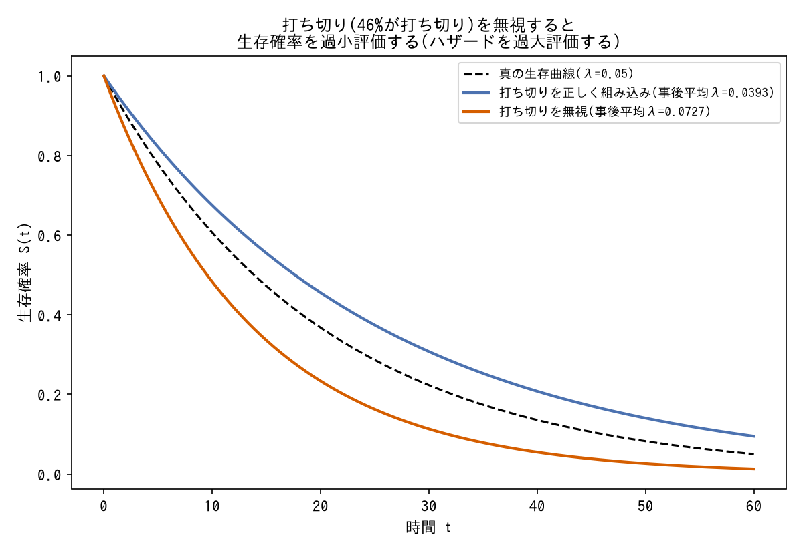

# 尤度・観測モデル選択

観測データを生成過程のどの量に結びつけるか、どの分布族を選ぶか。

---

### 観測変数がモデルのどの量に対応するかを明示的に検討する

- **症状**: 観測データ(incidence, daily new casesなど)が、モデル内のどの状態変数・どの流量に対応するかが自明でない場合、誤った対応付けをすると尤度全体が意味を持たなくなる。
- **対処**: 「incidenceはI(t)そのものか、β・S・I/Nか、γ・Iか」のように候補を列挙し、データの前提(平衡期データか、報告のタイミングか)から選択根拠を明示する。SEIRでは「E(潜伏期)は観測に直接現れない部分観測系」であることを踏まえ `daily_new ≈ σ・E(t)` を採用。
- **なぜ効くか**: 観測モデルの選択を誤ると、以降どれだけパラメータを調整しても構造的に正しい結果に辿り着けない。
- **登場プロジェクト**: [bayesian-epidemiological-models](https://github.com/karahashimanato/bayesian-epidemiological-models/blob/main/README.md#sis-ナイジェリア-マラリア罹患率)

---

### 同一の観測プロセスなら分布族を統一する

- **症状**: 複数の観測変数(S, Iなど)に対して、根拠なく異なる分布族を割り当ててしまう。
- **対処**: 「村の記録という同一観測プロセス」のように観測が生成される仕組みが同じなら、尤度の分布族もPoissonなどで統一する。
- **なぜ効くか**: 観測プロセスの実態とモデルの仮定を一致させることで、恣意的なモデル選択を避けられる。Poissonそのものの定義・制約は[tools/observation-models.md](../tools/observation-models.md#poisson)を参照。
- **登場プロジェクト**: [bayesian-epidemiological-models](https://github.com/karahashimanato/bayesian-epidemiological-models/blob/main/README.md#sir-eyamペスト流行1666)

---

### 右側打ち切りを尤度に直接組み込む

*PyMCで実際に指数分布ハザードの生存時間モデルを2通り(`pm.Potential`で打ち切りを正しく組み込み/打ち切りを無視して全観測をイベント扱い)フィットし、生存曲線を比較した結果(生成スクリプト: [scripts/generate_observation_model_plots.py](../scripts/generate_observation_model_plots.py))。*

- **症状**: 生存時間分析でイベント未発生(打ち切り)のデータを単純に除外・打ち切り時刻をイベント時刻として扱うと、生存確率を過小評価する。
- **対処**: `pm.Potential` を用いて統一対数尤度 `event_i・log h(t_i) + log S(t_i)` を直接実装し、イベント有無で対数尤度の項を切り替える。
- **なぜ効くか**: 打ち切り観測は「少なくともここまでは生存していた」という下限情報を持つため、尤度に正しく組み込むことでバイアスを避けられる。
- **登場プロジェクト**: [bayesian-hazard-models](https://github.com/karahashimanato/bayesian-hazard-models/blob/main/README.md)

---

### 離散潜在状態はforward algorithmで周辺化し`pm.Potential`に組み込む

![2レジームMarkov-Switchingモデルをforward algorithmで周辺化した尤度でPyMCフィットし、推定パラメータ(mu=[0.19, 2.92]、真値は[0, 3])から復元したP(レジーム1)は真のレジームの切り替わりとほぼ一致し、時点ごとのレジーム判定精度は94.7%だった](../assets/observation-model/markov_switching_forward_algorithm.png)

*合成データ(自己遷移確率0.95/0.90の2レジームHMM)に対し、`pytensor.scan`によるforward algorithmで周辺化した対数尤度を`pm.Potential`としてNUTSでフィットし、推定パラメータからforward algorithmで復元したレジーム確率と真のレジームを比較した結果(生成スクリプト: [scripts/generate_observation_model_plots.py](../scripts/generate_observation_model_plots.py))。*

- **症状**: Markov-Switching Modelのようにレジーム(離散潜在状態 $S_t$)を持つモデルは、 $S_t$を直接MCMCでサンプリングしようとすると離散変数のHMC/NUTSが扱いづらく、Compound Step(離散部分はMetropolis)によりESSが著しく低下する。
- **対処**: $S_t$自体をサンプリングせず、forward algorithmで各時点の状態確率分布を`pytensor.scan`で逐次更新し、対数周辺尤度を`pm.Potential`としてモデルに直接加える。連続パラメータ(遷移確率・平均・分散)だけをNUTSでサンプリングすればよい形に変換する。
- **なぜ効くか**: 離散潜在状態を解析的に積分(周辺化)してしまうことで、サンプラーは連続パラメータ空間だけを探索すればよくなり、離散変数由来の低ESS問題を根本的に回避できる。離散HMM系のベイズ実装における定石。forward algorithmそのものの仕組みは[tools/observation-models.md](../tools/observation-models.md#forward-algorithm離散潜在状態の周辺化尤度)を参照。
- **登場プロジェクト**: [bayesian-modeling-lab](https://github.com/karahashimanato/bayesian-modeling-lab/blob/main/README.md#日経225-markov-switching-model)

---

### 点過程の対数尤度は`pm.Potential`で直接記述する

- **症状**: 自己励起点過程(Hawkes/ETAS)のような連続時間イベントデータの尤度 $\log L = \sum_i\log\lambda(t_i) - \int_0^T\lambda(t)\,dt$ は、`pm.Normal`等の既製の確率分布に対応しない。
- **対処**: `pm.Potential`で対数尤度を直接記述する。積分項は、強度関数のカーネルが指数減衰など解析的に積分可能な形であれば、解析解をそのままコードに書き下ろす。
- **なぜ効くか**: PyMCの確率分布は「既知の分布族の対数密度」を前提にしているため、点過程のように尤度が総和と積分の組み合わせで表現される場合は、`pm.Potential`で任意のスカラー(対数尤度)をモデルに加える仕組みを使うしかない。MSMのforward algorithmと同じ「既製の分布に押し込めない尤度は`pm.Potential`で書く」という設計パターンの一例。Hawkes過程そのものの定義は[tools/observation-models.md](../tools/observation-models.md#hawkes過程点過程の尤度)を参照。
- **登場プロジェクト**: [bayesian-modeling-lab](https://github.com/karahashimanato/bayesian-modeling-lab/blob/main/README.md#能登半島地震-自己励起点過程hawkesetas)
