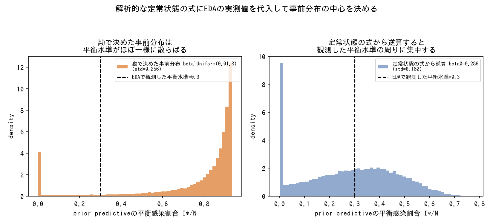
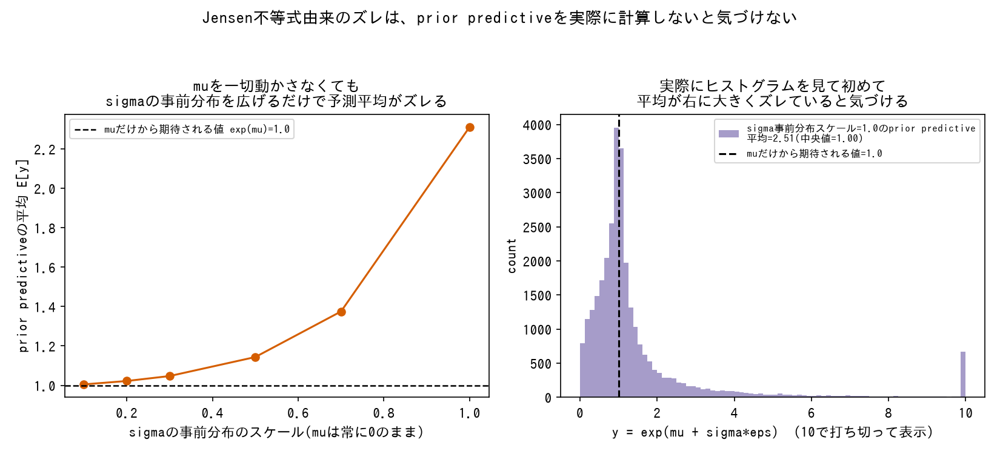
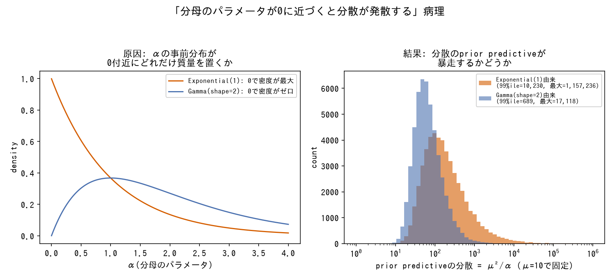
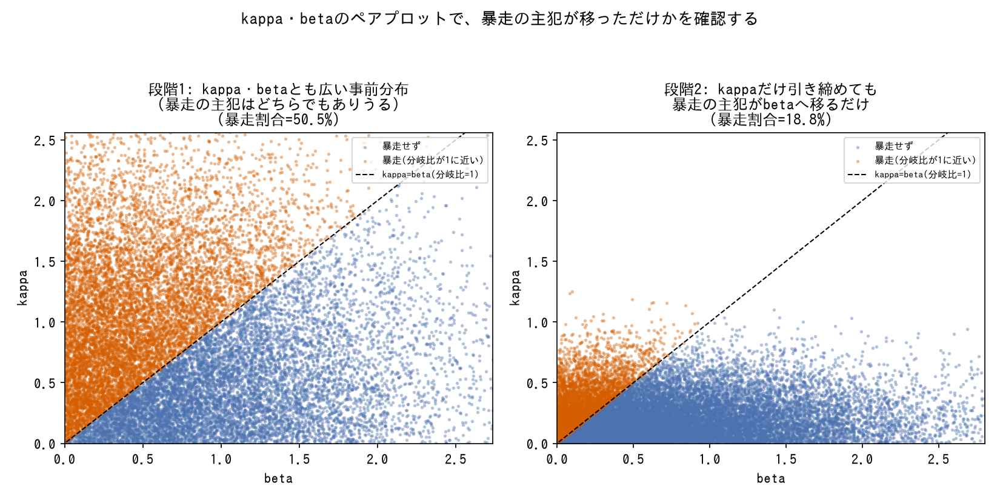
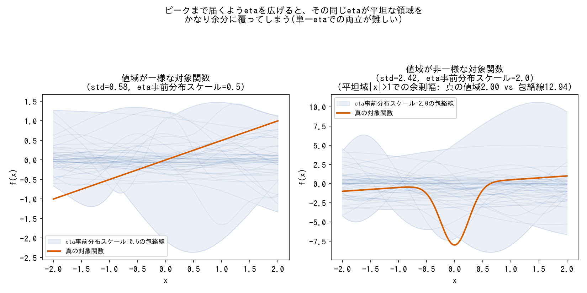
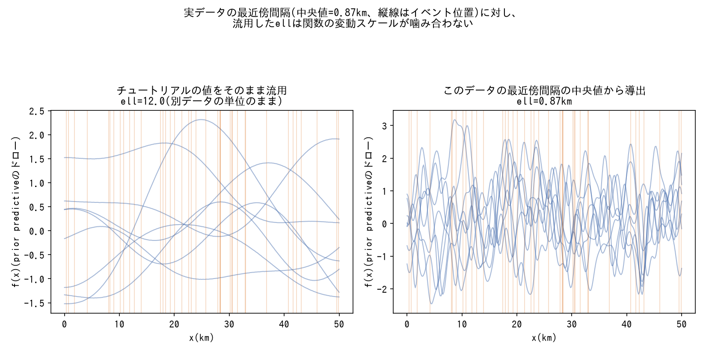
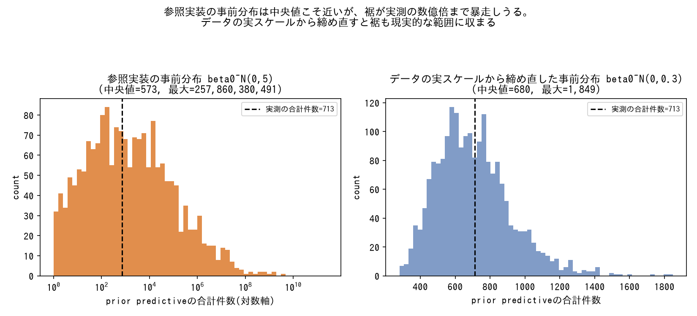

# 事前分布設計・prior predictive check

事前分布のスケールをどう決めるか、サンプリング前にどう検証するか。

---

### 定常状態の解析式に実データを代入して事前分布の中心値を決める

*SISモデルの解析的な定常状態の式に観測した平衡水準を代入してbetaの事前分布の中心を逆算し、勘で決めた事前分布と比較した結果(生成スクリプト: [scripts/generate_prior_predictive_plots.py](../scripts/generate_prior_predictive_plots.py))。*

- **症状**: 事前分布のスケールを勘や一般的な相場観だけで決めると、prior predictiveが非現実的な範囲に暴走する。
- **対処**: モデルの解析的な定常状態(平衡点・ピーク高さなど)の式に、EDAで観測した増減速度・平衡水準・季節振幅を代入して、事前分布の中心値を逆算する。SIR/SIS/SIRS/SEIRの4モデル共通で採用した手順。
- **なぜ効くか**: パラメータ空間で「データと矛盾しない範囲」を先に見積もってから事前分布を置くため、prior predictive checkで何度も往復する回数が減る。
- **登場プロジェクト**: [bayesian-epidemiological-models](https://github.com/karahashimanato/bayesian-epidemiological-models/blob/main/README.md#横断的な学び)

---

### 事前予測チェックはサンプリング前に必ず実施する

*対数正規リンクのモデルで、位置パラメータmuを固定したまま散らばりパラメータsigmaの事前分布だけを広げ、prior predictiveの平均が体系的にズレていく様子を実際に計算した結果(生成スクリプト: [scripts/generate_prior_predictive_plots.py](../scripts/generate_prior_predictive_plots.py))。*

- **症状**: パラメータのスケール設定ミス(予測確率が0/1に張り付く)や、Jensen不等式に起因する非直感的な挙動(他パラメータの分散が加わるだけで予測平均がズレる)は、サンプリング後の診断だけでは気づきにくい。
- **対処**: モデル構築の各段階でサンプリング前にprior predictive checkを行い、予測分布の形・範囲を目視確認する。
- **なぜ効くか**: 事後分布の診断(r_hat/ESS/divergence)が「健全」でも、それはモデルが収束しただけであってモデル設計自体の誤りは検出できない。prior predictiveは設計段階のミスをサンプリング前に切り分けられる数少ない手段。Jensen不等式そのものの定義は[tools/statistical-biases.md](../tools/statistical-biases.md#jensen不等式jensens-inequality)を参照。
- **登場プロジェクト**: [bayesian-A-B-testing](https://github.com/karahashimanato/bayesian-A-B-testing/blob/main/README.md#得られた方法論的な学び)

---

### 「分母のパラメータが0に近づくと分散が発散する」病理は分布族を問わず繰り返す

*prior predictiveを実際にサンプリングした結果(μ²/αの形の分散を例に、αの事前分布による違いを比較。生成スクリプト: [scripts/generate_prior_predictive_plots.py](../scripts/generate_prior_predictive_plots.py))。*

- **症状**: prior predictiveの最大値が現実離れした値(数百〜数千倍)に暴走する。SVモデルの`σ_η^2/(1-φ^2)`、Gamma-Poisson階層モデルの`μ^2/α_conc`、Hawkes過程の減衰項`e^(-β・dt)`(`β→0`で減衰が機能しなくなる)など、形は違うが「あるパラメータが0に近づくと分散・強度が発散する」という同型の構造が、独立した3つのモデルクラスで繰り返し発生した。
- **対処**: 分散が発散しうるパラメータの事前分布を、0付近の密度がゼロになる分布族(`Exponential`ではなく`Gamma(alpha>1, ...)`など)に変更する構造的対処を優先する。平均を動かす対症療法(スケールを緩める)より、分布の形自体を変える方が極端な裾を強く抑制できる。
- **なぜ効くか**: `Exponential`は0付近に確率密度の山を持つため、分母に来るパラメータとして使うと一定確率で分散爆発を引き起こす。`Gamma(shape>1)`は0での密度がゼロになるため、この経路を構造的に塞げる。一方Dirichlet-Multinomialのように「配分先の合計が固定されている」構造では、集中度パラメータが0に近づいても総量自体は上限を超えられないため、同型の発散がそもそも起こらない。「総量が固定か青天井か」を先に見抜けると、prior predictive checkの労力を節約できる。パラメータの性質ごとの事前分布の選び方一般は[tools/prior-distributions.md](../tools/prior-distributions.md)を参照。
- **登場プロジェクト**: [bayesian-modeling-lab](https://github.com/karahashimanato/bayesian-modeling-lab/blob/main/README.md#横断的な学び)

---

### 対処後も、暴走の主犯が別パラメータへ移っていないか都度ペアプロットで確認する

*Hawkes過程の期待総イベント数(分岐比kappa/betaが1に近づくと発散)を例に、kappaの事前分布だけを引き締めた前後でペアプロット上の暴走領域がどう変化するかを実際に計算した結果(生成スクリプト: [scripts/generate_prior_predictive_plots.py](../scripts/generate_prior_predictive_plots.py))。*

- **症状**: 1つのパラメータの事前分布を構造的に対処(0付近の密度をゼロにする分布へ変更)しても、prior predictiveの最大値がまだ大きい(例: 5880→3639)。
- **対処**: 残った暴走の原因を、単一パラメータの事前分布をさらに締めることで済ませず、複数パラメータ間のペアプロット(散布図)で診断し直し、暴走の主犯が別のパラメータに移っていないか確認する。移っていれば、そのパラメータにも同じ構造的対処を適用する。
- **なぜ効くか**: 複数パラメータが絡んで分散・強度を決める構造(Hawkes過程の`κ`と`β`など)では、1つを対処しても残りのパラメータが同じ役割を引き継いで暴走を再現することがある。単発の修正で終わらせず、都度診断し直すことで真に構造的な解決に到達できる。
- **登場プロジェクト**: [bayesian-modeling-lab](https://github.com/karahashimanato/bayesian-modeling-lab/blob/main/README.md#能登半島地震-自己励起点過程hawkesetas)

---

### 判断基準は極値だけでなく割合・信用区間幅で見る

![min/maxの範囲がほぼ同じ2つのprior predictive分布(Beta(5,5)*1000: min=41,max=948、Beta(0.3,0.3)*1000: min=0,max=1000)でも、現実的な範囲[300,700]に入る質量の割合は80.3%と19.0%で大きく異なる](../assets/prior-predictive/extreme_vs_proportion.png)

*Beta(5,5)とBeta(0.3,0.3)を[0,1000]にスケールしたprior predictiveを実際にサンプリングした結果(生成スクリプト: [scripts/generate_prior_predictive_plots.py](../scripts/generate_prior_predictive_plots.py))。*

- **症状**: prior predictiveの最大値・最小値だけを見て「範囲内だから大丈夫」と判断すると、分布の大部分が非現実的な領域に偏っていても見逃す。
- **対処**: 極値(min/max)に加えて、現実的な範囲に入る割合や信用区間の幅で事前分布の妥当性を判断する。
- **なぜ効くか**: 極値は外れ値1つでも動くため、分布全体の健全性の指標としては弱い。
- **登場プロジェクト**: [bayesian-A-B-testing](https://github.com/karahashimanato/bayesian-A-B-testing/blob/main/README.md#得られた方法論的な学び)

---

### GPのprior predictive checkは、ハイパーパラメータドローの包絡線がデータのスケールを覆うかで確認する

![GPハイパーパラメータの事前分布から関数を50回ドローし実データのスケールを覆っているか目視確認する: 包絡線は[-2.89, 4.40]まで広がるが、実データのスケール[-0.5, 1.3]と重なるドローは100%](../assets/prior-predictive/gp_hyperparameter_envelope.png)

*ExpQuad(RBF)カーネルの長さスケール・振幅・観測ノイズを事前分布から実際に50回ドローし、それぞれで得られる関数を計算した結果(生成スクリプト: [scripts/generate_prior_predictive_plots.py](../scripts/generate_prior_predictive_plots.py))。*

- **症状**: ガウス過程回帰では、カーネルの長さスケール(`ell`)・振幅(`eta`)・観測ノイズ(`sigma`)といったハイパーパラメータの事前分布を勘で決めると、生成される関数が実データのスケールに対して滑らかすぎたり暴れすぎたりする。
- **対処**: ハイパーパラメータを事前分布から50回程度ドローし、それぞれで得られる関数のprior predictive分布を実データに重ねて、包絡線が観測データのスケール(世界平均気温偏差なら-0.5〜+1.3℃、Mauna Loa CO2濃度偏差なら±20ppmなど)を覆いつつ暴走していないかを目視確認する。
- **なぜ効くか**: GPの事前分布は個々のハイパーパラメータの数値だけでは直感的に評価しづらく、実際に関数をサンプルして描画することで初めて「この長さスケール・振幅の組み合わせが生成する関数の形」を具体的に検証できる。標準RBFカーネルと複合カーネル(トレンド+季節周期)の双方で同じ確認手順を踏んだ。
- **登場プロジェクト**: [bayesian-gaussian-process](https://github.com/karahashimanato/bayesian-gaussian-process/blob/main/README.md#標準rbfカーネル-世界平均気温偏差) / [bayesian-gaussian-process](https://github.com/karahashimanato/bayesian-gaussian-process/blob/main/README.md#複合カーネル-mauna-loa-co2濃度)

---

### 対象関数のダイナミックレンジが不均一だと、単一のGPハイパーパラメータでの被覆が難しくなる

*値域が一様な対象関数と、大部分が平坦だが一部だけ急峻な(非一様な)対象関数とで、GPのprior predictive包絡線を実際に計算し、単一のetaで両立させることの難しさを比較した結果(生成スクリプト: [scripts/generate_prior_predictive_plots.py](../scripts/generate_prior_predictive_plots.py))。*

- **症状**: Branin関数のように値域の大部分がなだらかで最適点近傍だけ急峻な(あるいはその逆の)非一様な構造を持つ対象では、prior predictive checkの包絡線が真の値域よりかなり広め(bayesian-optimizationの2次元Braninでは包絡線`[-622, 621]`に対し真の値域は`[-308.1, -0.4]`)になり、1次元の単純な対象(Forrester関数、std≈4.5)ほどタイトな事前分布に締め切れない。
- **対処**: 1つの`eta`(振幅)で急峻な領域と平坦な領域の両方を無理に覆おうとせず、包絡線が真の値域を覆っていることさえ確認できれば許容する。対象関数のダイナミックレンジの大きさ(標準偏差)自体を、事前分布のスケール調整が難しくなる兆候として記録しておく。
- **なぜ効くか**: GPの単一の振幅パラメータ`eta`は空間全体で一様なスケールしか表現できないため、値の変動が場所によって大きく異なる(非定常な)関数では、事前分布の被覆と暴走抑制の両立が原理的に難しくなる。この制約は通常のprior predictive checkの目視確認([GPのprior predictive checkは、ハイパーパラメータドローの包絡線がデータのスケールを覆うかで確認する](#gpのprior-predictive-checkはハイパーパラメータドローの包絡線がデータのスケールを覆うかで確認する)参照)だけでは解消されず、対象関数の構造そのものに起因する限界として認識しておく必要がある。
- **登場プロジェクト**: [bayesian-optimization](https://github.com/karahashimanato/bayesian-optimization/blob/main/README.md#2次元branin-ノイズ有無の比較)

---

### GPのハイパーパラメータも、チュートリアルの値を流用せず対象データのスケールから導出する

*1次元上のイベント位置データについて、別チュートリアルのlengthscaleをそのまま流用した場合と、実データの最近傍間隔の中央値から導出した場合とで、GPのprior predictiveドローの変動スケールを実際に計算して比較した結果(生成スクリプト: [scripts/generate_prior_predictive_plots.py](../scripts/generate_prior_predictive_plots.py))。*

- **症状**: 空間点過程LGCP(能登半島地震)のGP長さスケール・分散の事前分布を、PyMC公式チュートリアル(イソギンチャクデータ、任意単位)の設定のまま流用すると、対象データ(km単位の実座標)のスケールと噛み合わない。
- **対処**: 実際の震源分布のスケール(震源間の最近傍距離の中央値2.4km、本震からの距離の中央値26.6km等)からGPの長さスケール・分散の事前分布をゼロから導出し、prior predictive checkで確認する。
- **なぜ効くか**: GPのハイパーパラメータは単位に依存する量(km単位かanonymous unitか)であり、チュートリアルの値は多くの場合そのチュートリアル固有のデータスケールに合わせて選ばれている。単位・スケールが異なるデータにそのまま流用すると、事前分布が暗黙に想定するスケールと実データのスケールが一致しない。実際、事後の長さスケールは事前分布の中心(12km)から19.5kmへ、GP分散は事前分布の中心(0.3)から1.86へと大きく上方修正されており、データがより強い空間集中を示していたことが分かる。
- **登場プロジェクト**: [bayesian-spatial-models](https://github.com/karahashimanato/bayesian-spatial-models/blob/main/README.md#part-3-空間点過程lgcp能登半島地震)

---

### 参照実装の事前分布をそのまま使わず、データの実スケールから締め直す

*相対リスクモデルの切片beta0について、参照実装の緩い事前分布とデータの実スケールから締め直した事前分布とで、prior predictiveの合計件数の分布を実際に計算して比較した結果(生成スクリプト: [scripts/generate_prior_predictive_plots.py](../scripts/generate_prior_predictive_plots.py))。*

- **症状**: BYM2モデルで参照実装の`beta0~N(0,5)`等をそのまま使うと、prior predictive checkでシミュレーションされる観測件数が実測(合計536件)の数百倍のオーダーに暴走する。
- **対処**: このデータの実際のスケール(期待件数`E`・共変量`x`の範囲)から`beta0~N(0,0.3)`程度まで事前分布を引き締め、prior predictiveの分布が現実的な範囲に収まることを確認する。
- **なぜ効くか**: 参照実装の事前分布は多くの場合、別のデータセット(あるいは一般的な相場観)のスケールに合わせて選ばれている。分母のパラメータが0に近づいて分散が発散する構造的な病理([分母のパラメータが0に近づくと分散が発散する病理は分布族を問わず繰り返す](#分母のパラメータが0に近づくと分散が発散する病理は分布族を問わず繰り返す)参照)とは異なり、これは事前分布のスケール自体が対象データと噛み合っていないだけの単純な不一致であり、EDAで把握した実データのスケールに立ち返って締め直すことで解消する。
- **登場プロジェクト**: [bayesian-spatial-models](https://github.com/karahashimanato/bayesian-spatial-models/blob/main/README.md#part-1の技術的な発見)
