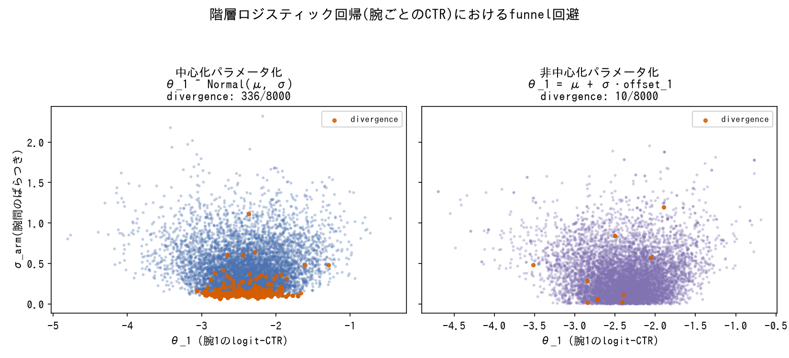
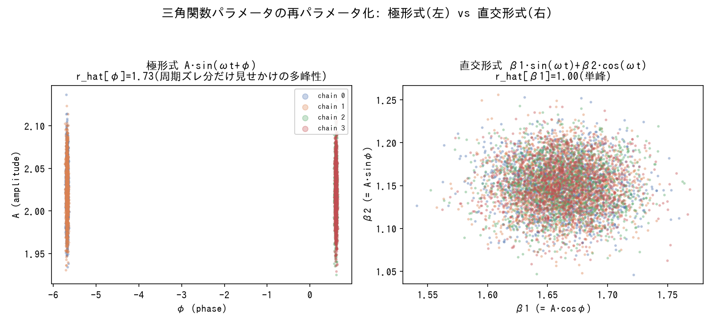
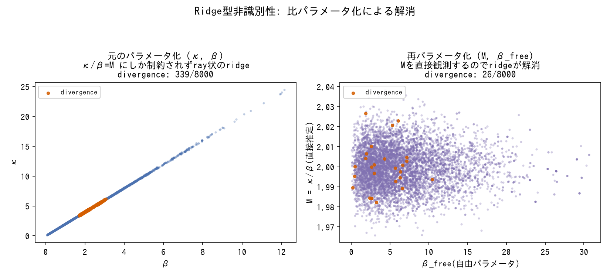
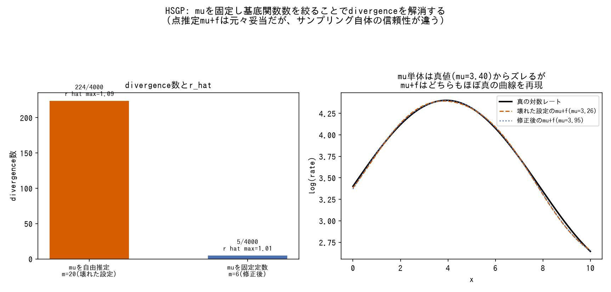

# パラメータ化・非識別性対策

比の形で意味を持つ量、値の矛盾が起きやすい量をどう再パラメータ化するか。

---

### 比が意味を持つ量は「定数+ε」で再パラメータ化する

- **症状**: R0 = β/γ のように2つのパラメータの比が本質的に意味を持つ量は、βとγを独立に事前分布で動かすとprior predictiveが暴走する(SISでは現実の数百万倍に達した)。
- **対処**: R0 = 1 + ε (SIS)、R0 = 0.8 + ε (SIRS) のように、比そのものを中心値+小さな揺らぎ ε ~ Gamma/Beta で再パラメータ化する。
- **なぜ効くか**: 個々のパラメータ(β, γ)の分散をいくら調整しても、比の分布は間接的にしか制御できない。比自体を直接パラメータ化すれば、prior predictiveの範囲を直接コントロールできる。
- **登場プロジェクト**: [bayesian-epidemiological-models](https://github.com/karahashimanato/bayesian-epidemiological-models/blob/main/README.md#横断的な学び)

---

### 値の矛盾を構造的に排除するため、独立パラメータではなく他の量から導出する

- **症状**: I0(初期感染者数)を独立にサンプルすると、他のパラメータ(gamma)と数値的に矛盾する組み合わせが起こりうる。
- **対処**: `I0 = incidence_obs[0] / gamma` のように、独立サンプルせず既知の観測値と他パラメータから導出する。
- **なぜ効くか**: 導出関係を明示することで、そもそも矛盾した組み合わせが事前分布のサポートに含まれなくなる。
- **登場プロジェクト**: [bayesian-epidemiological-models](https://github.com/karahashimanato/bayesian-epidemiological-models/blob/main/README.md#sis-ナイジェリア-マラリア罹患率)

---

### モデルを複雑にすると新しい非識別性を生みやすい

- **症状**: 階層モデルやスプラインなど柔軟なモデルに拡張すると、切片(水準)を複数のパラメータが奪い合う構造になり、事後分布が不安定になる。
- **対処**: 各パラメータの役割分担を明示し、事前分布の感度分析(スケールを変えて事後がどれだけ動くか)で「データが支持する値か、事前分布に抑え込まれているだけか」を切り分ける。
- **なぜ効くか**: 非識別性はモデルが複雑になるほど新しい形で発生しうるため、拡張のたびに役割分担と感度分析をセットで確認する必要がある。
- **登場プロジェクト**: [bayesian-A-B-testing](https://github.com/karahashimanato/bayesian-A-B-testing/blob/main/README.md#得られた方法論的な学び)

---

### 非中心化パラメータ化(non-centered parameterization)でfunnel問題を回避する

*PyMCで実際にNUTSサンプリングした結果(試行回数の少ない腕を含む10腕の階層ロジスティック回帰。生成スクリプト: [scripts/generate_reparameterization_plots.py](../scripts/generate_reparameterization_plots.py))。抽象的なNeal's funnelの定義自体は[tools/posterior-pathologies.md](../tools/posterior-pathologies.md#funnel漏斗状の病理neals-funnel)を参照。*

- **症状**: 階層モデルで個々のグループ効果(腕ごとのCTRなど)を「全体平均からの分布」として直接パラメータ化(中心化パラメータ化)すると、事後分布が漏斗(funnel)状の形になり、NUTSサンプラーが不安定になる。
- **対処**: グループ効果を `mu_logit + sigma_arm * offset_raw` のように、標準正規分布に従う `offset_raw` とスケール `sigma_arm` の積で表現する非中心化パラメータ化を採用する。
- **なぜ効くか**: 中心化パラメータ化ではグループ効果とスケールパラメータの間に強い事後相関が生まれ、サンプラーが漏斗の狭い部分を探索しにくくなる。非中心化はこの相関を弱め、パラメータ空間の形を扱いやすくする。funnelそのものの定義は[tools/posterior-pathologies.md](../tools/posterior-pathologies.md#funnel漏斗状の病理neals-funnel)を参照。
- **登場プロジェクト**: [Multi-Armed-Bandit](https://github.com/karahashimanato/Multi-Armed-Bandit/blob/main/README.md#実装上の注意点)

---

### 三角関数の"中"にあるパラメータ(周波数・位相)は直交形式へ再パラメータ化する

*PyMCで実際にNUTSサンプリングした結果(周期7・位相の事前分布が3周期分にまたがる設定で、極形式は周期のズレ分だけ見せかけの多峰性を生む。生成スクリプト: [scripts/generate_reparameterization_plots.py](../scripts/generate_reparameterization_plots.py))。*

- **症状**: 振幅・周期・位相を直接推定する極形式(`A*sin(2πt/T+φ)`)パラメータ化で、r_hat>2という深刻な多峰性が発生する。事前分布を締めてもむしろ悪化する。
- **対処**: `A*sin(ωt+φ) = β1*sin(ωt) + β2*cos(ωt)`のように、三角関数の"外"にある線形係数(直交形式・Cartesian form)として書き直す。周波数 $\omega$は周期図(periodogram)などデータから外生的に固定し、 $\beta_1, \beta_2$を通常の線形パラメータとして推定する。振幅・位相は事後的に`Deterministic`で復元する。
- **なぜ効くか**: 周期がわずかに違うだけで長い時系列全体にわたって位相が大きくズレていくため、極形式は尤度面に複数の「谷」(局所解)を作りやすい。線形係数への書き換えは、モデルの表現力を保ったまま尤度面を滑らかにし、この種の多峰性の根本原因(周波数-位相間の非線形な相互作用)を排除する。
- **登場プロジェクト**: [bayesian-modeling-lab](https://github.com/karahashimanato/bayesian-modeling-lab/blob/main/README.md#sunspot-周期性を持つ非線形状態空間モデル)

---

### 比が意味を持つ量は、比自体への再パラメータ化でridge型の非識別性を緩和する

*PyMCで実際にNUTSサンプリングした結果(κ/βの比のみが尤度に制約される単純化モデルで、Hawkes過程のκ,β構造を模したもの。生成スクリプト: [scripts/generate_reparameterization_plots.py](../scripts/generate_reparameterization_plots.py))。*

- **症状**: Hawkes過程の $\kappa$(興奮強度)と $\beta$(減衰速度)のように、2パラメータが「どちらも似た形で強度を押し上げる」関係にあると、事後分布のペアプロットに斜めのridge構造が現れ、divergenceが発生する(指数減衰カーネルを $dt\to0$近傍でテイラー展開すると $1-\beta\cdot dt$となり、 $\kappa$と $\beta$が数式レベルで同じ役割を持ってしまうことが原因)。
- **対処**: 分岐比 $M=\kappa/\beta$のように、意味のある比そのものを独立パラメータとしてサンプルし、元のパラメータ( $\kappa=M\beta$)を`Deterministic`で導出する。
- **なぜ効くか**: 比を直接パラメータ化することで、ridge構造の"沿う方向"を1つのパラメータに集約でき、サンプラーが冗長な方向を探索する必要がなくなる。[epidemiological-modelsのR0再パラメータ化](reparameterization.md)と同じ発想だが、こちらは事前予測の暴走ではなくridge型の幾何学的非識別性(divergence)の緩和が目的である点が異なる。ridge型非識別性そのものの定義は[tools/posterior-pathologies.md](../tools/posterior-pathologies.md#ridge型非識別性)を参照。
- **登場プロジェクト**: [bayesian-modeling-lab](https://github.com/karahashimanato/bayesian-modeling-lab/blob/main/README.md#能登半島地震-自己励起点過程hawkesetas)

---

### ラベルスイッチングは順序制約または事前分布のレンジ分離で解消する

![ラベルスイッチング: 順序制約なしではchainごとにmu[0]が-2.5付近と2.5付近に分かれ(r_hat=1.73)、素朴な事後平均は-0.07に潰れる。順序制約ありでは全chainが一致する(r_hat=1.00)](../assets/pathologies/label_switching.png)

*PyMCで実際にNUTSサンプリングした結果(対称な2成分混合モデル、真の値は±2.5。生成スクリプト: [scripts/generate_pathology_plots.py](../scripts/generate_pathology_plots.py))。詳細は[tools/posterior-pathologies.md](../tools/posterior-pathologies.md#ラベルスイッチングlabel-switching)を参照。*

- **症状**: 対称な構造を持つ複数の潜在成分(MSMの2レジーム、2-factor SVモデルのfast/slow成分)が、MCMCの探索中に"名前"を入れ替えてしまい、事後平均を取ると成分同士が混ざり合って潰れる(例: 2レジームのボラティリティが同じ値に収束し区別不能になる)。divergence=0・r_hat≈1.00でも発生し、サンプリング健全性の指標だけでは検出できない。
- **対処**: 事後的に成分を区別する場合は`pt.sort()`などで順序制約(例: $\sigma_0 < \sigma_1$)を課す。あらかじめ非対称性を仮定できる場合は、成分ごとに事前分布のレンジを分離する(例: $\phi^{fast}\sim\text{Beta}(2,5)$、 $\phi^{slow}\sim\text{Beta}(20,1.5)$)。
- **なぜ効くか**: どちらの方法も、モデルの対称性(どちらの成分がどちらの"名前"でも尤度が同じ)を、パラメータ空間に非対称な制約を課すことで壊す。順序制約は事後的な後処理、レンジ分離は事前分布による先回りという違いはあるが、狙いは同じ。ラベルスイッチングそのものの定義は[tools/posterior-pathologies.md](../tools/posterior-pathologies.md#ラベルスイッチングlabel-switching)を参照。
- **登場プロジェクト**: [bayesian-modeling-lab](https://github.com/karahashimanato/bayesian-modeling-lab/blob/main/README.md#日経225-markov-switching-model) / [bayesian-modeling-lab](https://github.com/karahashimanato/bayesian-modeling-lab/blob/main/README.md#日経225-stochastic-volatility)

---

### 理論的に必須な制約と、単なる願望としての制約を区別する

- **症状**: パラメータに「こうあってほしい」という範囲(例: Hawkes過程の分岐比 $M<1$、安定性への期待)を、深く検討せず事前分布の制約として組み込んでしまう。
- **対処**: その制約が数学的に必須な条件(例: AR(1)の $\phi\in(-1,1)$は定常性のための必要条件)なのか、単に分析者が期待する結果(例: 有限観測期間では $M>1$でも矛盾なくデータを説明できるため、 $M<1$は必須ではない)なのかを切り分ける。必須でなければ、 $(0,\infty)$のような開いた事前分布を採用し、制約の要否自体をデータに語らせる。
- **なぜ効くか**: 願望に基づく制約を課すと、その制約が真に成り立つかどうかという分析上重要な問いに、事前分布があらかじめ答えを出してしまうことになる。必須な制約とそうでない制約を区別することで、本当に検証すべき問いを事前分布で潰さずに済む。
- **登場プロジェクト**: [bayesian-modeling-lab](https://github.com/karahashimanato/bayesian-modeling-lab/blob/main/README.md#能登半島地震-自己励起点過程hawkesetas)

---

### GPの平均関数を固定定数にし、基底関数数を絞ることで非識別性を解消する

*非ガウス尤度(Poisson)のHSGP回帰をPyMCで実際に2通り(mu自由推定+m=20 / mu固定+m=6)サンプリングした結果(生成スクリプト: [scripts/generate_reparameterization_plots.py](../scripts/generate_reparameterization_plots.py))。点推定(mu+f)自体はどちらの設定でも妥当だが、サンプリングの信頼性(divergence・r_hat)が大きく異なる点に注意。*

- **症状**: 非ガウス尤度(Poisson)のGP回帰で、平均関数`mu`を確率変数として推定しつつ`pm.gp.Latent`をサンプリングすると、r_hat最大4.06・divergence 71という完全な収束失敗に陥る。原因は2種類の複合的な非識別性: (1) `mu`とGP自体の低周波成分が交絡する尾根(ridge)状の構造、(2) 計算量削減のため`pm.gp.HSGP`(基底関数近似)に切り替えても、基底関数数`m`が多い(m=20)と「`eta`(振幅)を大きくしながら基底係数を比例的に小さくする」ことで尤度を際限なく上げられる退化(`eta`の上限を1.5→5と緩めるたびに事後がその上限に張り付き続けることで確認)。
- **対処**: `mu`を`log(mean(fires))`のような固定定数にし、基底関数数を`m=20`から`m=6`まで絞る。
- **なぜ効くか**: どちらの非識別性も「モデルの自由度が尤度に対して過剰である」ことに起因する。パラメータ数を絞る・平均を固定するといった「モデルの自由度を意図的に削る」対応により、尤度を無限に押し上げられる方向そのものをパラメータ空間から除去できる。ridge型非識別性そのものの定義は[tools/posterior-pathologies.md](../tools/posterior-pathologies.md#ridge型非識別性)を参照。
- **登場プロジェクト**: [bayesian-gaussian-process](https://github.com/karahashimanato/bayesian-gaussian-process/blob/main/README.md#非ガウス尤度ポアソン-山火事件発生件数)

---

### BYMのθ/φ分離の非識別性は、BYM2の(σ,ρ)再パラメータ化で解消する

- **症状**: BYMモデルで地区固有の非構造項`θ`と空間構造項`φ`を別々の分散(`σ_θ`,`σ_φ`)でモデル化すると、両者の事後ペアプロットに緩やかな負の相関(-0.31)が現れ、θ単体・φ単体のESS(中央値: θ=1486、φ=7011)が合成量`θ+φ`のESS(中央値8113)より明確に低くなる。`σ_θ`のr_hatも1.14まで悪化する。
- **対処**: 同じ量を`σ・(√(1-ρ)・θ*+√(ρ/scale)・φ*)`に再パラメータ化する(BYM2、Riebler et al. 2016)。`σ`は全体スケール、`ρ`は空間分散の割合を表し、`scale`はグラフラプラシアンの一般化逆行列から自前で計算する。
- **なぜ効くか**: 元のパラメータ化では`σ_θ`と`σ_φ`がどちらも「観測されたばらつきの一部」を説明する冗長な自由度を持つが、BYM2は「合計の大きさ(σ)」と「その内訳(ρ)」という直交した2つの問いに分解する。この再パラメータ化により`σ`,`ρ`の事後相関は0.08まで縮小し、全パラメータのr_hatが1.00に改善する。BYMの非識別性そのものの定義は[tools/spatial-models.md](../tools/spatial-models.md#bymbesag-york-mollié)、ridge型非識別性との対応は[tools/posterior-pathologies.md](../tools/posterior-pathologies.md#ridge型非識別性)を参照。なお`az.compare`によるLOO-CVでは3モデル(ICAR/BYM/BYM2)の予測性能に有意差はなく、BYM2の価値は予測精度ではなく分散成分の分離推定の安定性にある([techniques/model-evaluation.md](model-evaluation.md#looで差がつかなくても分散成分を安定して分離推定できることに価値がある場合がある)参照)。
- **登場プロジェクト**: [bayesian-spatial-models](https://github.com/karahashimanato/bayesian-spatial-models/blob/main/README.md#part-1-bym2スコットランド口唇癌データ)

---

### RW1の絶対水準の不定性は、β0との交絡を生むため中心化で解消する

- **症状**: 空間時系列BYMの時間項に`pm.GaussianRandomWalk`(RW1)を使うと、RW1自体の絶対水準(全体を定数だけ底上げしても尤度が変わらない)が切片`β0`と交絡し、両者の分離が事後分布上で不安定になりうる。
- **対処**: `time_raw - mean(time_raw)`のように、RW1の値を使用前に中心化(平均を引く)してから線形予測子に組み込む。
- **なぜ効くか**: RW1(`x_t=x_{t-1}+ε_t`)は差分だけで定義されるため絶対水準に関する情報を持たず、`β0`と自由に足並みを揃えられる冗長な自由度を持つ。中心化により「RW1の平均的な水準」という自由度を明示的にゼロへ固定し、`β0`との役割分担を明確にする。
- **登場プロジェクト**: [bayesian-spatial-models](https://github.com/karahashimanato/bayesian-spatial-models/blob/main/README.md#part-2の技術的な発見)
