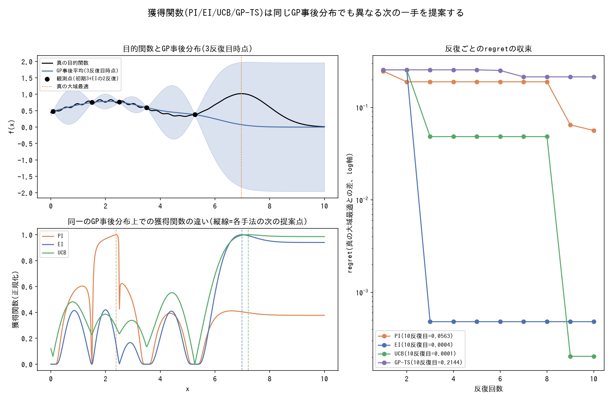

# 獲得関数の型

ガウス過程(GP)を代理モデルとしたベイズ最適化(BO)で、代理モデルの事後分布(平均・不確実性)から「次にどこを評価すべきか」を決める獲得関数そのものの用語辞典。GP自体の推論手法(`pm.gp.Marginal`等)は[tools/inference-methods.md](inference-methods.md)、代理モデルとしてのGP回帰そのものは[analysis-types.md](../analysis-types.md#ガウス過程回帰gaussian-process-regression)を参照。

*局所最適と大域最適を持つ1次元関数に対し、4つの獲得関数で実際に逐次ベイズ最適化(10反復)を実行した結果(GP回帰は固定ハイパーパラメータのRBFカーネルによる閉形式の事後分布。生成スクリプト: [scripts/generate_acquisition_functions_plots.py](../scripts/generate_acquisition_functions_plots.py))。数値は実プロジェクトの再現ではなく、同じ質的パターン(PIの停滞、EI/UCBの速い収束、GP-TSの確率的な遅さ)を示す独自の合成デモ。*

---

### PI (Probability of Improvement)

- **定義**: 現在のベスト観測値を上回る確率だけを最大化する、最も単純な獲得関数。改善の"大きさ"は考慮しない。
- **数式・仕組み**: `PI(x) = Φ((μ(x) - f_best - ξ) / σ(x))`(`μ(x)`,`σ(x)`はGP事後の平均・標準偏差、`Φ`は標準正規分布の累積分布関数、`ξ`は探索を促す微小なマージン)。
- **使い分け**: 改善確率だけを見るため、小さくても確実な改善が見込める局所的な領域に固執しやすく、大域最適の探索に失敗するリスクが高い。bayesian-optimizationの1次元ベンチマークでは、PIは10反復目でもregret=5.0644と全く収束せず、大域最適側を一度も探索しなかった(4手法中唯一の未収束)。実務では[EI](#ei-expected-improvement)や[UCB](#ucb-upper-confidence-bound)を優先し、PIは比較のベースラインとして使うことが多い。
- **登場プロジェクト**: [bayesian-optimization](https://github.com/karahashimanato/bayesian-optimization/blob/main/README.md#1次元ノイズなし-獲得関数の挙動比較)

---

### EI (Expected Improvement)

- **定義**: 改善が起きる確率だけでなく、その期待される改善幅も加味する獲得関数。BOで最も標準的に使われる。
- **数式・仕組み**: `EI(x) = (μ(x)-f_best)・Φ(z) + σ(x)・φ(z)`、`z = (μ(x)-f_best)/σ(x)`(`φ`は標準正規分布の密度関数)。第1項が「改善確率×改善幅」、第2項が不確実性そのものへのボーナスに相当する。
- **使い分け**: 改善確率(PI)だけでは無視される「どれだけ改善するか」を考慮するため、局所解への固執を避けやすい。bayesian-optimizationの1次元ベンチマークでは3反復目から大域最適側の不確実性の高い領域へ切り替わり、8反復目でregret<1e-3に収束した。ノイズのある目的関数では、「現在のベスト(incumbent)」に生の観測値ではなくGP事後平均(観測点での再評価値)を使うことで、ノイズの実現値を追いかけないようにする工夫が必要になる。
- **登場プロジェクト**: [bayesian-optimization](https://github.com/karahashimanato/bayesian-optimization/blob/main/README.md#1次元ノイズなし-獲得関数の挙動比較)(①②③・Part Bすべてで標準の獲得関数として採用)

---

### UCB (Upper Confidence Bound)

- **定義**: GP事後平均に、不確実性(標準偏差)を係数`κ`倍して足した楽観的な信頼上限を最大化する獲得関数。
- **数式・仕組み**: `UCB(x) = μ(x) + κ・σ(x)`。`κ`が大きいほど不確実性の高い領域(探索)を、小さいほど平均値の高い領域(活用)を優先する。
- **使い分け**: `κ`が探索の強さを直接制御する解釈しやすいパラメータとして働く。bayesian-optimizationの1次元ベンチマーク(`κ=2.0`)では3反復目から一貫して大域最適側へ向かい、4手法中最速の8反復目でregret=0に到達した。
- **登場プロジェクト**: [bayesian-optimization](https://github.com/karahashimanato/bayesian-optimization/blob/main/README.md#1次元ノイズなし-獲得関数の挙動比較)

---

### GP版Thompson Sampling(GP-TS)

- **定義**: 多腕バンディットの[Thompson Sampling](inference-methods.md#thompson-sampling)(各腕の事後分布から1サンプル引き、最大の腕を選ぶ)を、離散腕から連続空間へ拡張したもの。GPの事後分布から関数を1つサンプルし、そのサンプル関数を最大化する点を次の評価点として選ぶ。
- **数式・仕組み**: `f_sample ~ GP事後分布(観測済みのx_1..x_nの下で)`、次の評価点`= argmax_x f_sample(x)`。事後分布のサンプリングそのものが探索と活用のバランスを自然に取るという発想は、離散腕のThompson Samplingと共通。
- **使い分け**: 事後サンプルの確率的なばらつきに依存するため、収束までの反復数が読みにくい。bayesian-optimizationの1次元ベンチマークでは6反復目まで局所解近辺で停滞し、7反復目に事後サンプルの偶然性で大域最適側へ転じて10反復目で収束した(10反復目のregret=0.0056)。seed依存性(別の乱数シードでも同程度の反復数で収束するか)は未検証の課題として残る。
- **登場プロジェクト**: [bayesian-optimization](https://github.com/karahashimanato/bayesian-optimization/blob/main/README.md#1次元ノイズなし-獲得関数の挙動比較)
