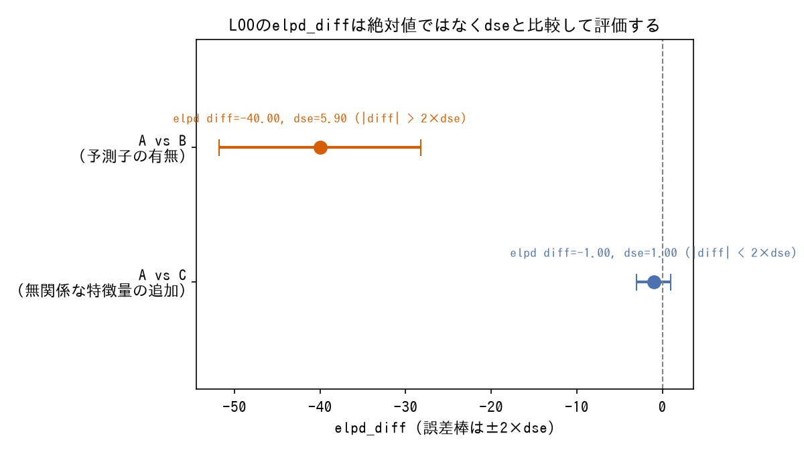
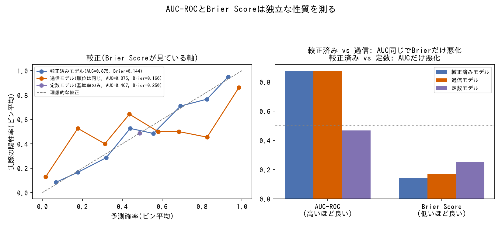
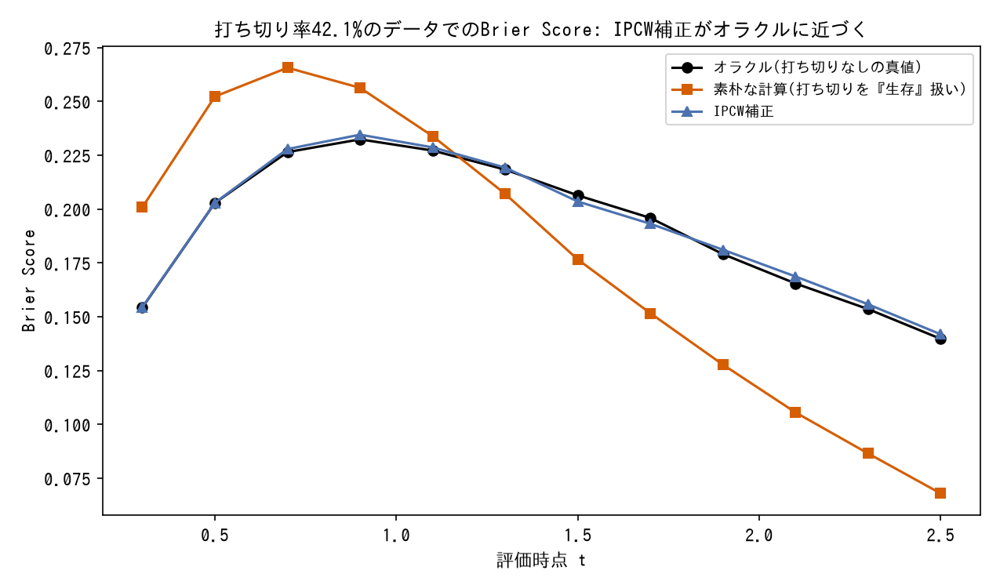
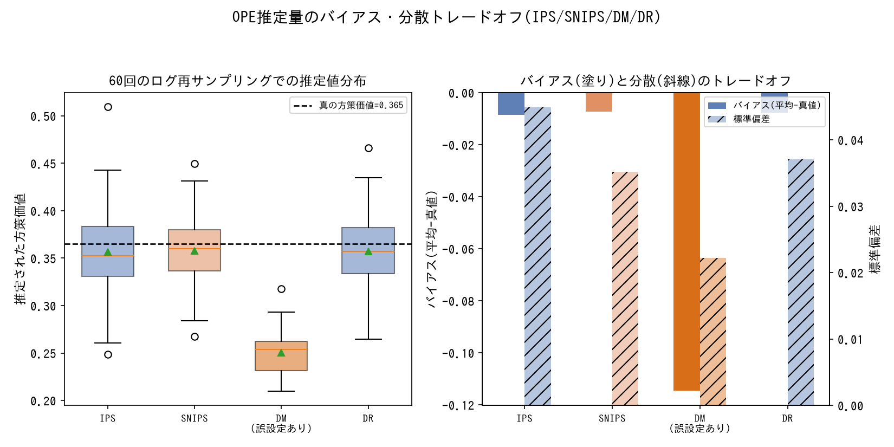
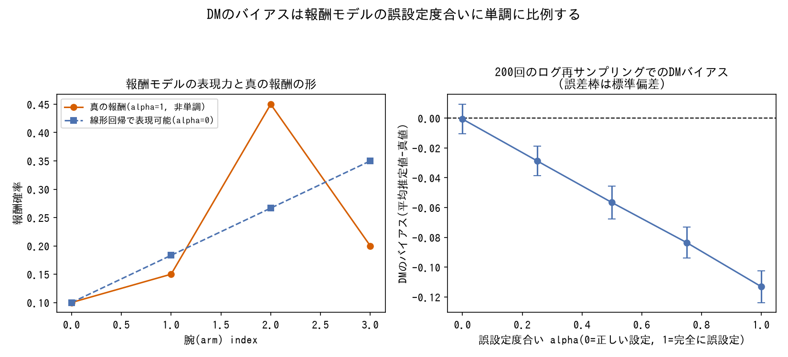
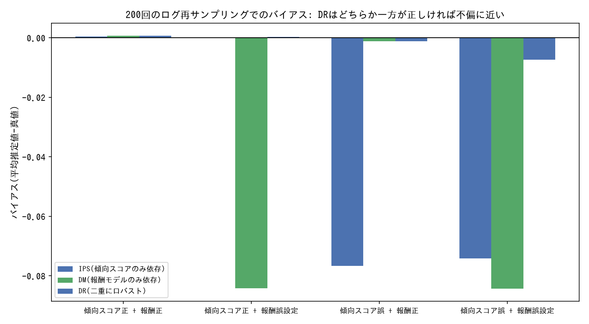
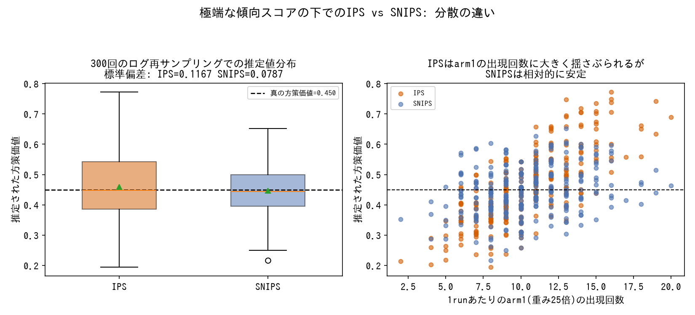
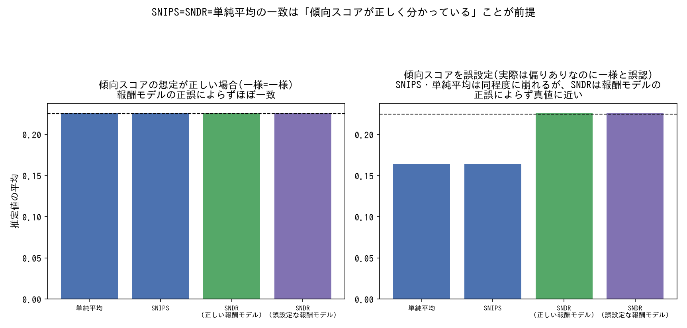
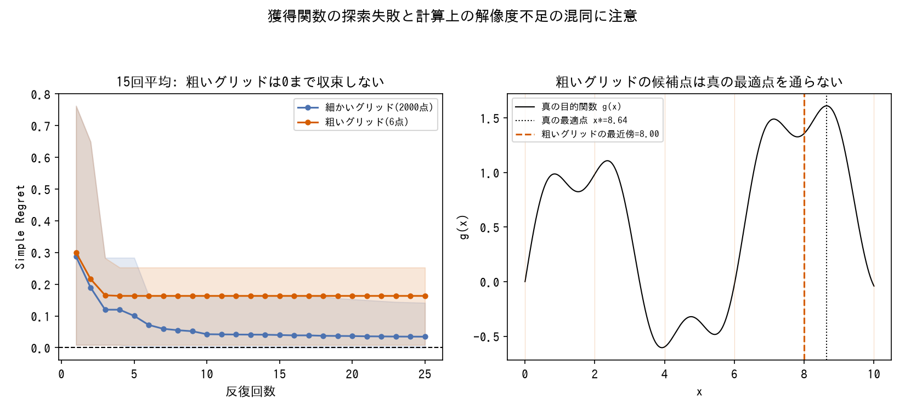

# 評価指標・推定量

モデルの予測性能評価や、ログデータからのオフ方策評価(OPE)で使う指標・推定量の用語辞典。`techniques/`が「症状/対処」型の教訓集であるのに対し、こちらは各指標そのものの定義・仕組み・使い分けを引くためのリファレンス。

---

### LOO (Leave-One-Out Cross-Validation, PSIS-LOO)

*PyMCで実際に3種類の線形回帰モデルをサンプリングし、`pm.compute_log_likelihood`とArviZの`az.compare`でPSIS-LOOを計算した結果(生成スクリプト: [scripts/generate_evaluation_metrics_plots.py](../scripts/generate_evaluation_metrics_plots.py))。*

- **定義**: ベイズモデルの汎化性能(未見データに対する予測対数尤度の期待値)を、実際にholdoutデータを分離しなくても近似的に見積もる指標。
- **数式・仕組み**: 理論上は各データ点を1つずつ除いて再学習した場合の対数予測密度の合計(`elpd_loo`)だが、モデルをデータ点の数だけ再学習するのは非現実的なため、Pareto-Smoothed Importance Sampling(PSIS)で近似計算する。モデル間比較には2モデルの`elpd_loo`の差である`elpd_diff`と、その標準誤差`dse`を使う。有効パラメータ数`p_LOO`はモデルの実効的な複雑さを表し、過学習ペナルティの目安になる。
- **使い分け**: held-outデータを別途用意しにくい/したくない場合の汎化性能推定に使う。`elpd_diff`は単体の絶対値では意味がなく、`dse`と比較して初めて「有意な差か」を判断できる([techniques/model-evaluation.md](../techniques/model-evaluation.md#looの差は標準誤差dseと比較して評価する)参照)。
- **登場プロジェクト**: [bayesian-hazard-models](https://github.com/karahashimanato/bayesian-hazard-models/blob/main/README.md#2-予測性能評価とモデル比較-held-outデータによる検証) / [bayesian-A-B-testing](https://github.com/karahashimanato/bayesian-A-B-testing/blob/main/README.md#得られた方法論的な学び)

---

### AUC-ROC

*PyMCで実際にベイズロジスティック回帰をサンプリングし、その事後平均係数から3種類の予測確率を作って比較した結果(生成スクリプト: [scripts/generate_evaluation_metrics_plots.py](../scripts/generate_evaluation_metrics_plots.py))。*

- **定義**: 二値分類モデルの順位付け能力(正例を負例より高いスコアと予測できているか)を測る指標。0.5がランダム、1.0が完全な分離を意味する。
- **数式・仕組み**: 閾値を動かしたときのTPR(真陽性率)とFPR(偽陽性率)の軌跡であるROC曲線の下側面積。ペアワイズに解釈すると「ランダムに選んだ正例のスコアが、ランダムに選んだ負例のスコアを上回る確率」と等価。
- **使い分け**: 確率の絶対値ではなく、相対的な順位付けの良さを見たいときに使う。確率較正(絶対値としての正しさ)を見るには[Brier Score](#brier-score)と併用する必要がある。
- **登場プロジェクト**: [bayesian-A-B-testing](https://github.com/karahashimanato/bayesian-A-B-testing/blob/main/README.md#得られた方法論的な学び)

---

### Brier Score

*既知のハザード関数から生成した打ち切りなしのオラクルデータと、そこに一様乱数で打ち切りを加えたデータの両方でBrier Scoreを計算し比較した結果(生成スクリプト: [scripts/generate_evaluation_metrics_plots.py](../scripts/generate_evaluation_metrics_plots.py))。*

- **定義**: 予測確率と実際の結果(0/1)のズレを二乗誤差で測る、確率較正(calibration)の指標。値が小さいほど良い。
- **数式・仕組み**: `(予測確率 - 実際の結果)^2` の平均。二値分類・生存時間分析のいずれでも定義でき、生存時間分析では各時点ごとに(打ち切りを逆確率重み付け(IPCW)で補正して)計算する。
- **使い分け**: 「確率の絶対値がどれだけ当たっているか」を見たいときに使う。順位付けの良さ([AUC-ROC](#auc-roc)/[C-index](#c-index--time-dependent-auc))とは数学的に独立な性質なので、一方が改善してももう一方の改善は保証されない。両方を確認する。
- **登場プロジェクト**: [bayesian-A-B-testing](https://github.com/karahashimanato/bayesian-A-B-testing/blob/main/README.md#得られた方法論的な学び) / [bayesian-hazard-models](https://github.com/karahashimanato/bayesian-hazard-models/blob/main/README.md#2-予測性能評価とモデル比較-held-outデータによる検証)

---

### C-index (+ Time-Dependent AUC)

*PyMCで実際に2種類のベイズ指数分布ハザードモデル(共変量なし/共変量あり)をフィットし、ホールドアウトデータでC-indexとBrier Scoreを計算した結果(生成スクリプト: [scripts/generate_model_evaluation_plots.py](../scripts/generate_model_evaluation_plots.py))。*

- **定義**: 生存時間分析における順位付け精度の指標。AUC-ROCの生存時間版に相当し、「実際に先にイベント(解約など)を迎えた対象を、モデルが正しく『よりリスクが高い』と予測できたか」をペアごとに評価する。
- **数式・仕組み**: 比較可能な全ペア(打ち切りの有無からイベント順序が確定できるペア)のうち、予測ハザード比の大小関係と実際のイベント順序が一致した割合。Time-Dependent AUCはこれを時点ごとに計算したもので、経過時間(契約からの月数など)に応じてモデルの識別力がどう変化するかを追える。
- **使い分け**: 「誰が先にイベントを迎えるか」という順位付けの精度を見たいときに使う。絶対確率の較正を見るには[Brier Score](#brier-score)と併用する必要がある(改善が一致しないことがある)。
- **登場プロジェクト**: [bayesian-hazard-models](https://github.com/karahashimanato/bayesian-hazard-models/blob/main/README.md#2-予測性能評価とモデル比較-held-outデータによる検証)

---

### IPS (Inverse Propensity Scoring)

*ログデータ(一様ランダム方策)を60回再サンプリングし、IPS/SNIPS/DM/DRの各推定量で新方策の価値を推定した結果。DMの報酬モデルは非単調な真の報酬をarm indexへの線形回帰(PyMC)で近似する意図的な誤設定(生成スクリプト: [scripts/generate_evaluation_metrics_plots.py](../scripts/generate_evaluation_metrics_plots.py))。*

- **定義**: オフ方策評価(OPE)において、ログ方策下で観測された報酬を、新方策と旧(ログ収集)方策の選択確率比(傾向スコア比)で重み付けし、新方策を実際に運用した場合の期待報酬を推定する手法。
- **数式・仕組み**: `V_IPS = (1/n) Σ [π_e(a_i|x_i) / π_b(a_i|x_i)] * r_i`(`π_e`が評価したい新方策、`π_b`がログ収集時の方策=傾向スコア)。
- **使い分け**: 傾向スコアが既知または信頼できる形で推定できており、報酬モデル自体は信頼できない場合に使う。傾向スコアが極端に小さいサンプルがあると重みが爆発し分散が大きくなる弱点がある([SNIPS](#snips-self-normalized-ips)で軽減)。
- **登場プロジェクト**: [Multi-Armed-Bandit](https://github.com/karahashimanato/Multi-Armed-Bandit/blob/main/README.md#主な発見)

---

### DM (Direct Method)

*4本の腕を持つバンディットで、真の報酬(非単調)と線形回帰で表現可能な報酬の間を線形補間したデータを使い、報酬モデルを線形回帰(OLS)でフィットしてDM推定値のバイアスを比較した結果(生成スクリプト: [scripts/generate_evaluation_metrics_plots.py](../scripts/generate_evaluation_metrics_plots.py))。*

- **定義**: ログデータから報酬モデル(コンテキストと行動から報酬を予測する回帰モデル)を直接学習し、新方策の行動選択確率で期待値を取ることで新方策の性能を推定する手法。
- **数式・仕組み**: `V_DM = (1/n) Σ_i Σ_a π_e(a|x_i) * r̂(x_i, a)`(`r̂`は学習済みの報酬モデル)。
- **使い分け**: 傾向スコアが信頼できない/欠損している場合に使う。報酬モデルの当てはまりが悪いとバイアスがそのまま乗る弱点がある([DR](#dr-doubly-robust)で軽減)。
- **登場プロジェクト**: [Multi-Armed-Bandit](https://github.com/karahashimanato/Multi-Armed-Bandit/blob/main/README.md#主な発見)

---

### DR (Doubly Robust)

*4本の腕を持つバンディットで、傾向スコア(既知/分析者が誤って一様だと思い込む)と報酬モデル(腕ごとの標本平均/線形回帰による誤設定)の2x2の組み合わせについて、IPS・DM・DRのバイアスを比較した結果(生成スクリプト: [scripts/generate_evaluation_metrics_plots.py](../scripts/generate_evaluation_metrics_plots.py))。*

- **定義**: [IPS](#ips-inverse-propensity-scoring)と[DM](#dm-direct-method)を組み合わせ、傾向スコアと報酬モデルのどちらか一方さえ正しく特定できていれば不偏推定量になるという「二重にロバスト」な性質を持つOPE推定量。
- **数式・仕組み**: `V_DR = V_DM + (1/n) Σ [π_e(a_i|x_i)/π_b(a_i|x_i)] * (r_i - r̂(x_i,a_i))`。DMの推定値に、実際の報酬とDMの予測との残差をIPS的に補正する項を足す形。
- **使い分け**: IPS単体より分散を抑えつつ、DM単体よりバイアスを抑えたい場合の標準的な選択肢。
- **登場プロジェクト**: [Multi-Armed-Bandit](https://github.com/karahashimanato/Multi-Armed-Bandit/blob/main/README.md#主な発見)

---

### SNIPS (Self-Normalized IPS)

*傾向スコアが0.98/0.02と極端に偏った2腕バンディットで、IPS・SNIPSそれぞれの推定値の分布と、稀な腕の出現回数への依存度を比較した結果(生成スクリプト: [scripts/generate_evaluation_metrics_plots.py](../scripts/generate_evaluation_metrics_plots.py))。*

- **定義**: [IPS](#ips-inverse-propensity-scoring)の重み(傾向スコア比)の合計で正規化することで、IPSの分散を抑えた推定量。
- **数式・仕組み**: `V_SNIPS = Σ[w_i * r_i] / Σ w_i`(`w_i = π_e(a_i|x_i)/π_b(a_i|x_i)`)。
- **使い分け**: IPSの重みが不安定(分散が大きい)ときに、わずかなバイアスと引き換えに分散を大きく減らしたい場合に使う。
- **登場プロジェクト**: [Multi-Armed-Bandit](https://github.com/karahashimanato/Multi-Armed-Bandit/blob/main/README.md#主な発見)

---

### SNDR (Self-Normalized DR)

*4本の腕を持つバンディットで、ログ収集方策が一様な場合(特殊構造)と、分析者が傾向スコアを誤設定した場合の両方で、単純平均・SNIPS・SNDRを比較した結果(生成スクリプト: [scripts/generate_evaluation_metrics_plots.py](../scripts/generate_evaluation_metrics_plots.py))。*

- **定義**: [DR](#dr-doubly-robust)のIPS的補正項部分を[SNIPS](#snips-self-normalized-ips)と同様に自己正規化した、DRの低分散版。
- **数式・仕組み**: DRの補正項`Σ w_i(r_i - r̂)`を`Σ w_i`で正規化してからDMの推定値に加える。
- **使い分け**: DRの分散をさらに抑えたい場合の実務的な標準選択。ランダム方策の一様な傾向スコアという特殊構造下では`SNIPS = SNDR = 単純平均DM`という恒等式が理論的に成り立ち、実データでの一致確認は推定量の実装が正しいかを検証する回帰テストとして使える([techniques/model-evaluation.md](../techniques/model-evaluation.md#特殊構造の下で推定量どうしが一致することを確認し実装の妥当性検証に使う)参照)。
- **登場プロジェクト**: [Multi-Armed-Bandit](https://github.com/karahashimanato/Multi-Armed-Bandit/blob/main/README.md#主な発見)

---

### Regret(単純後悔、Simple Regret)

*1次元の多峰関数に対しGP-UCBによるベイズ最適化を実行し、獲得関数自体の最大化に使う候補グリッドの解像度を変えてsimple regretの収束を比較した結果(生成スクリプト: [scripts/generate_evaluation_metrics_plots.py](../scripts/generate_evaluation_metrics_plots.py))。*

- **定義**: ベイズ最適化(BO)における収束の評価指標。真の最適値と、ある時点までに観測した最良値との差。
- **数式・仕組み**: `regret_t = g(x*) - max(g(x_1),...,g(x_t))`(`g(x*)`は真の大域最適値)。反復`t`が進むにつれて0に近づくほど、真の最適解に近い点を発見できていることを示す。
- **使い分け**: 真の最適解が既知なベンチマーク関数での獲得関数比較に使う(実応用では真の最適値`g(x*)`が未知のため使えず、代わりにholdoutデータでの最終性能を使う)。獲得関数自体の最大化に使う探索(グリッドの分解能など)が律速している場合、regretが理論上の0まで収束しないことがあり、獲得関数の探索失敗と計算上の解像度不足を混同しないよう注意する。
- **登場プロジェクト**: [bayesian-optimization](https://github.com/karahashimanato/bayesian-optimization/blob/main/README.md#1次元ノイズなし-獲得関数の挙動比較)
