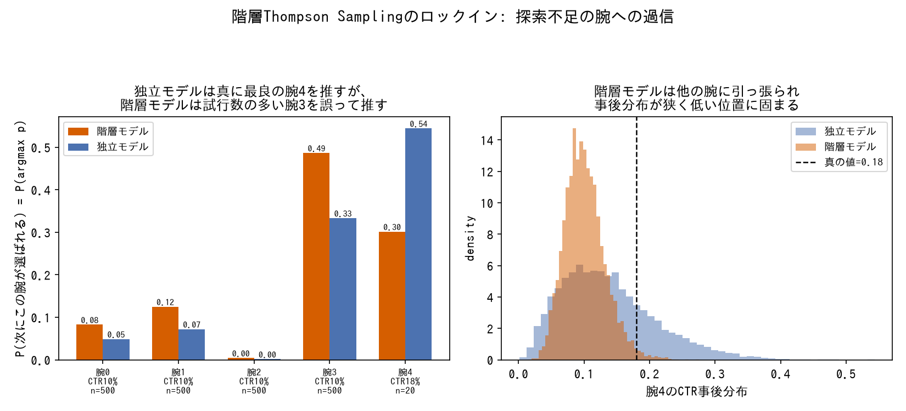

# 推論エンジン・サンプリング手法

事後分布をどう計算するか(MCMC/変分推論)、方策をどう評価・選択するか(バンディットアルゴリズム)の用語辞典。定義・仕組み・使い分けを引くためのリファレンス。

## MCMCサンプリング手法の比較(HMC / Metropolis-Hastings / Gibbs Sampling)

提案(次の候補点)をどう作るかという1点だけが違い、それが高次元・相関の強い事後分布での効率を大きく左右する。

| 手法 | 提案の作り方 | メリット | デメリット | このindexでの実例 |
|---|---|---|---|---|
| **HMC**(Hamiltonian Monte Carlo) | 勾配情報を使って仮想的な「運動量」を与え、ハミルトン力学の軌道(leapfrog積分)に沿って遠くまで一気に提案する | 高次元・相関の強い空間でも高い受理率を保ったまま効率的に探索できる(ランダムウォークしない)。曲がった等高線(リング状の分布など)も勾配に沿って追跡できる | 勾配計算が必要(尤度が微分可能でなければ使えない)。ステップサイズ・軌道長のチューニングが結果を大きく左右する。局所スケールが場所によって桁違いに変わる分布([Funnel](posterior-pathologies.md#funnel漏斗状の病理neals-funnel)のneckなど)では固定ステップ幅では対応しきれない | [NUTS](#nuts-no-u-turn-sampler)として全プロジェクトの連続パラメータで採用(軌道長の自動調整版) |
| **Metropolis-Hastings** | 現在地から提案分布(多くは対称なランダムウォーク)で次の点を提案し、尤度比に基づく受理確率で採否を決める | 勾配不要、離散パラメータにも使える、実装がシンプル | ランダムウォークのため、相関の強い・高次元の空間では採択されても移動量が小さく、自己相関が強く残りやすい | [Compound Step](#compound-step)の離散変数側で採用。連続変数(NUTS)に対しESSが約1/6に低下する例が確認されている |
| **Gibbs Sampling** | 各パラメータを、他のパラメータを固定した条件付き分布から順番に直接サンプリングする(条件付き分布が既知・共役な場合に成立) | 提案の受理/棄却という概念がなく常に採択される。共役な階層モデルでは高効率 | 条件付き分布が解析的に求まる(共役)場合にしか使えないことが多い。パラメータ間の相関が強いと軸に沿った移動しかできず収束が遅くなる | このindexで扱ったプロジェクトでは未使用(PyMCのデフォルトNUTSが連続パラメータの大半をカバーするため) |

3手法とも「提案が独立/対称なランダムウォークか、勾配で導かれた軌道か」という同じ軸の違いに帰着する。[bayesian-causal-inference](https://github.com/karahashimanato/bayesian-causal-inference/blob/main/README.md#学び)でmean-field ADVIが強く相関したパラメータ間の不確実性を過大評価したのも、[Compound Step](#compound-step)でMetropolis法のESSが低下したのも、根っこは同じ「パラメータ間の相関が強い空間を、相関を考慮しない独立仮定・ランダムウォークで探索する非効率さ」に行き着く。

3手法が実際にどう探索するかを動かして比較できるインタラクティブな可視化: [MCMCサンプリング手法の比較(Artifact)](https://claude.ai/code/artifact/629e3a1c-4c08-4219-87bd-6e4969e832ce)。分布セレクタで4種類の目標分布を切り替えられる。数値は同梱のNode.jsシミュレーションで実測した値(有限差分で勾配も検証済み)。

- **相関ガウス分布(ρ可変、0.5〜0.99)**: ρを上げるほど[Ridge型非識別性](posterior-pathologies.md#ridge型非識別性)に近づき、HMCは軌道が尾根に沿い続けられるかが、MH/Gibbsは1ステップの実質的な歩幅がどれだけ縮むかが試される。
- **Bimodal(2峰)混合分布**: [マルチモダリティ](posterior-pathologies.md#マルチモダリティ多峰性)の簡易版。HMC・MHとも局所的な情報(勾配・固定分散の提案)しか持たないため、谷を挟んだ隣の峰へは60反復では移れず開始した峰に留まり続ける。Gibbsは条件付き分布が共役でなくなるため、この分布ではそもそも実行できない(比較表の「デメリット」を可視化で直接示す実例)。
- **Funnel(漏斗型)**: [Funnel](posterior-pathologies.md#funnel漏斗状の病理neals-funnel)を`v ~ N(0, 1.5²)`(対数スケール)・`θ|v ~ N(0, exp(v)²)`の2次元に単純化したもの。HMCはleapfrogの軌道長をランダム化していても、ステップ幅(eps)は分布全体で固定のため、mouth(v>1、θのスケールが広い領域)向けに丁度良い値はneck(v<-1、スケールが急に狭まる領域)では大きすぎる。1500反復のシミュレーションで検証すると、eps=0.18でmouth側の受理率96.7%に対しneck側は8.0%まで落ち込む(かつ一度neckに入ると抜け出しにくく足踏みし続ける)。MHも固定分散(σ=0.5)の提案がneckでは相対的に大きすぎ、探索できるθの範囲がmouth側より大きく狭まる。Gibbsは`θ|v`こそ共役(閉形式)だが`v|θ`が標準分布にならないため使えない。
- **Ring(リング状)**: このindexの各プロジェクトに直接登場する構造ではなく、曲がった等高線上での探索の違いを見るための汎用例として追加した分布(中心からの距離が`N(2.0, 0.35²)`に従う)。勾配に沿ったleapfrog軌道はリングの曲率をたどれるため、固定seedでの60反復デモでHMCは約287°分周方向に進むのに対し、等方的なランダムウォークしか持たないMHは同じ60反復で約-18°しか進まない(リングに沿う方向の提案がほとんど採択されないため)。Gibbsは`x`の条件付き分布(`y`固定)が原点を挟んで双峰になり(Bimodalと同じ理由)使えない。

---

### NUTS (No-U-Turn Sampler)

- **定義**: HMC(ハミルトニアンモンテカルロ)を発展させた、軌道の長さを自動的に決定するMCMCサンプラー。PyMCで連続パラメータをサンプリングする際のデフォルト手法。
- **数式・仕組み**: パラメータ空間に仮想的な「運動量」を導入し、ハミルトン力学の軌道をシミュレートしてサンプルを生成する(勾配を使うため、ランダムウォークするMetropolis法より効率的に空間を探索できる)。軌道が"Uターン"し始めるタイミングを自動検出して停止することで、手動でのステップ数調整を不要にする。
- **使い分け**: PyMCで連続パラメータをサンプリングする際の基本選択。離散パラメータには使えず、混在するモデルでは[Compound Step](#compound-step)による組み合わせになる。
- **登場プロジェクト**: [Multi-Armed-Bandit](https://github.com/karahashimanato/Multi-Armed-Bandit/blob/main/README.md#実装上の注意点)(`pymc`+`numpyro`のNUTS) / [bitcoin-utxo-survival](https://github.com/karahashimanato/bitcoin-utxo-survival/blob/main/README.md#計算戦略二段構え)(ローカルPyMC/NUTS)

---

### ADVI / mean-field変分推論(SVI)

- **定義**: 事後分布を、扱いやすい形の近似分布(mean-fieldの場合、パラメータ間の相関を無視した独立正規分布の積)で近似し、両者の差(KLダイバージェンス)を最小化する最適化問題として解く、MCMCより高速な近似推論手法。
- **数式・仕組み**: MCMCのようにサンプルを逐次生成せず、勾配降下法で近似分布のパラメータ(平均・分散)を直接最適化する。mean-field近似は変数間の共分散を0とみなすため、パラメータ間の相関が強い場合に不確実性を系統的に過小評価する。
- **使い分け**: NUTSより高速だが不確実性を過小評価しうるため、採用前にNUTSと事後分布を比較し乖離の大きさを確認する(SDで約15倍の差が出たケースあり)。大規模データで個体レベルモデルをローカルでNUTSサンプリングするのが非現実的な場合の代替手段としても使う([techniques/diagnostics.md](../techniques/diagnostics.md#変分推論adviとmcmcnutsの不確実性を比較する)参照)。
- **登場プロジェクト**: [bayesian-A-B-testing](https://github.com/karahashimanato/bayesian-A-B-testing/blob/main/README.md#分析の流れnotebooks) / [bitcoin-utxo-survival](https://github.com/karahashimanato/bitcoin-utxo-survival/blob/main/README.md#計算戦略二段構え)(numpyro SVIで個体レベルモデル)

---

### Compound Step

*PyMCで実際にサンプリングした結果(Poisson変化点モデル、離散パラメータtauと連続パラメータlambda1,lambda2を比較。生成スクリプト: [scripts/generate_mcmc_diagnostics_plots.py](../scripts/generate_mcmc_diagnostics_plots.py))。詳細は[tools/mcmc-diagnostics.md](mcmc-diagnostics.md#ess-effective-sample-size)を参照。*

- **定義**: PyMCが、1つのモデルの中に離散変数と連続変数が混在する場合に自動的に採用する、変数の種類ごとに異なるサンプラーを組み合わせる仕組み。
- **数式・仕組み**: 連続変数には[NUTS](#nuts-no-u-turn-sampler)、離散変数にはMetropolis法を個別に割り当て、1イテレーション内で両方のステップを順に実行する。
- **使い分け**: 離散パラメータ(変化点の位置など)を含むモデルで自動的に発動する。Metropolisはランダムウォーク的な提案のため自己相関が強く、同じサンプル数でも離散変数のESSが連続変数より1桁近く低くなりやすい。離散変数を連続変数に緩和できれば(シグモイド近似など)NUTSのみでサンプリングでき、この問題を回避できる([tools/mcmc-diagnostics.md](mcmc-diagnostics.md#ess-effective-sample-size)参照)。
- **登場プロジェクト**: [bayesian-modeling-lab](https://github.com/karahashimanato/bayesian-modeling-lab/blob/main/README.md#nile川-ベイズ変化点分析)(変化点`tau`)

---

### Replay法(オフライン方策評価のシミュレーション)

- **定義**: 過去にランダム方策で収集したログデータだけを使って、別の(評価したい)方策をオンラインで運用した場合の挙動を再現するオフラインシミュレーション手法。
- **数式・仕組み**: ログの各行を時系列順に1件ずつ処理し、評価方策が実際にログと同じ行動(腕)を選んだ場合のみ、そのログの報酬を採用してモデルを更新する。行動が一致しない行は「その方策が選ばなかった」ものとして破棄する。ログ収集方策が一様ランダムであれば、この手続きは評価方策を実際にオンライン運用した場合と統計的に同じ分布を持つ推定になる。
- **使い分け**: 新しい方策(階層ベイズ版Thompson Samplingなど)を実際に本番投入せずに、過去のランダム方策ログだけで性能を検証したい場合に使う。行動が一致しない行を大量に破棄するため、有効に使えるラウンド数はログ全体よりかなり少なくなる(本プロジェクトでは約1,235万行のログに対し、実際に使えたのは約1.7万ラウンド)。
- **登場プロジェクト**: [Multi-Armed-Bandit](https://github.com/karahashimanato/Multi-Armed-Bandit/blob/main/README.md#notebook構成)

---

### Thompson Sampling

*PyMCで実際に階層Beta-Binomialモデルをサンプリングし、5本腕のうち1本だけ試行数が極端に少ないスナップショットに対する「次にその腕が選ばれる確率」を、独立モデル(閉形式のBeta事後分布)と比較した結果(生成スクリプト: [scripts/generate_inference_methods_plots.py](../scripts/generate_inference_methods_plots.py))。*

- **定義**: 各腕(選択肢)の報酬確率の事後分布から1つサンプルを引き、そのサンプル値が最大の腕を選択する、ベイズ的な多腕バンディットアルゴリズム。事後分布のサンプリングそのものが、探索(不確実な腕を試す)と活用(良さそうな腕を選ぶ)のバランスを自然に取る。
- **数式・仕組み**: 独立版は各腕ごとに独立な[Beta-Binomial](observation-models.md#beta-binomial)(Beta-Bernoulli)事後分布を持つ。階層版は腕間で情報を共有する階層ベイズモデルの事後分布からサンプルする。
- **使い分け**: 階層版は腕間の情報共有によりMAEを改善できる一方、収縮バイアスや、事後分布の確信が強まりすぎて探索が止まる「ロックイン」を起こしうる。ロックインは「探索の下限を保証する」仕組み(ε-greedyミックスなど)を別途組み合わせて対策する([techniques/diagnostics.md](../techniques/diagnostics.md#オンライン方策のロックインは探索の下限保証の欠如を疑う)参照)。
- **登場プロジェクト**: [Multi-Armed-Bandit](https://github.com/karahashimanato/Multi-Armed-Bandit/blob/main/README.md#notebook構成)

---

### `pm.gp.Marginal`(GPの解析的周辺化)

- **定義**: ガウス尤度のGP回帰で、潜在関数`f`を明示的にサンプリングせず解析的に周辺化(積分消去)し、カーネルのハイパーパラメータ(長さスケール`ell`、振幅`eta`、観測ノイズ`sigma`)だけをNUTSでサンプリングする厳密GP推論。
- **数式・仕組み**: `f ~ GP(0, k)`、`y ~ Normal(f(x), sigma)`というガウス尤度・ガウス過程の組み合わせでは、`f`を積分消去した周辺尤度が解析的に閉形式で書ける(共役性)。計算コストはカーネル行列(N×N)の逆行列計算に由来しO(N³)。
- **使い分け**: ガウス尤度・厳密GPを使う場合の基本選択。O(N³)のため数百〜千点を超えると非現実的になる(Mauna Loa CO2濃度の例では全68年分・821点をそのまま使うと4chain分のNUTSサンプリングに数時間かかる見込みが判明し、直近150ヶ月・150点に絞った)。非ガウス尤度には使えない([pm.gp.Latent + HSGP](#pmgplatent--hsgp基底関数近似)参照)。大規模データには[pm.gp.MarginalApprox(VFE)](#pmgpmarginalapproxvfe誘導点近似スパースgp)を検討する。
- **登場プロジェクト**: [bayesian-gaussian-process](https://github.com/karahashimanato/bayesian-gaussian-process/blob/main/README.md#標準rbfカーネル-世界平均気温偏差) / [bayesian-gaussian-process](https://github.com/karahashimanato/bayesian-gaussian-process/blob/main/README.md#複合カーネル-mauna-loa-co2濃度)

---

### `pm.gp.Latent` + HSGP(基底関数近似)

- **定義**: ガウス尤度以外の尤度(Poissonなど)でGPを使う場合に、潜在関数`f`を明示的な確率変数としてサンプリングする手法。厳密な`pm.gp.Latent`は計算コストが高いため、有限個の大域基底関数の線形結合でGPを近似するHSGP(Hilbert Space GP)を通常組み合わせる。
- **数式・仕組み**: `f(x) ≈ Σ_j √S(√λ_j)・φ_j(x)・β_j`のように、有限個(`m`個)の基底関数`φ_j`の線形結合で近似し、係数`β_j`を標準正規分布に従う確率変数としてサンプリングする。
- **使い分け**: Poissonなど非ガウス尤度を使う場合の標準的な選択。基底関数数`m`を増やしすぎると、振幅`eta`を大きくしながら基底係数を比例的に小さくすることで尤度を際限なく上げられる退化(非識別性)を起こしうるため、`m`を絞る・平均関数を固定するといった対応が必要になる場合がある([techniques/reparameterization.md](../techniques/reparameterization.md#gpの平均関数を固定定数にし基底関数数を絞ることで非識別性を解消する)参照)。有限個の大域基底関数で近似するため、学習データ域外への外挿はHSGPの近似構造そのものに起因して不安定になりうる(多項式回帰同様の限界)。非ガウス尤度でなくとも、長さスケールの事後がグリッド間隔に対して短い領域に迷い込み厳密GP(`pm.gp.Latent`)の共分散行列が悪条件化する場合、`pm.gp.HSGP`は共分散行列そのものを構成しないため数値的な安定性の面でも有効な代替になる([tools/posterior-pathologies.md](posterior-pathologies.md#gpの共分散行列悪条件化によるサンプリング停止divergenceに現れない病理)参照)。
- **登場プロジェクト**: [bayesian-gaussian-process](https://github.com/karahashimanato/bayesian-gaussian-process/blob/main/README.md#非ガウス尤度ポアソン-山火事件発生件数) / [bayesian-spatial-models](https://github.com/karahashimanato/bayesian-spatial-models/blob/main/README.md#part-3-空間点過程lgcp能登半島地震)(LGCP、`pm.gp.Latent`→`pm.gp.HSGP`で実行時間100分超→7秒)

---

### `pm.gp.MarginalApprox`(VFE、誘導点近似・スパースGP)

- **定義**: 厳密GPのO(N³)の計算コストを、少数の誘導点(inducing points)による変分近似(VFE, Variational Free Energy)でO(N・M²)に削減するスパースGP手法。
- **数式・仕組み**: 全データ点の代わりに`M`個の誘導点(`pm.gp.util.kmeans_inducing_points`などで自動配置)を経由してGPを近似する。VFE尤度は`pm.Potential`として実装されており、通常の観測確率変数`y_obs`を持たないため、`pm.sample_prior_predictive`のような標準APIがそのままでは使えない([techniques/implementation-hacks.md](../techniques/implementation-hacks.md#pmgpmarginalapproxのvfe尤度はpotential実装のためsample_prior_predictiveが使えない)参照)。
- **使い分け**: 大規模データ(千〜万点規模)にガウス尤度のGPを適用したい場合の選択肢。誘導点数`M`の選定自体が新たなチューニング対象になる(M=150では勾配1回の評価に約0.11秒かかるのに対しM=25では約0.01秒と、実測コストが理論上のO(N・M)より`M`に敏感)。厳密カーネルに基づくVFE近似は、[HSGP](#pmgplatent--hsgp基底関数近似)(大域基底関数近似)より外挿の安定性で優れることが実証されている。
- **登場プロジェクト**: [bayesian-gaussian-process](https://github.com/karahashimanato/bayesian-gaussian-process/blob/main/README.md#スパースgp-nyc日次気温データ)
