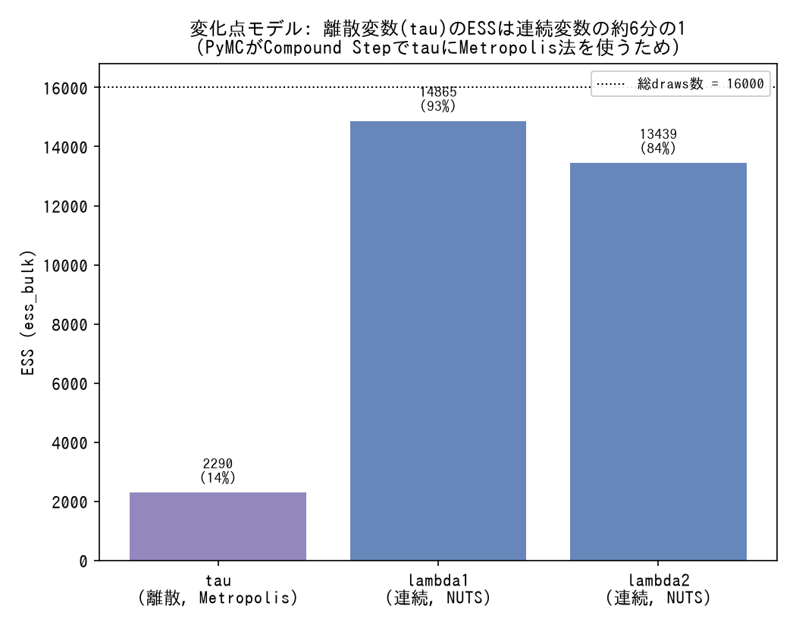

# MCMC診断指標

r_hat/ESS/divergenceなど、MCMCサンプリングの健全性を測る指標の用語辞典。`techniques/diagnostics.md`が「症状/対処」型の教訓集であるのに対し、こちらは各指標そのものの定義・仕組み・使い分けを引くためのリファレンス。

---

### r_hat(Gelman-Rubin統計量)

- **定義**: 複数のMCMCチェーンが同じ目標分布に収束しているかを測る指標。1.00に近いほど良く、慣習的に1.01未満が目安とされる。
- **数式・仕組み**: チェーン内分散とチェーン間分散の比から計算される(全体の分散に対して、個々のチェーンの分散がどれだけ小さいか)。複数のチェーンがそれぞれ異なる値に固定されたまま混ざっていない(マルチモダリティ)場合に大きく悪化する。
- **使い分け**: 診断の入り口として最初に確認する指標。ただしmean-field ADVIのようにチェーン間比較という概念自体が存在しない手法では定義できない。r_hatが健全(≈1.00)でも局所的な探索の破綻(divergence)は見逃すため、[ESS](#ess-effective-sample-size)→[Divergence](#divergence発散)の順で追加確認する必要がある([techniques/diagnostics.md](../techniques/diagnostics.md#r_hat--ess--divergencesの3段階診断ワークフロー)参照)。
- **登場プロジェクト**: [bayesian-A-B-testing](https://github.com/karahashimanato/bayesian-A-B-testing/blob/main/README.md#得られた方法論的な学び) / [bayesian-modeling-lab](https://github.com/karahashimanato/bayesian-modeling-lab/blob/main/README.md#sunspot-周期性を持つ非線形状態空間モデル)

---

### ESS (Effective Sample Size)

*PyMCで実際にサンプリングした結果(Poisson変化点モデル、離散パラメータtauと連続パラメータlambda1,lambda2を比較。生成スクリプト: [scripts/generate_mcmc_diagnostics_plots.py](../scripts/generate_mcmc_diagnostics_plots.py))。*

- **定義**: MCMCサンプルの自己相関を考慮した「実質的に独立とみなせるサンプル数」。サンプル数(draws)が同じでも、自己相関が強いほどESSは小さくなる。
- **数式・仕組み**: サンプル系列の自己相関関数を積分して算出する。分布の中心付近の推定精度を表す`ess_bulk`と、裾(信用区間の端など)の推定精度を表す`ess_tail`に分けて評価されることが多い。
- **使い分け**: サンプル数が十分でも、ESSが低ければ事後分布の推定(特に信用区間の端)の精度が実質的に不足している可能性がある。離散変数はPyMCが自動的にCompound Step(離散部分にMetropolis法)を使うため、連続変数よりESSが1桁近く低くなりやすい([techniques/diagnostics.md](../techniques/diagnostics.md#離散変数はessが低くなりやすい)参照)。
- **登場プロジェクト**: [bayesian-modeling-lab](https://github.com/karahashimanato/bayesian-modeling-lab/blob/main/README.md#nile川-ベイズ変化点分析) / [bayesian-hazard-models](https://github.com/karahashimanato/bayesian-hazard-models/blob/main/README.md#2-予測性能評価とモデル比較-held-outデータによる検証)(`p_LOO`と並ぶ実効サンプルサイズの文脈)

---

### Divergence(発散)

- **定義**: HMC/NUTSが事後分布の急峻に曲がった領域(高い曲率)を数値的に正しく積分できず、シミュレーションが破綻したサンプリングステップ。個々のdivergent pointは信頼できないサンプルとして扱われる。
- **数式・仕組み**: HMCは連続的な軌道をシンプレクティック積分器で離散近似する。ステップサイズに対して局所的な曲率が急すぎる領域(funnel構造など)では、離散化誤差が蓄積してエネルギー保存則から大きく外れ、divergentと判定される。
- **使い分け**: divergent pointsがパラメータ空間のどこに現れるかで病理の種類を切り分けられる。特定の隅に局所集中していれば構造的な非識別性(funnel等、[techniques/reparameterization.md](../techniques/reparameterization.md)参照)、事後分布全体に薄く分散していればステップサイズ不足の可能性が高い([techniques/diagnostics.md](../techniques/diagnostics.md#divergent-pointsの分布パターン局所集中-vs-分散で病理の種類を切り分ける)参照)。
- **登場プロジェクト**: [bayesian-modeling-lab](https://github.com/karahashimanato/bayesian-modeling-lab/blob/main/README.md#nile川-ベイズ変化点分析) / [bayesian-epidemiological-models](https://github.com/karahashimanato/bayesian-epidemiological-models/blob/main/README.md#sir-eyamペスト流行1666)

---

### target_accept

- **定義**: NUTSサンプラーがステップサイズを自動調整する際の目標受理率(acceptance rate)。デフォルトは0.8前後で、1に近づけるほどステップサイズが小さくなり、1ステップあたりの数値積分が慎重になる。
- **数式・仕組み**: warmup(tuning)期間中、実際の受理率が`target_accept`に近づくようステップサイズを適応的に調整するデュアル平均化アルゴリズムを使う。`target_accept`を上げるとステップサイズが小さくなり、急峻な領域でも[divergence](#divergence発散)を起こしにくくなる代わりに、1ステップあたりの移動距離が小さくなり同じdraws数での[ESS](#ess-effective-sample-size)が下がりうる。
- **使い分け**: divergenceを減らす簡易な対症療法として使う。ただしdivergenceが減ってもESS/r_hatが悪化していれば、モデルの構造的な問題(非識別性・パラメータ化)自体は解消していないサインであり、根本対処(再パラメータ化)と使い分ける必要がある([techniques/diagnostics.md](../techniques/diagnostics.md#表面的改善と根本問題の解決を区別する)参照)。
- **登場プロジェクト**: [bayesian-A-B-testing](https://github.com/karahashimanato/bayesian-A-B-testing/blob/main/README.md#得られた方法論的な学び) / [bayesian-modeling-lab](https://github.com/karahashimanato/bayesian-modeling-lab/blob/main/README.md#nile川-ベイズ変化点分析)
