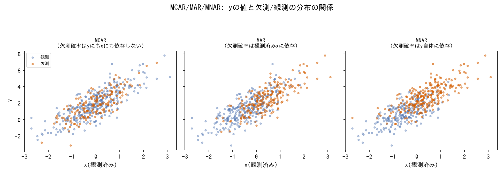
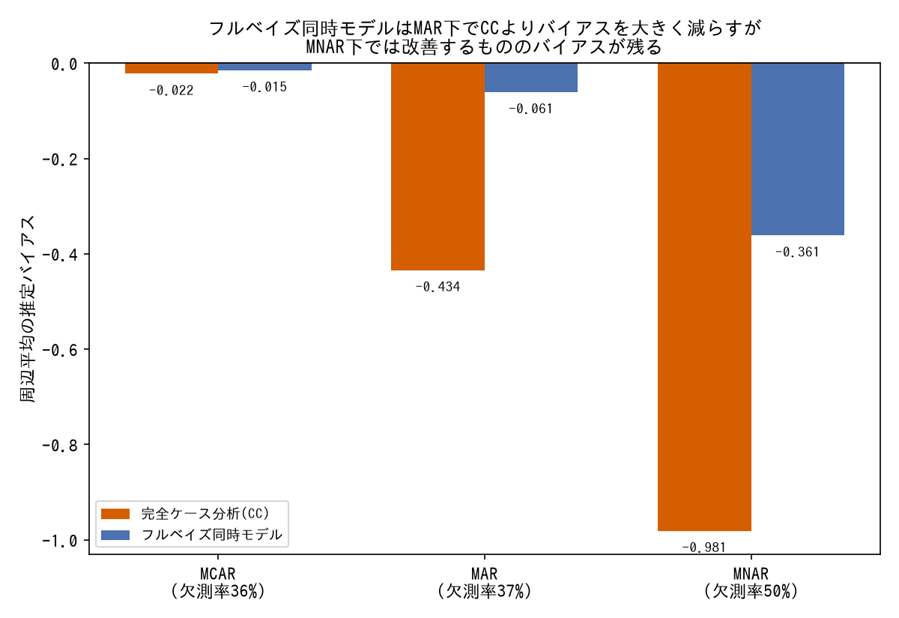

# 欠測データ処理の型

観測にどの分布を割り当てるか(`tools/observation-models.md`)とは別に、そもそも観測されるはずの値の一部が欠けている状況をどう扱うかの用語辞典。欠測が起こる仕組み(欠測メカニズム)の分類と、それぞれに対応する処理・モデルの定義・仕組み・使い分けを引くためのリファレンス。

---

### MCAR/MAR/MNAR(欠測メカニズムの分類)

*3つの欠測メカニズムを合成データ(y=2.0+1.5x+noise)で実際に再現した結果(生成スクリプト: [scripts/generate_missing_data_plots.py](../scripts/generate_missing_data_plots.py))。*

- **定義**: 欠測が起こる確率が何に依存するかによる3分類。Rubin (1976) の枠組み。MCAR(Missing Completely At Random)は欠測確率が観測値・欠測値のどちらにも依存しない。MAR(Missing At Random)は欠測確率が観測されている他の変数には依存するが、欠測している値自体には依存しない。MNAR(Missing Not At Random)は欠測確率が欠測している値そのものに依存する。
- **数式・仕組み**: 欠測指標`R`(観測=1、欠測=0)、観測されうる値`Y`、観測済み共変量`X`として、`P(R|Y,X) = P(R|X)`(Yに依存しない)ならMAR、さらに`P(R|Y,X) = P(R)`(XにもYにも依存しない)ならMCAR、`P(R|Y,X)`がYにも依存すればMNAR。MCARはMARの特殊ケース(MARの方が広い仮定)。
- **使い分け**: MCAR/MARであれば欠測を無視した尤度ベースの処理(完全ケース分析でも係数は不偏、あるいはフルベイズ同時モデル・[MICE](#micemultiple-imputation-by-chained-equations))で妥当な推定が得られる。MNARが疑われる場合は欠測メカニズム自体を尤度に組み込む([Selection Model](#selection-modelheckman型)・[Pattern-Mixture Model](#pattern-mixture-model))必要があるが、MNARかどうか自体は観測データだけからは検証できない(欠測している値は見えないため)、という原理的な非識別性を持つ。実務では、完全観測に近い共変量(人口規模など)と欠測パターンの関係をEDAで確認し、MARの物語がどこまで説得力を持つかを検討することが多い([techniques/eda.md](../techniques/eda.md#欠測パターンの可視化から欠測メカニズムの仮説とモデル設計の根拠を得る)参照)。
- **登場プロジェクト**: [bayesian-missing-data](https://github.com/karahashimanato/bayesian-missing-data/blob/main/README.md)(World Bank開発指標、健康指標の欠測が人口規模と強く相関しGDPとは相関しない実例を発見)

---

### フルベイズ同時モデル(欠測値の潜在変数としての自動補完)

*PyMCのマスク配列(`numpy.ma.MaskedArray`)による自動補完を、CC(完全ケース分析)と実際に比較した結果(生成スクリプト: [scripts/generate_missing_data_plots.py](../scripts/generate_missing_data_plots.py))。*

- **定義**: 欠測値を通常の確率変数(観測されていれば尤度に、欠測していれば事前分布とモデル構造だけから決まる潜在変数)としてモデルに含め、パラメータと同時にサンプリングする方法。PyMCでは`observed`にマスク配列(欠測箇所をマスクした`numpy.ma.MaskedArray`)を渡すと自動的にこの扱いになる。
- **数式・仕組み**: 観測されている`y_obs`は通常通り尤度に寄与し、欠測している`y_mis`はモデルの構造(回帰式・他の変数との関係)と事前分布だけから事後分布が決まる確率変数として扱われる。パラメータの事後分布は、観測データと欠測値の両方についての同時事後分布を周辺化した形で得られる。
- **使い分け**: MCAR/MARの下では、欠測メカニズムを明示的にモデル化しなくても(欠測を無視した尤度のままでも)妥当な推定が得られる、欠測データ処理の基本形。実装が単純な一方、MNARの下では欠測メカニズムの情報を使わないため系統的に歪む([techniques/observation-model.md](../techniques/observation-model.md#mnar欠測が値自体に依存するが疑われる場合は欠測メカニズム自体を尤度に組み込む)参照)。
- **登場プロジェクト**: [bayesian-missing-data](https://github.com/karahashimanato/bayesian-missing-data/blob/main/README.md#01-mcarmar--単一変数ケーススタディ)(MCAR/MARそれぞれで、周辺平均のバイアスをCC・平均補完より1桁小さく抑えた)

---

### MICE(Multiple Imputation by Chained Equations)

- **定義**: 欠測がある各変数を、他の変数を説明変数とする回帰モデルで順番に予測・補完することを繰り返す(chained equations)反復的な多重代入手法。1回だけでなく複数回(`m`回)の補完データセットを生成し、結果を統合することで補完自体の不確実性も推定に反映する。
- **数式・仕組み**: 各変数を目的変数、残りの変数を説明変数とする回帰を順番にフィットし、欠測箇所を予測値(+ノイズ)で埋める操作を変数間で繰り返し、収束するまで反復する。`m`個の独立な補完済みデータセットそれぞれでモデルをフィットし、Rubinのルールでパラメータ推定値・分散を統合する。
- **使い分け**: フルベイズ同時モデルほど計算コストをかけずに欠測を扱いたい場合の実用的な代替。ただし、簡易的な正規近似による95%信用区間のカバレッジは名目の95%を下回りうる(bayesian-missing-dataではMCARの下で86.7%)ため、区間推定の精度が重要な場面ではフルベイズと比較検証することが望ましい。
- **登場プロジェクト**: [bayesian-missing-data](https://github.com/karahashimanato/bayesian-missing-data/blob/main/README.md#01-mcarmar--単一変数ケーススタディ)(`IterativeImputer`によるMICE、m=20回)

---

### Selection Model(Heckman型)

- **定義**: MNARに対処するため、「値そのもの」を生成する式と「観測されるかどうか(欠測するかどうか)」を生成する式を分けて同時にモデル化し、後者の式に前者の値への依存(非無視可能性パラメータ`γ_y`)を明示的に持たせるモデル(計量経済学のHeckman補正モデルが起源)。
- **数式・仕組み**: アウトカムモデル`y ~ Normal(Xβ, σ)`と、観測モデル`P(観測) = Φ(Zα + γ_y・y)`(`Φ`は標準正規分布の累積分布関数)を同時に尤度に組み込む。`γ_y`が0でない場合、観測されるかどうかが`y`自体の大きさに依存するMNARを表現する。
- **使い分け**: 「値が大きい(小さい)ほど報告されにくい」という具体的なMNARの仮説がある場合に使う。`γ_y`の符号は真の非無視可能性の方向を正しく捉えやすいが、実サンプルサイズでは大きさを過小推定しやすい(bayesian-missing-dataでは推定-0.564±0.301に対し真の値相当-1.455)という、Heckman型モデルの識別が弱いという既知の弱点がある。
- **登場プロジェクト**: [bayesian-missing-data](https://github.com/karahashimanato/bayesian-missing-data/blob/main/README.md#02-mnar--selection-model-vs-pattern-mixture-model)(死亡率が高い国ほど報告されにくい仮想シナリオ)

---

### Pattern-Mixture Model

- **定義**: MNARに対処するもう一つのアプローチ。観測パターン(観測された/欠測した)ごとにデータを層別し、欠測群の条件付き分布が観測群の条件付き分布からどれだけズレているかを感度パラメータ`δ`で表現するモデル。
- **数式・仕組み**: 観測群では`y|観測 ~ Normal(μ_obs, σ)`、欠測群(観測できない)では`y|欠測 ~ Normal(μ_obs + δ, σ)`のように、観測群の分布に感度パラメータ`δ`を加えた分布を欠測群に仮定する。`δ=0`はMARに相当し、`δ`を動かして結果がどれだけ変わるかを確認する感度分析として使うことが多い。
- **使い分け**: 「真の`δ`」はデータから特定できない(bayesian-missing-dataでは真の周辺平均を再現する`δ*=0.497`は事後的にしか分からない)ため、Selection Modelのように非無視可能性パラメータを直接推定するのではなく、複数の`δ`の値に対して結果がどう変わるかを提示し、結果の頑健性(または脆弱性)自体を可視化する目的で使う。
- **登場プロジェクト**: [bayesian-missing-data](https://github.com/karahashimanato/bayesian-missing-data/blob/main/README.md#02-mnar--selection-model-vs-pattern-mixture-model)(δの感度分析)

---

### 多変量同時欠測モデル(逐次条件付け分解)

- **定義**: 2つ以上の変数が相関して同時に欠測するケースで、各変数を独立に補完するのではなく、変数間の相関構造を明示的にモデルへ組み込んで同時に補完するモデル。
- **数式・仕組み**: 変数`(y1,y2)`の同時分布を、周辺分布`y1 ~ Normal(μ1,σ1)`と条件付き分布`y2|y1 ~ Normal(μ2 + beta_cross・(y1-μ1), σ2)`の積に分解する(多変量正規分布と数学的に同値な逐次条件付け分解)。相関の強さは`beta_cross`から事後的に逆算できる(`implied_rho = beta_cross・σ1/σ2`)。
- **使い分け**: 「もう片方の変数が観測されている」行で、独立モデル(2変数を別々に補完)より個票レベルの補完精度を改善したい場合に使う(bayesian-missing-dataでは相関する2健康指標でRMSEが2.7〜4.0%改善)。両方が同時に欠測している行では、追加で使える情報がないため独立モデルとの差はほぼ生じない。`pm.MvNormal`+`LKJCholeskyCov`が環境によって収束しない場合の代替実装としても使える([techniques/implementation-hacks.md](../techniques/implementation-hacks.md#pmmvnormallkjcholeskycovがblas未リンク環境で収束しない場合逐次条件付け分解で代替する)参照)。
- **登場プロジェクト**: [bayesian-missing-data](https://github.com/karahashimanato/bayesian-missing-data/blob/main/README.md#03-多変量同時分布モデル--半合成デザインによる検証)(相関するhealth_exp_gdp_pct・under5_mortalityの同時補完)
