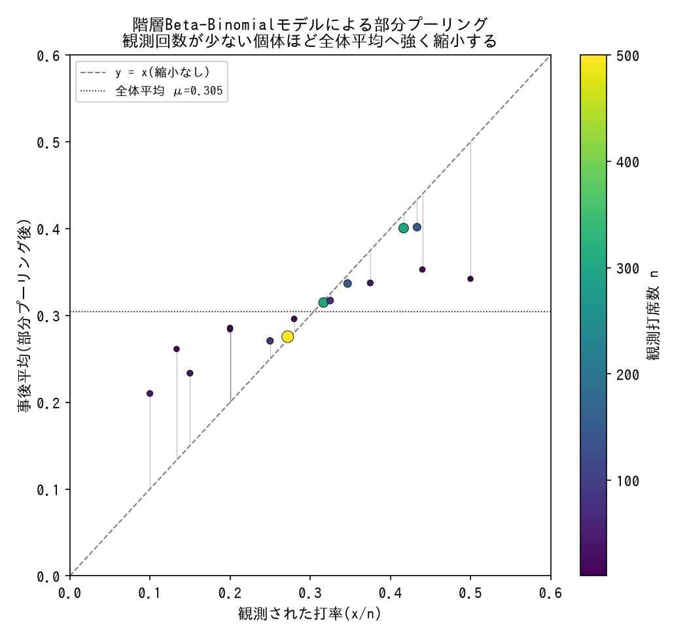

# 観測モデル・尤度分布

観測データをモデルのどの分布・尤度で結びつけるかの用語辞典。`techniques/observation-model.md`が「症状/対処」型の教訓集であるのに対し、こちらは各分布・尤度パターンそのものの定義・仕組み・使い分けを引くためのリファレンス。

---

### Poisson

- **定義**: 単位時間・単位区間あたりに起こる離散イベントの回数をモデル化する分布。平均と分散が等しい(equidispersion)という制約を持つ。
- **数式・仕組み**: `P(k) = λ^k * e^{-λ} / k!`。連続時間モデル(SIR/SIS/SIRSなど)では、状態変数の予測値(感染者数I(t)など)を`λ`とするPoisson尤度で観測データと結びつけることが多い。
- **使い分け**: 観測プロセスが同一(同じ記録方法)である複数の観測変数には分布族を統一する。分散が平均を大きく上回る(overdispersion)場合は[Gamma-Poisson](#gamma-poisson負の二項分布相当)への切り替えを検討する。実際、SIRモデルでは「分散=平均」という制約が、急峻なピーク高さの過小評価に寄与した可能性が確認されている。
- **登場プロジェクト**: [bayesian-epidemiological-models](https://github.com/karahashimanato/bayesian-epidemiological-models/blob/main/README.md#sir-eyamペスト流行1666)

---

### Bernoulli / Binomial

- **定義**: 二値の成功/失敗(クリック有無、勝敗など)を1回ずつモデル化するのがBernoulli、n回の試行のうちの成功回数をまとめてモデル化するのがBinomial。
- **数式・仕組み**: `Bernoulli(p): P(x=1)=p`、`Binomial(n,p): P(k)=C(n,k) p^k (1-p)^{n-k}`。数学的には同一の尤度に帰着する。
- **使い分け**: 個々の試行を行単位で扱うか、集計済みの成功回数として扱うかで選ぶ。共役事前分布としてBetaを使うと解析的な事後計算ができる([Beta-Binomial](#beta-binomial)参照)。
- **登場プロジェクト**: [Multi-Armed-Bandit](https://github.com/karahashimanato/Multi-Armed-Bandit/blob/main/README.md#notebook構成)(Beta-Bernoulli Thompson Sampling) / [bayesian-modeling-lab](https://github.com/karahashimanato/bayesian-modeling-lab/blob/main/README.md#mlb打率-階層ベイズbeta-binomial)(打率のBinomial尤度)

---

### Beta-Binomial

*PyMCで実際にサンプリングした結果(観測打席数10〜500の18個体を模したシミュレーション。生成スクリプト: [scripts/generate_observation_models_plots.py](../scripts/generate_observation_models_plots.py))。*

- **定義**: 成功確率`p`を固定値ではなくBeta分布に従う確率変数として扱う階層モデル。個体ごとに異なる成功確率のばらつきを表現できる。
- **数式・仕組み**: `p_i ~ Beta(α,β)`、`x_i ~ Binomial(n_i, p_i)`。`α, β`は「全体平均μ」「集中度κ」に再パラメータ化されることが多い(`α=μκ`, `β=(1-μ)κ`)。
- **使い分け**: 個体(打者、広告群など)ごとの観測回数が異なり、個体間のばらつきそのものを階層的にモデル化・部分プーリング(shrinkage)したい場合に使う。単純なBinomial(固定p)では個体差を無視してしまう。
- **登場プロジェクト**: [bayesian-A-B-testing](https://github.com/karahashimanato/bayesian-A-B-testing/blob/main/README.md#分析の流れnotebooks)(広告群 vs psa群のCVR比較) / [bayesian-modeling-lab](https://github.com/karahashimanato/bayesian-modeling-lab/blob/main/README.md#mlb打率-階層ベイズbeta-binomial)(MLB打率の階層モデル)

---

### Gamma-Poisson(負の二項分布相当)

![Gamma-Poissonによるoverdispersion補正: 分散/平均比2.20のカウントデータに対し、Poisson固定分散モデルの95%予測区間[2,12]は実測データの88%しかカバーしないが、Gamma-Poisson階層モデルの区間[1,16]は98%をカバーする](../assets/observation-models/gamma_poisson_overdispersion.png)

*PyMCで実際にサンプリングし事後予測チェック(PPC)を行った結果(生成スクリプト: [scripts/generate_observation_models_plots.py](../scripts/generate_observation_models_plots.py))。*

- **定義**: Poissonの発生率`λ`を固定値ではなくGamma分布に従う確率変数として扱う階層モデル。overdispersion(分散>平均)を表現できる。
- **数式・仕組み**: `λ_i ~ Gamma(α_conc, β)`、`x_i ~ Poisson(λ_i)`。`λ`を周辺化するとNegative Binomial分布と数学的に同値になる。
- **使い分け**: カウントデータの分散が平均より大きく、かつ個体間のばらつきを階層的に表現したい場合に使う。集中度パラメータ`α_conc`が0に近づくと分散が発散する構造的な落とし穴があるので注意([techniques/prior-predictive-check.md](../techniques/prior-predictive-check.md#分母のパラメータが0に近づくと分散が発散する病理は分布族を問わず繰り返す)参照)。
- **登場プロジェクト**: [bayesian-modeling-lab](https://github.com/karahashimanato/bayesian-modeling-lab/blob/main/README.md#サメ襲撃件数-階層ベイズgamma-poisson)

---

### Dirichlet-Multinomial

- **定義**: 複数カテゴリへの配分比率をDirichlet分布に従う確率変数として扱い、観測されたカテゴリ別カウントをMultinomial尤度で結びつける階層モデル。
- **数式・仕組み**: `p ~ Dirichlet(concentration * base_measure)`、`x ~ Multinomial(N, p)`。総量`N`がカテゴリに配分される構造のため、集中度パラメータが0に近づいても個々のカテゴリ値は`N`で頭打ちになり、[Gamma-Poisson](#gamma-poisson負の二項分布相当)のような分散発散が起こらない。
- **使い分け**: 複数カテゴリへの配分比率(封入率など)を、カテゴリ間の相関も考慮しつつモデル化したい場合に使う。「総量が固定か青天井か」でGamma-Poissonとの発散リスクの有無が変わる点を覚えておくと事前予測チェックの労力を節約できる。
- **登場プロジェクト**: [bayesian-modeling-lab](https://github.com/karahashimanato/bayesian-modeling-lab/blob/main/README.md#ポケモンカード封入率-階層ベイズdirichlet-multinomial)

---

### Normal / Student-t(観測分布)

- **定義**: 連続値の観測データをモデル化する基本分布。Normalは正規分布、Student-tは自由度パラメータ`ν`を持ち、Normalより裾が重い(外れ値に頑健な)分布。
- **数式・仕組み**: Student-tは`ν→∞`でNormalに収束する。金融時系列のようにファットテール(急激な変動)を持つデータでは、Normal観測分布だと外れ値の影響を過大評価してしまう。
- **使い分け**: 残差やリターンの分布が正規分布より裾が重いと疑われる場合はStudent-tを試す。ただし、裾の重さを変えるだけでは解決しない構造的な問題(モデルの表現力不足など)もあり、Student-tへの変更だけで狙った現象(ACFのギャップなど)が解消するとは限らない([techniques/model-evaluation.md](../techniques/model-evaluation.md#有意なパラメータと狙っていた問題の解決は別軸で検証する)参照)。
- **登場プロジェクト**: [bayesian-modeling-lab](https://github.com/karahashimanato/bayesian-modeling-lab/blob/main/README.md#日経225-stochastic-volatility)

---

### Exponential(ハザード関数)

- **定義**: 生存時間分析における最も単純なハザード関数。時間によらずハザード率(瞬間イベント発生率)が一定であると仮定する。
- **数式・仕組み**: `h(t) = λ`(定数)。生存関数は`S(t) = exp(-λt)`。
- **使い分け**: モデルの基準点・最も制約の強いベースラインとして使う。Kaplan-Meier曲線との比較で系統的なズレ(序盤の急減衰・終盤の緩やかな減衰など)が見える場合、ハザード率一定という仮定がデータと整合しないサインであり、[Weibull](#weibullハザード関数)など時間依存のハザードへ拡張する。
- **登場プロジェクト**: [bayesian-hazard-models](https://github.com/karahashimanato/bayesian-hazard-models/blob/main/README.md#-exponentialモデル)

---

### Weibull(ハザード関数)

- **定義**: ハザード率が時間とともに単調に増加/減少することを表現できる、[Exponential](#exponentialハザード関数)の一般化。
- **数式・仕組み**: `h(t) = (k/λ)(t/λ)^{k-1}`。形状パラメータ`k`が1より小さければハザードは時間とともに減少、1より大きければ増加(`k=1`でExponentialに一致)。
- **使い分け**: Exponential(ハザード一定)がKaplan-Meier曲線と系統的にズレる場合の次の選択肢。`k`の事後分布が1を明確に下回れば「時間とともにイベントが起きにくくなる」ことを定量的に示せる。
- **登場プロジェクト**: [bayesian-hazard-models](https://github.com/karahashimanato/bayesian-hazard-models/blob/main/README.md#-weibullモデル)

---

### Piecewise Exponential(Cox比例ハザード)

- **定義**: 時間を複数の区間に区切り、区間ごとに異なる定数ハザード(ベースラインハザード)を推定するノンパラメトリックに近いアプローチ。Cox比例ハザードモデルのベイズ的表現として広く使われる。
- **数式・仕組み**: `h(t|x) = h_{0,k(t)} × exp(x^T β)`(`k(t)`は`t`が属する区間、`h_{0,k(t)}`は区間ごとのベースラインハザード、`exp(x^T β)`が共変量による比例的な補正)。各対象が実際に通過した区間ごとの滞在時間を表す行列(exposure matrix)で累積ハザードを積算して尤度を計算する。
- **使い分け**: Exponential/Weibullのような単純な関数形では捉えきれない、U字型などの複雑なベースラインハザードの形状を、強いパラメトリックな仮定を置かずに推定したい場合に使う。
- **登場プロジェクト**: [bayesian-hazard-models](https://github.com/karahashimanato/bayesian-hazard-models/blob/main/README.md#-cox比例ハザード-piecewise-exponential) / [bitcoin-utxo-survival](https://github.com/karahashimanato/bitcoin-utxo-survival/blob/main/README.md#計算戦略二段構え)(UTXO滞留時間への同型モデルの転用)

---

### Frailty(変量効果)

- **定義**: 個体・グループごとに観測されない異質性(frailty)があると仮定し、ベースラインハザードに乗算的な変量効果を導入する、[Piecewise Exponential](#piecewise-exponentialcox比例ハザード)の拡張。
- **数式・仕組み**: `h(t|x) = h_{0,k(t)} × exp(x^T β) × z_group`(`z`はグループごとの変量効果、平均1に制約されることが多い)。
- **使い分け**: 共変量(契約タイプなど)だけでは説明しきれないグループ間の系統差(支払方法ごとの解約しやすさなど)がある場合に導入する。LOOでの改善幅が有効パラメータ数の増加(過学習ペナルティ)に見合うか確認する([tools/evaluation-metrics.md](evaluation-metrics.md#loo-leave-one-out-cross-validation-psis-loo)参照)。
- **登場プロジェクト**: [bayesian-hazard-models](https://github.com/karahashimanato/bayesian-hazard-models/blob/main/README.md#4-支払方法paymentmethodごとの解約しやすさfrailty-z)

---

### Hawkes過程(点過程の尤度)

- **定義**: 過去のイベントが将来のイベント発生強度を一時的に押し上げる「自己励起性」を持つ連続時間の点過程。地震の余震などに使われる。
- **数式・仕組み**: 強度関数`λ(t) = μ + Σ_{t_i<t} κ・exp(-β(t-t_i))`(`μ`が背景強度、`κ`・`β`が励起の強さと減衰速度)。対数尤度は`log L = Σ_i log λ(t_i) - ∫_0^T λ(t)dt`で、既製の確率分布に対応しないため`pm.Potential`で直接実装する。
- **使い分け**: 離散時系列・横断データとは異なり、連続時間のイベント発生時刻そのもの(地震の発生時刻など)をモデル化したい場合に使う。`κ`/`β`のように2パラメータが似た形で強度を押し上げる構造だと、ridge型の非識別性が起きやすい点に注意([techniques/reparameterization.md](../techniques/reparameterization.md#比が意味を持つ量は比自体への再パラメータ化でridge型の非識別性を緩和する)参照)。
- **登場プロジェクト**: [bayesian-modeling-lab](https://github.com/karahashimanato/bayesian-modeling-lab/blob/main/README.md#能登半島地震-自己励起点過程hawkesetas)

---

### forward algorithm(離散潜在状態の周辺化尤度)

- **定義**: レジーム(離散潜在状態)を持つモデル(Markov-Switching Modelなど)で、離散状態をMCMCで直接サンプリングせず、解析的に周辺化(積分消去)して連続パラメータだけをサンプリング対象にする尤度計算手法。
- **数式・仕組み**: 各時点の状態確率分布を`pytensor.scan`で逐次更新し(前の時点の状態確率×遷移確率×観測尤度)、最終的な対数周辺尤度を`pm.Potential`としてモデルに加える。離散潜在状態自体は事後的に別途復元できる。
- **使い分け**: 離散潜在状態をNUTSで直接サンプリングしようとすると、Compound Step(離散部分はMetropolis)によりESSが著しく低下する。forward algorithmで周辺化すれば、連続パラメータ(遷移確率・平均・分散)だけをNUTSでサンプリングできる、離散HMM系のベイズ実装の定石。
- **登場プロジェクト**: [bayesian-modeling-lab](https://github.com/karahashimanato/bayesian-modeling-lab/blob/main/README.md#日経225-markov-switching-model)
