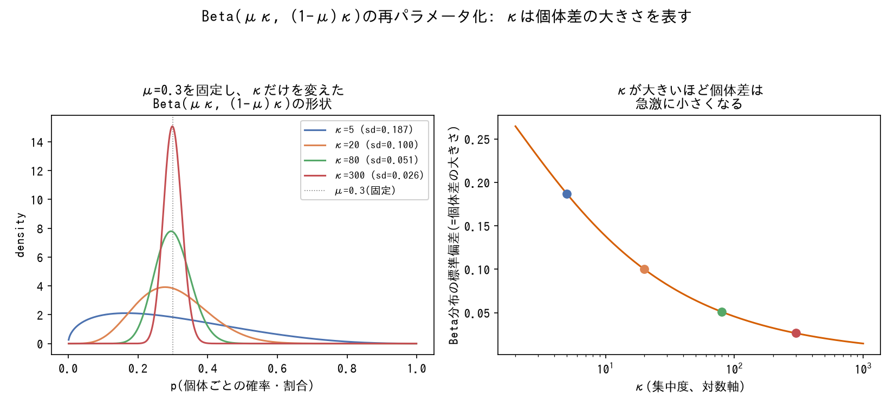
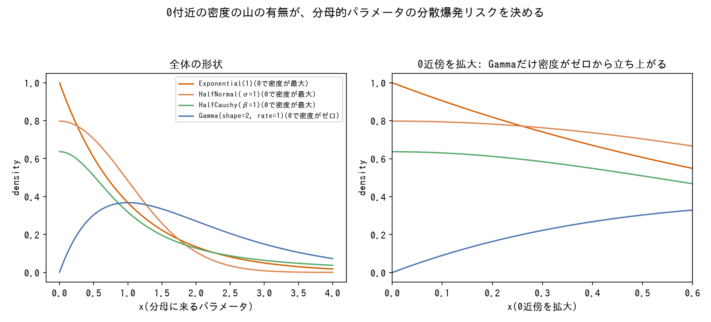
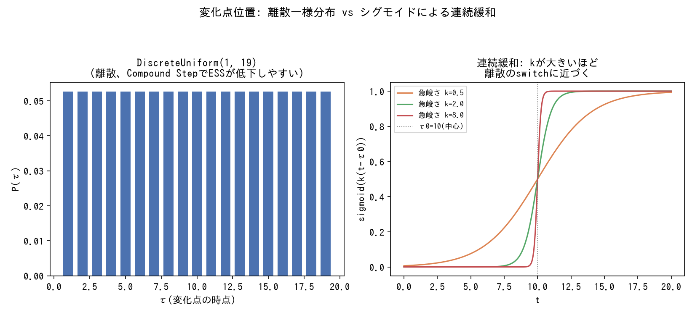
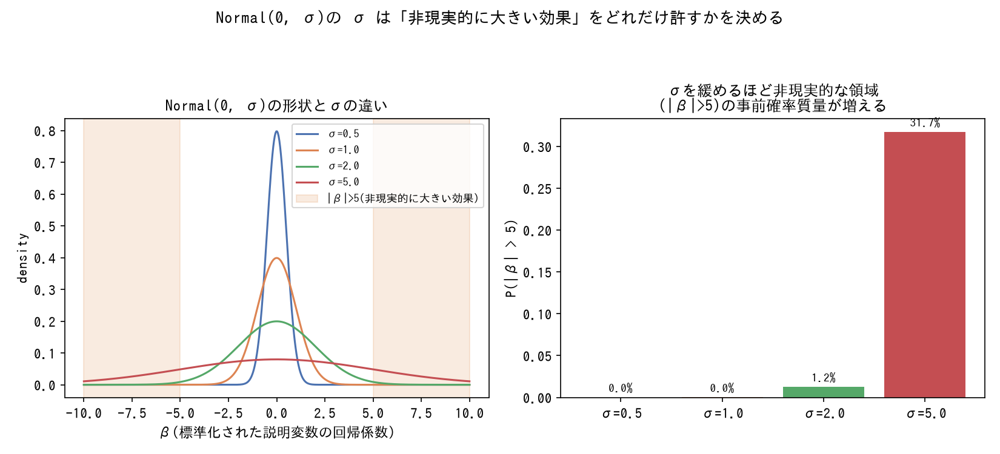
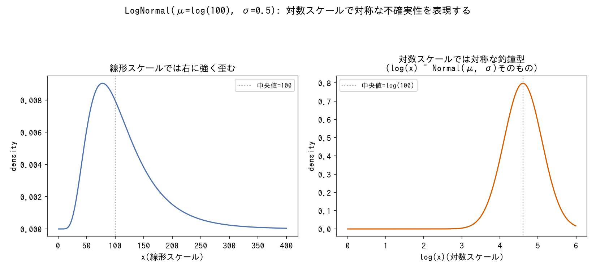

# 事前分布の選び方

パラメータの性質(確率か、正のスケールか、無制約の実数かなど)ごとに、どの分布族を事前分布として選ぶかの用語辞典。[tools/observation-models.md](observation-models.md)が観測データ側の分布(尤度)を扱うのに対し、こちらは推定したいパラメータ側の分布(事前分布)を扱う。事前分布のスケール自体をどう検証するかは[techniques/prior-predictive-check.md](../techniques/prior-predictive-check.md)を参照。

---

### 確率・割合(0〜1に制約された値)

*Beta(μκ,(1-μ)κ)の密度関数を実際に計算した結果(生成スクリプト: [scripts/generate_prior_distributions_plots.py](../scripts/generate_prior_distributions_plots.py))。*

- **代表的な事前分布**: `Beta(α, β)`
- **選び方のコツ**: `α`・`β`を直接指定するより、「全体平均`μ`」「集中度`κ`」に再パラメータ化(`α=μκ`, `β=(1-μ)κ`)すると解釈しやすい。`μ`には「リーグ平均」のような事前知識を、`κ`には「個体差がどれくらい大きいと想定するか」を反映させる。
- **落とし穴**: 集中度`κ`自体は次の「正のスケール・集中度パラメータ」と同じ0近傍の発散リスクを持つ。
- **登場プロジェクト**: [bayesian-modeling-lab](https://github.com/karahashimanato/bayesian-modeling-lab/blob/main/README.md#mlb打率-階層ベイズbeta-binomial)(MLB打率) / [bayesian-A-B-testing](https://github.com/karahashimanato/bayesian-A-B-testing/blob/main/README.md#分析の流れnotebooks)

---

### 正のスケール・集中度パラメータ(σ, λ, κなど、0より大きい値)

*各分布族の密度関数を実際に計算した結果(生成スクリプト: [scripts/generate_prior_distributions_plots.py](../scripts/generate_prior_distributions_plots.py))。この0近傍の密度の違いが実際にprior predictiveの分散爆発リスクを左右することは[techniques/prior-predictive-check.md](../techniques/prior-predictive-check.md#分母のパラメータが0に近づくと分散が発散する病理は分布族を問わず繰り返す)を参照。*

- **代表的な事前分布**: `HalfNormal`、`HalfCauchy`、`Gamma(alpha>1, beta)`
- **選び方のコツ**: そのパラメータが「分散・強度を分母的に決める」役割(Gamma-Poissonの集中度、階層モデルのグループ間分散など)を持つ場合、`Exponential`のように0付近に確率密度の山を持つ分布を使うと、まれに0に近い値を引いて分散が爆発するリスクがある。0での密度がゼロになる分布族(`Gamma(alpha>1,...)`)を選ぶと、この経路を構造的に塞げる([techniques/prior-predictive-check.md](../techniques/prior-predictive-check.md#分母のパラメータが0に近づくと分散が発散する病理は分布族を問わず繰り返す)参照)。
- **落とし穴**: PyMCの`pm.HalfNormal(lower=, upper=)`のように、存在しない引数を渡してもエラーにならず黙って無視される実装上の罠がある。範囲を制約したい場合は分布の引数ではなく別の方法(truncation等)で実現する必要がある。
- **登場プロジェクト**: [bayesian-modeling-lab](https://github.com/karahashimanato/bayesian-modeling-lab/blob/main/README.md#nile川-ベイズ変化点分析)(Nile) / [bayesian-modeling-lab](https://github.com/karahashimanato/bayesian-modeling-lab/blob/main/README.md#サメ襲撃件数-階層ベイズgamma-poisson)(サメ)

---

### 変化点位置(離散 vs 連続の時点パラメータ)

*DiscreteUniformのPMFとシグモイド関数を実際に計算した結果(生成スクリプト: [scripts/generate_prior_distributions_plots.py](../scripts/generate_prior_distributions_plots.py))。*

- **代表的な事前分布**: `DiscreteUniform`(離散一様分布)、連続緩和する場合は`Uniform`+シグモイド関数
- **選び方のコツ**: 変化点が起こりうる範囲に強い事前知識がなければ`Uniform`系で無情報にする。ただし離散のままだとCompound StepでESSが低下しやすいため、シグモイド関数による連続緩和も検討する([tools/state-space-models.md](state-space-models.md#変化点モデルchangepoint-model)参照)。
- **登場プロジェクト**: [bayesian-modeling-lab](https://github.com/karahashimanato/bayesian-modeling-lab/blob/main/README.md#nile川-ベイズ変化点分析)

---

### 無制約の実数パラメータ(回帰係数など)

*Normal(0, σ)の密度関数と裾確率を実際に計算した結果(生成スクリプト: [scripts/generate_prior_distributions_plots.py](../scripts/generate_prior_distributions_plots.py))。σを締めすぎるとJensen不等式由来の非直感的な挙動が見えにくくなる点は[tools/statistical-biases.md](statistical-biases.md#jensen不等式jensens-inequality)を参照。*

- **代表的な事前分布**: `Normal(0, σ)`
- **選び方のコツ**: スケール`σ`は、対応する説明変数の値の範囲・単位に応じて「非現実的に大きい効果を許さない」程度に設定する。`σ`を締めすぎると、Jensen不等式由来の非直感的な挙動(他パラメータの分散が加わるだけで予測平均がズレる)が見えにくくなることもあるため、事前予測チェックとセットで確認する([tools/statistical-biases.md](statistical-biases.md#jensen不等式jensens-inequality)参照)。
- **登場プロジェクト**: [bayesian-A-B-testing](https://github.com/karahashimanato/bayesian-A-B-testing/blob/main/README.md#分析の流れnotebooks)(ロジスティック回帰係数)

---

### 桁が大きく変わりうる正の値(初期値・カウントの推定値など)

*LogNormalの密度関数を線形・対数の両スケールで実際に計算した結果(生成スクリプト: [scripts/generate_prior_distributions_plots.py](../scripts/generate_prior_distributions_plots.py))。*

- **代表的な事前分布**: `LogNormal`
- **選び方のコツ**: 正の値のみを取り、対数スケールで対称な不確実性を表現したい(桁が数倍〜数十倍変わりうる)量に使う。機械的な逆算値に対して「10倍以上まで動かしても結果に変化がないか」のような感度分析と組み合わせて使うと、パラメータの効き方の限界を切り分けやすい。
- **登場プロジェクト**: [bayesian-epidemiological-models](https://github.com/karahashimanato/bayesian-epidemiological-models/blob/main/README.md#seir-湖北省covid-19初期流行)(SEIRの初期潜伏者数E0)
