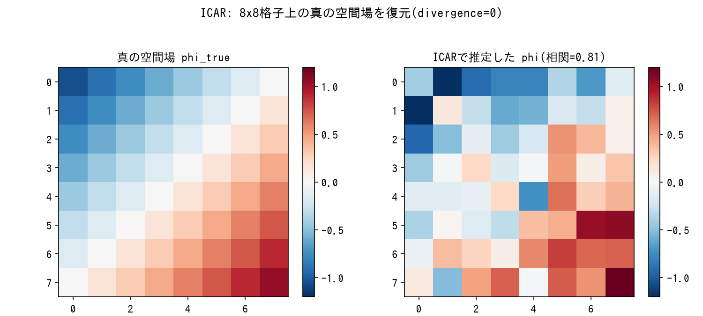
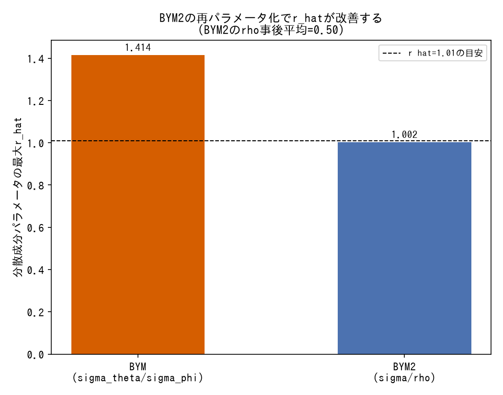
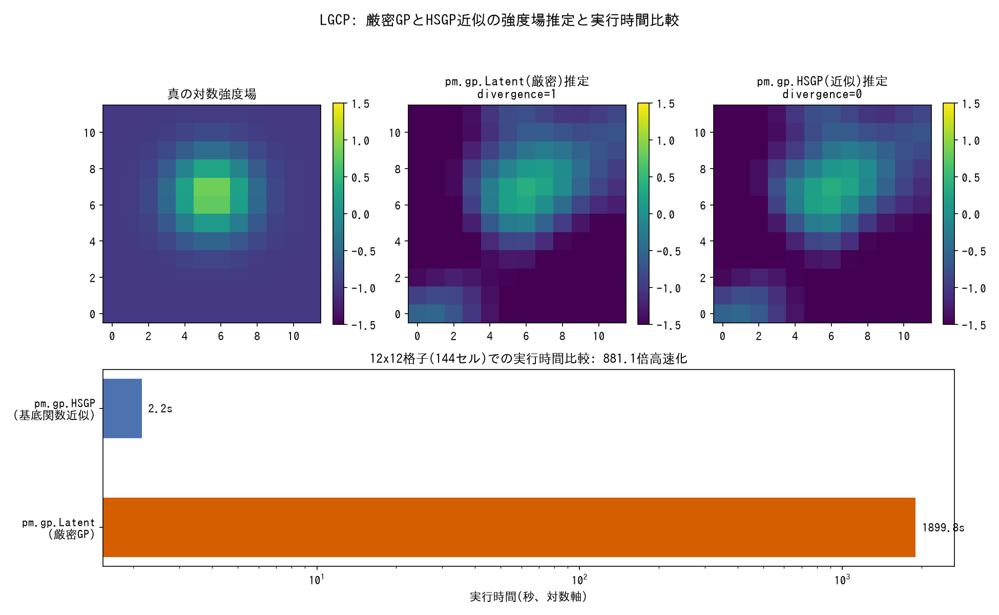

# 空間モデルの型

観測にどの分布を割り当てるか(`tools/observation-models.md`)、時間方向の潜在状態をどう構造化するか(`tools/state-space-models.md`)とは別に、隣接構造や連続空間上の位置に依存する空間相関そのものをどう構造化するかの用語辞典。定義・仕組み・使い分けを引くためのリファレンス。

---

### ICAR(Intrinsic Conditional Autoregressive)

*Poisson相対リスクモデル(疾病マッピング風の合成データ)をPyMCで実際にサンプリングした結果(生成スクリプト: [scripts/generate_spatial_models_plots.py](../scripts/generate_spatial_models_plots.py))。*

- **定義**: 隣接する地区同士の値が似た値を持ちやすいという空間相関を、隣接地区間の差の二乗和にペナルティをかけることで表現する事前分布。エリアデータ(行政区画など、隣接グラフを持つ集計データ)に対する空間ベイズモデルの基礎になる。
- **数式・仕組み**: 対数密度は`-0.5 * Σ_{i~j} (φ_i - φ_j)² / σ_φ²`(`i~j`は地区iと地区jが隣接することを表す)。これは精度行列がグラフラプラシアン`Q`(次数を対角、隣接を-1とする行列)である多変量正規分布に相当するが、`Q`は全体を平行移動しても対数密度が変わらないため本質的に特異(singular)であり、識別のためsum-to-zero制約(`Σφ_i=0`)が必要になる。
- **使い分け**: 空間構造のみを表現したいベースラインとして使う。PyMCの`pm.ICAR`は対数密度(`logp`)のみを実装し`random()`を持たないため、`pm.sample_prior_predictive()`や`pm.model_to_graphviz`がそのままでは使えない制約がある([techniques/implementation-hacks.md](../techniques/implementation-hacks.md#pmicarは前向きサンプリング不可な上logpの閉形式共分散で代替できる)参照)。地区固有の非構造的なばらつきも同時に表現したい場合は[BYM](#bymbesag-york-mollié)を検討する。
- **登場プロジェクト**: [bayesian-spatial-models](https://github.com/karahashimanato/bayesian-spatial-models/blob/main/README.md#part-1-bym2スコットランド口唇癌データ)(スコットランド56地区口唇癌データ)

---

### BYM(Besag-York-Mollié)

![BYM: theta[0]とphi[0]の事後サンプルは強い負の相関(r=-0.70)を持ち、データがtheta+phiの合計しか制約しないridge型非識別性を示す。sigma_thetaのr_hat=1.414と収束に失敗するが、sigma_phiのr_hat=1.002は健全](../assets/spatial-models/bym_nonidentifiability.png)

*8x8格子グラフ上の合成データでBYMモデルを実際にPyMCでサンプリングした結果(生成スクリプト: [scripts/generate_spatial_models_plots.py](../scripts/generate_spatial_models_plots.py))。*

- **定義**: [ICAR](#icarintrinsic-conditional-autoregressive)の空間構造項`φ`に加えて、地区固有の非構造的なばらつき`θ`を導入した疾病マッピングの標準モデル(Besag, York & Mollié 1991)。
- **数式・仕組み**: `y_i ~ Poisson(E_i・exp(β0+β1・x_i+θ_i+φ_i))`、`θ_i ~ Normal(0,σ_θ)`(非構造項)、`φ ~ ICAR(σ_φ)`(空間構造項)。観測件数`y`と期待件数`E`(標準化死亡比のオフセット)を組み合わせた相対リスクのPoissonモデルとして書かれることが多い。
- **使い分け**: 「隣接地区間で共有される空間相関」と「地区固有の孤立したばらつき」を分けて推定したい場合の基本形。ただし`σ_θ`と`σ_φ`は事後分布上で分離しにくい(θ単体・φ単体のESSが、その合成量`θ+φ`より明確に低くなる)という教科書的な非識別性を抱える。「θとφの内訳は決まりにくいが、両者の合計は比較的よく決まる」という構造は[tools/posterior-pathologies.md](posterior-pathologies.md#ridge型非識別性)のridge型非識別性と同型で、[BYM2](#bym2)による再パラメータ化で緩和する([techniques/reparameterization.md](../techniques/reparameterization.md#bymのθφ分離の非識別性はbym2のσρ再パラメータ化で解消する)参照)。
- **登場プロジェクト**: [bayesian-spatial-models](https://github.com/karahashimanato/bayesian-spatial-models/blob/main/README.md#part-1-bym2スコットランド口唇癌データ)(σ_θ/σ_φの事後相関-0.31、σ_θのr_hat=1.14)

---

### BYM2

*同一の合成データに対しBYMとBYM2を両方実際にPyMCでサンプリングし比較した結果(生成スクリプト: [scripts/generate_spatial_models_plots.py](../scripts/generate_spatial_models_plots.py))。*

- **定義**: BYMの非構造項`θ`・空間構造項`φ`を、「全体スケール`σ`」と「空間分散の割合`ρ`」への再パラメータ化によって分離しやすくした改良版(Riebler et al. 2016)。
- **数式・仕組み**: `σ・(√(1-ρ)・θ* + √(ρ/scale)・φ*)`(`θ*~Normal(0,1)`、`φ*~ICAR(1)`)。`scale`はグラフラプラシアンの一般化逆行列(Moore-Penrose逆行列)から計算するスケーリング係数で、`ρ`の解釈(空間分散の割合)を隣接グラフの構造によらず一定に保つ役割を持つ([techniques/implementation-hacks.md](../techniques/implementation-hacks.md#bym2のスケーリング係数はグラフラプラシアンの一般化逆行列から自前で計算する)参照)。
- **使い分け**: BYMで`σ_θ`/`σ_φ`の分離が不安定な場合の標準的な解決策。`ρ`の事後平均が1に近いほど「空間変動の大部分は隣接地区間の空間相関で説明される」ことを、0に近いほど「地区固有の非構造的なばらつきが支配的」であることを直接示す。LOO-CVでの予測性能はBYM・ICARと有意差がつかないことが多く、BYM2の価値は予測精度の向上ではなく分散成分を安定して分離推定できるという推論の健全性にある([techniques/model-evaluation.md](../techniques/model-evaluation.md#looで差がつかなくても分散成分を安定して分離推定できることに価値がある場合がある)参照)。
- **登場プロジェクト**: [bayesian-spatial-models](https://github.com/karahashimanato/bayesian-spatial-models/blob/main/README.md#2-bym2による解消)(σ,ρの事後相関0.08、全パラメータr_hat=1.00、ρ事後平均0.81)

---

### 空間時系列BYM(Knorr-Held型space-time interaction)

- **定義**: [BYM2](#bym2)を時間方向に拡張し、「時間とともに空間パターンがどう変化するか」を表現するモデル(Knorr-Held 2000)。空間・時間・両者の交互作用を分けて構造化する。
- **数式・仕組み**: `η_it = β0 + S_i(空間、BYM2) + δ_t(時間、RW1) + ψ_it(交互作用)`。交互作用`ψ_it`をどこまで構造化するかでType I〜IVに分かれ、Type Iは`ψ_it ~ Normal(0,σ_ψ)`(郡×週で完全に非構造)、Type IVは`ψ`の精度行列を空間ラプラシアン`Q_space`と時間RW1の構造行列`Q_time`のクロネッカー積`Q_space⊗Q_time`で構成する(空間・時間ともに構造化)。後者の二次形式`vec(Ψ)^T(Q_space⊗Q_time)vec(Ψ)`は、明示的に大きな精度行列を作らず`sum(Psi * (Q_space @ Psi @ Q_time))`という行列演算だけで計算できる([techniques/implementation-hacks.md](../techniques/implementation-hacks.md#クロネッカー積gmrfの二次形式は精度行列を明示せず行列演算で計算する)参照)。
- **使い分け**: 「空間パターンが時間的に安定しているか、それとも構造的に変化していくか」を検証したい場合に使う。Type IVはType Iより計算コストが高いが、交互作用の構造化自体が予測性能の向上につながる場合がある(BYM2が予測性能で差がつかなかったのとは対照的)。RW1の絶対水準は`β0`と交絡するため、時間側の変数は中心化してから使う必要がある([techniques/reparameterization.md](../techniques/reparameterization.md#rw1の絶対水準の不定性はβ0との交絡を生むため中心化で解消する)参照)。
- **登場プロジェクト**: [bayesian-spatial-models](https://github.com/karahashimanato/bayesian-spatial-models/blob/main/README.md#part-2-空間時系列bymオハイオ州covid-19)(オハイオ州88郡のCOVID-19週次新規件数、Type IVがType Iに対しelpd_diff=-70・dse=16で有意に改善)

---

### LGCP(Log-Gaussian Cox Process、空間点過程)

*12x12格子に離散化した合成ホットスポットデータで、厳密GPとHSGPを両方実際にPyMCでサンプリングし比較した結果(生成スクリプト: [scripts/generate_spatial_models_plots.py](../scripts/generate_spatial_models_plots.py))。*

- **定義**: 隣接グラフを持たない連続空間上のイベント(地震の震源など)の発生強度を、ガウス過程で表現する点過程。[Hawkes過程](observation-models.md#hawkes過程点過程の尤度)が時間軸上の自己励起点過程であるのに対し、LGCPは空間(または時空間)上の強度場そのものをGPでノンパラメトリックに推定する。
- **数式・仕組み**: 対象領域を格子(セル)に離散化し、各セルの対数強度`log λ(s)`にMatérnやRBFなどのカーネルを持つガウス過程を割り当て、セルごとのイベント件数を`Poisson(λ(s)・|セル面積|)`でモデル化する。GPのハイパーパラメータ(長さスケール・分散)は、既存のプロジェクトが使う一般的なチュートリアルの値をそのまま流用せず、実際のイベント分布のスケール(震源間の最近傍距離など)からprior predictive checkで導出する([techniques/prior-predictive-check.md](../techniques/prior-predictive-check.md#gpのハイパーパラメータもチュートリアルの値を流用せず対象データのスケールから導出する)参照)。
- **使い分け**: イベントの発生時刻ではなく発生位置そのものの集中度(ホットスポット)を推定したい場合に使う。厳密なGP(`pm.gp.Latent`、Cholesky分解)は、長さスケールの事後がグリッド間隔に対して短い領域に迷い込むと共分散行列が悪条件化し、divergenceという形では現れないままNUTSのサンプリングが実質的に停止する病理を起こしうる([tools/posterior-pathologies.md](posterior-pathologies.md#gpの共分散行列悪条件化によるサンプリング停止divergenceに現れない病理)参照)。`pm.gp.HSGP`(Hilbert空間近似)に置き換えると共分散行列そのものを構成しないため数値的に安定する([tools/inference-methods.md](inference-methods.md#pmgplatent--hsgp基底関数近似)参照)。
- **登場プロジェクト**: [bayesian-spatial-models](https://github.com/karahashimanato/bayesian-spatial-models/blob/main/README.md#part-3-空間点過程lgcp能登半島地震)(能登半島地震カタログ93件、Matérn 5/2カーネル、`pm.gp.Latent`→`pm.gp.HSGP`で実行時間100分超→7秒に短縮)
