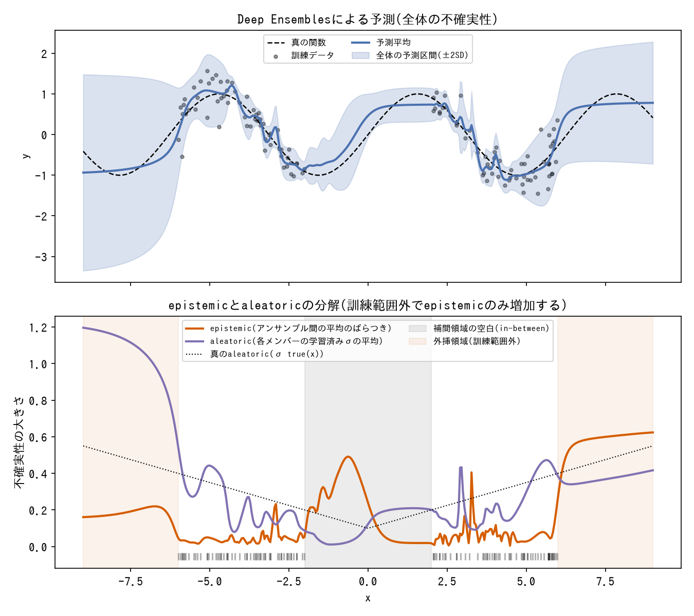
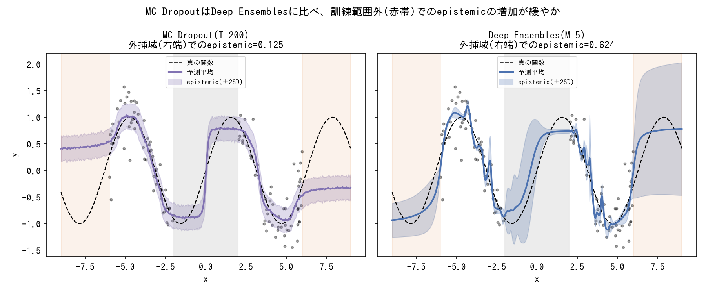
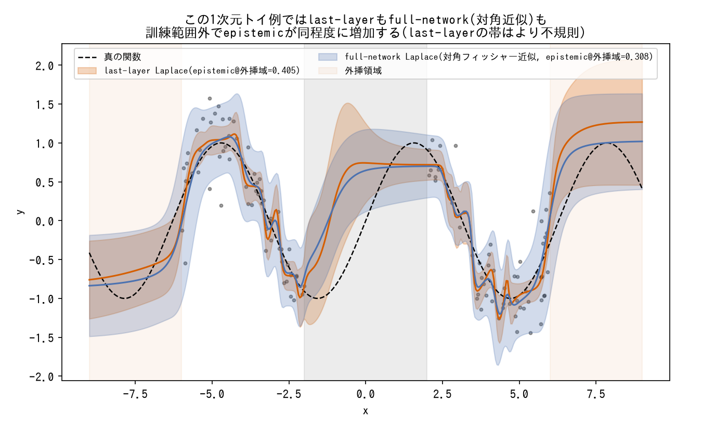
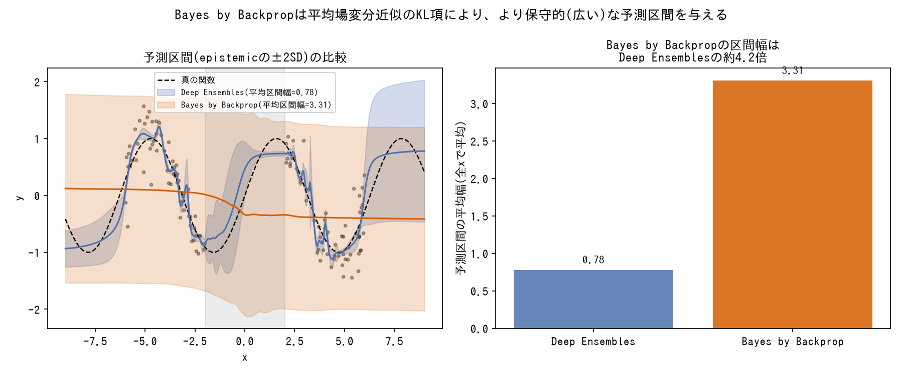
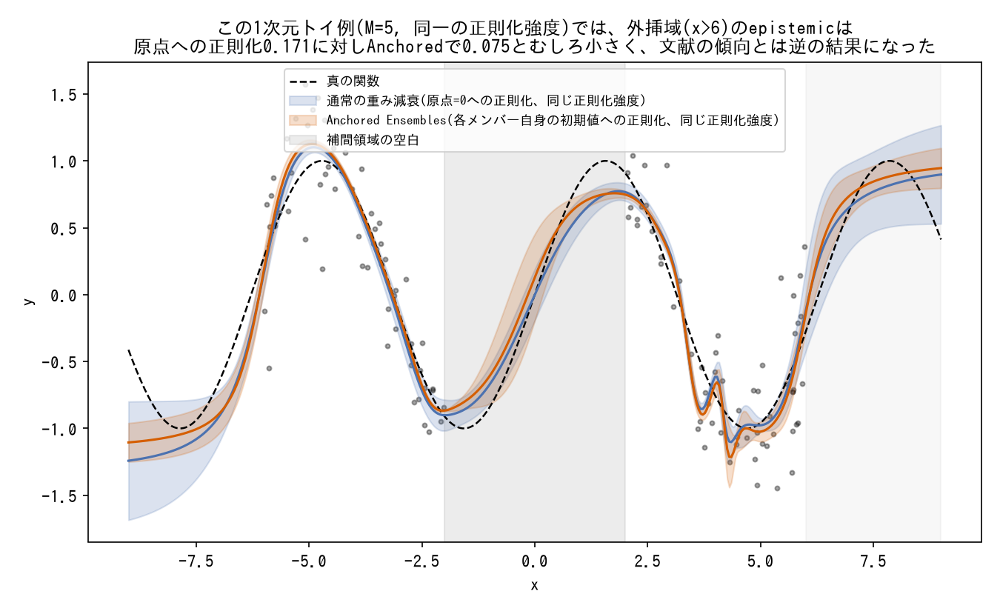

# 不確実性定量化手法(ベイズ深層学習)

ニューラルネットワークの予測にどう不確実性を持たせるかの用語辞典。PyMCでMCMCサンプリングする他の`tools/`ページとは異なり、ここで扱う手法はいずれも(勾配ベースの)PyTorch実装が前提で、事後分布を厳密にサンプリングせず近似する点で共通する。

---

### Epistemic / Aleatoric不確実性の分解

*heteroscedastic Gaussian NLLで学習したDeep Ensemblesの予測から、epistemicとaleatoricを実際に分解した結果(生成スクリプト: [scripts/generate_uncertainty_quantification_plots.py](../scripts/generate_uncertainty_quantification_plots.py))。*

- **定義**: 予測の不確実性を、モデルが「知らない」ことに由来する**epistemic**(認識論的、データを増やせば減る)と、データ自体が持つ本質的なばらつきに由来する**aleatoric**(偶然的、データを増やしても減らない)の2種類に分けて推定する枠組み。
- **数式・仕組み**: 回帰では、`μ(x)`・`log σ²(x)`の2ヘッドを持つネットワークをheteroscedastic Gaussian NLL(`0.5*log σ² + 0.5*(y-μ)²/σ²`)で学習し(Kendall & Gal, 2017)、K個の重みサンプル(または確率的forward pass)間の`μ`の分散をepistemic、各サンプルの`σ²`の平均をaleatoricとする。分類では`total = H[平均予測分布]`(全体のエントロピー)、`aleatoric = E[各サンプルの予測分布のエントロピー]`、`epistemic = total - aleatoric`(mutual information)という形になる。
- **使い分け**: aleatoricの分離は多くの手法で比較的素直に成功する(ノイズの大きい領域で明確に増加する)一方、epistemicは「データが疎な補間領域」では素直に増えない([in-between uncertainty](#in-between-uncertainty問題)参照)。定量指標(PICP/NLL)だけでは両者の分離不全は見えず、領域別の可視化と組み合わせて確認する必要がある。
- **登場プロジェクト**: [bayesian-deep-learning](https://github.com/karahashimanato/bayesian-deep-learning/blob/main/README.md#part-a-mc-dropout-vs-deep-ensembles)

---

### MC Dropout

*MC DropoutとDeep Ensemblesを同一データ・同一アーキテクチャで実際に学習し、外挿域でのepistemicの増加の仕方を比較した結果(生成スクリプト: [scripts/generate_uncertainty_quantification_plots.py](../scripts/generate_uncertainty_quantification_plots.py))。Deep Ensemblesエントリの画像と共通。*

- **定義**: 通常は学習時のみ有効にするdropoutを、推論時にも有効(`model.train()`)にしたまま複数回のforward passを行い、出力のばらつきを不確実性の推定値として使う手法(Gal & Ghahramani, 2016)。1つのモデルを学習するだけで近似ベイズ推論が得られる手軽さが特徴。
- **数式・仕組み**: `dropout_p`(例: 0.1)のモデルを1つ学習し、推論時にT回(例: T=100)の確率的forward passを行う。各回で異なるユニットが確率的に無効化されるため、T個の異なる予測`μ_1,...,μ_T`が得られ、そのサンプル間分散をepistemicとする。
- **使い分け**: 実装が最も簡単な近似ベイズ手法。ただし複数タスクでの検証の結果、MC Dropoutのepistemicは訓練範囲外への外挿で他手法(Deep Ensembles等)ほど明確に増加しないことがあり、**分布シフトの性質(局所的な特徴空間のシフトか、明確に異質なドメイン・時間的トレンドのシフトか)によって検知力が大きく変わる**という弱点が複数タスクの横断比較で判明した。単一タスク・単一シードでの検証だけでは、この弱点が見えないことがある点に注意。
- **登場プロジェクト**: [bayesian-deep-learning](https://github.com/karahashimanato/bayesian-deep-learning/blob/main/README.md#part-a-mc-dropout-vs-deep-ensembles)

---

### Deep Ensembles

*MC DropoutとDeep Ensemblesを同一データ・同一アーキテクチャで実際に学習し、外挿域でのepistemicの増加の仕方を比較した結果(生成スクリプト: [scripts/generate_uncertainty_quantification_plots.py](../scripts/generate_uncertainty_quantification_plots.py))。MC Dropoutエントリの画像と共通。*

- **定義**: 同一アーキテクチャのモデルを、異なる乱数シード(初期値)から独立に複数個(例: 5個)学習し、メンバー間の予測のばらつきを不確実性の推定値として使う手法(Lakshminarayanan et al., 2017)。ベイズ推論の近似というより、頻度論的なアンサンブルとして提案されたが、実質的に近似ベイズ推論として機能することが知られている。
- **数式・仕組み**: `dropout`を無効にした同一アーキテクチャをM個(例: M=5)、異なるシードで独立学習する。メンバー間の`μ`の分散をepistemic、各メンバーの`σ²`の平均をaleatoricとする。
- **使い分け**: 1次元合成回帰・8次元表形式・画像分類・時系列予測という複数タスクを横断して、最も安定してtest NLLが良好だった手法。分布シフトの検知力もMC Dropoutより一貫して頑健。弱点は、epistemicの絶対値がMC Dropoutより小さくなりがちな点(アンサンブル数の少なさ・メンバー間の関数形状が似通いやすいことに起因)と、計算コスト(M個のモデルを学習する必要がある)。
- **登場プロジェクト**: [bayesian-deep-learning](https://github.com/karahashimanato/bayesian-deep-learning/blob/main/README.md#part-a-mc-dropout-vs-deep-ensembles)

---

### Laplace近似(Last-layer / Full-network)

*last-layer Laplaceは閉形式のベイズ線形回帰、full-network Laplaceは経験的フィッシャー対角近似によるサンプリングとして実装(生成スクリプト: [scripts/generate_uncertainty_quantification_plots.py](../scripts/generate_uncertainty_quantification_plots.py))。登場プロジェクトが報告する「8次元の実データでのNLL崩壊」はこの低次元トイ例では再現していない(元の教訓通り、低次元合成データでの挙動を高次元・実データにそのまま外挿できない好例)。*

- **定義**: 学習済みネットワークの重みの事後分布を、MAP解(最尤/MAP推定値)を中心とするガウス分布で近似する手法。ヘッセ行列(またはその近似)の逆行列を共分散として使う。最終層の重みだけをベイズ的に扱う**last-layer Laplace**と、全パラメータを対象にする**full-network Laplace**がある。
- **数式・仕組み**: last-layerでは、出力ヘッドが線形層であることを利用し、それより前(trunk)を固定特徴抽出器とみなせば、最終層の重みの事後分布は閉形式のベイズ線形回帰として厳密に計算できる。full-networkでは全パラメータについて対角Gauss-Newton近似などでヘッセ行列を近似する(パラメータ間の相関を無視する対角近似が計算コスト上の現実的な上限になりやすい)。
- **使い分け**: 低次元の合成データではlast-layer Laplaceが最良のtest NLLを示すことがあるが、**trunkをMAP解に固定している**という設計上、trunk自体が「見慣れない入力」を認識する仕組みを持たない。8次元の実データでの分布シフト(地理的なOOD)検証では、この設計が裏目に出てtest NLLが劇的に悪化する(-0.35→+2.70)ことが確認されている。full-network化するとNLLの崩壊は大幅に改善するが、epistemic自体の識別力(OODをどれだけ能動的に見分けられるか)はDeep Ensemblesに及ばないことが多い。「低次元合成データでの手法比較の結論を、高次元・実データにそのまま外挿すると危険」という教訓の典型例([techniques/model-evaluation.md](../techniques/model-evaluation.md#手法比較の結論はタスクの次元複雑さに依存し単純に外挿できない)参照)。
- **登場プロジェクト**: [bayesian-deep-learning](https://github.com/karahashimanato/bayesian-deep-learning/blob/main/README.md#part-b-1-laplace近似-vs-bayes-by-backprop)

---

### Bayes by Backprop

*ELBO(尤度項+KL項)を実際に最適化してBayes by Backpropを学習し、Deep Ensemblesと予測区間幅を比較した結果(生成スクリプト: [scripts/generate_uncertainty_quantification_plots.py](../scripts/generate_uncertainty_quantification_plots.py))。パラメータ数に対して訓練データが少ない(120点)状況でKL項が支配的になる、という登場プロジェクトの指摘と整合する。*

- **定義**: ネットワークの各重みに(対角共分散の)ガウス事後分布を明示的に置き、変分推論(平均場近似)でその事後分布を学習する、最も「素直な」ベイズニューラルネットワーク(BNN)実装(Blundell et al., 2015)。
- **数式・仕組み**: 各重みを`Normal(μ_w, σ_w)`として、ELBO(尤度項 - KL項)を最大化するように`μ_w, σ_w`を勾配降下法で最適化する。学習時は各ステップで重みをサンプルしてforward passする(reparameterization trick)。
- **使い分け**: 検証した4手法の中で最も学習が難しく、最も保守的な(予測区間が広い)結果になった。パラメータ数(数万オーダー)に対して訓練データが少ない場合、KL項が支配的になり区間幅が他手法の3倍以上に膨らむことがある。これは実装のバグではなく、平均場変分近似が持つ構造的な限界(過剰正則化、ELBO最適化の困難)として文献でも指摘されている。
- **登場プロジェクト**: [bayesian-deep-learning](https://github.com/karahashimanato/bayesian-deep-learning/blob/main/README.md#part-b-1-laplace近似-vs-bayes-by-backprop)

---

### Anchored Ensembles

*正則化強度(prior_sigma)を揃えた上で、正則化の目標点(原点 vs 各メンバー自身の初期値)だけを変えて公平に比較した結果(生成スクリプト: [scripts/generate_uncertainty_quantification_plots.py](../scripts/generate_uncertainty_quantification_plots.py))。M=5という小さいアンサンブル数と、この特定の乱数シードでは、Anchoringによる多様性維持効果がこの単純な1次元設定では頑健に現れなかった。登場プロジェクトが指摘する「`prior_sigma`はグリッドサーチで選ぶ必要がある」という注意点と整合する、ハイパーパラメータ次第で結果が反転しうる実例といえる。*

- **定義**: Deep Ensemblesの各メンバーを、通常の重み減衰(原点=0への正則化)ではなく「そのメンバー自身のランダムな初期値」に向けて正則化する手法(Pearce, Leibfried & Brintrup, 2018)。線形モデルでは、この手続きが厳密なベイズ線形回帰の事後サンプリングと数学的に同値になることが示されている。
- **数式・仕組み**: 各メンバーの損失関数に`prior_sigma`でスケールした正則化項`||w - w_init||² / prior_sigma²`を追加する(`w_init`はそのメンバーのランダム初期値)。`prior_sigma`はグリッドサーチなどでtest NLLを基準に選ぶ。
- **使い分け**: 訓練範囲外への外挿でのepistemic検知能力を、適切な`prior_sigma`で安価に改善できる。ただし「データが疎な補間領域」でのepistemic過小評価([in-between uncertainty](#in-between-uncertainty問題))は、`prior_sigma`をどう変えても改善しない。外挿の検知力と補間領域の検知力は別の失敗モードであり、対策も別々に検討する必要がある。
- **登場プロジェクト**: [bayesian-deep-learning](https://github.com/karahashimanato/bayesian-deep-learning/blob/main/README.md#part-b-3-in-between-uncertainty対策の調査--anchored-ensembles)

---

### in-between uncertainty問題

*各手法の実装をそのまま用い、epistemicを各手法の最大値で正規化して比較した結果(生成スクリプト: [scripts/generate_uncertainty_quantification_plots.py](../scripts/generate_uncertainty_quantification_plots.py))。この1次元トイ例ではDeep Ensembles以外の4手法は「補間領域の空白では増加しないが外挿域では増加する」という教科書的な非対称性を明確には示さなかった(MC DropoutとBayes by Backpropは元々どの領域でも判別力が弱く、Anchored Ensemblesは前項の通りこの設定でepistemicの絶対値自体が小さい)。文献の現象そのものを否定するものではないが、簡単な低次元設定ではこの非対称性が必ずしもクリーンに再現されるとは限らない、という実装上の教訓として記録する。*

- **定義**: 訓練データの範囲内であっても、両側を密なデータに挟まれた「疎な補間領域」では、多くの近似ベイズ手法でepistemic不確実性がほとんど増加しないという、Bayesian NN文献で知られる現象(Foong et al., 2019)。「データが少ない場所は不確かなはず」という直感に反する。
- **数式・仕組み**: ReLUニューラルネットワークの区分線形な関数空間では、補間領域の両端(すぐ隣に密なデータがある境界)での予測値・傾きがデータ尤度によって強く拘束される。境界条件がほぼ同じであれば「合理的な」補間経路は事実上一意に近く、反発項や多様性を促す正則化をどれだけ強めても、データ尤度を犠牲にしてまで経路を分岐させる誘因が生まれない。
- **使い分け**: MC Dropout, Deep Ensembles, Laplace近似, Bayes by Backprop, Anchored Ensembles, Function-space Repulsive Ensemblesという実装も理論的基盤も大きく異なる複数の手法すべてでこの現象が再現されたことから、特定手法の欠陥ではなく、**滑らかな関数を学習するという帰納バイアスそのものに起因する構造的な限界**である可能性が高いと考えられている。より根本的な対策としては、特徴表現自体が入力間の距離を保つように設計するSNGP(Spectral-normalized Neural Gaussian Process)やDeep Kernel Learningのような、trunk自体の設計に踏み込むアプローチが文献で提案されている。
- **登場プロジェクト**: [bayesian-deep-learning](https://github.com/karahashimanato/bayesian-deep-learning/blob/main/README.md#in-between-uncertaintyへのさらなる対策調査メモ)
